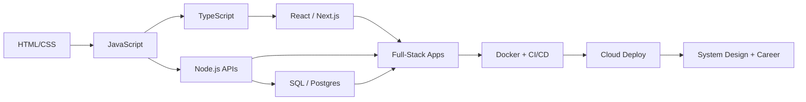

```
╔═══════════════════════════════════════════════════════════════════════════════════╗
║                                                                                   ║
║                                                                                   ║
║    ██████╗  ██████╗  █████╗ ██████╗     ████████╗ ██████╗                         ║
║    ██╔══██╗██╔═══██╗██╔══██╗██╔══██╗    ╚══██╔══╝██╔═══██╗                        ║
║    ██████╔╝██║   ██║███████║██║  ██║       ██║   ██║   ██║                        ║
║    ██╔══██╗██║   ██║██╔══██║██║  ██║       ██║   ██║   ██║                        ║
║    ██║  ██║╚██████╔╝██║  ██║██████╔╝       ██║   ╚██████╔╝                        ║
║    ╚═╝  ╚═╝ ╚═════╝ ╚═╝  ╚═╝╚═════╝        ╚═╝    ╚═════╝                         ║
║                                                                                   ║
║    ███████╗██╗   ██╗██╗     ██╗     ███████╗████████╗ █████╗  ██████╗██╗  ██╗     ║
║    ██╔════╝██║   ██║██║     ██║     ██╔════╝╚══██╔══╝██╔══██╗██╔════╝██║ ██╔╝     ║
║    █████╗  ██║   ██║██║     ██║     ███████╗   ██║   ███████║██║     █████╔╝      ║
║    ██╔══╝  ██║   ██║██║     ██║     ╚════██║   ██║   ██╔══██║██║     ██╔═██╗      ║
║    ██║     ╚██████╔╝███████╗███████╗███████║   ██║   ██║  ██║╚██████╗██║  ██╗     ║
║    ╚═╝      ╚═════╝ ╚══════╝╚══════╝╚══════╝   ╚═╝   ╚═╝  ╚═╝ ╚═════╝╚═╝  ╚═╝     ║
║                                                                                   ║
║       🛣️  Frontend → Backend → DevOps → FullStack Developer → 🚀                 ║
║                                                                                   ║
║       "Your journey to mastering the complete development stack"                  ║
║                                                                                   ║
╚═══════════════════════════════════════════════════════════════════════════════════╝
```

<p align="center">
  
  
  
  
  
</p>

A curated collection of **100% FREE** courses, docs, tutorials, and projects to go from zero → full-stack developer (with DevOps skills). Built for self-taught learners, career switchers, and anyone who wants a clear path without paywalls.

> **Last refreshed:** September 2026 — links verified, outdated destinations updated, and new learning resources added. Nothing previously listed was removed.

### Why this repo?
| | |
|---|---|
| 🎯 **One roadmap** | Frontend → Backend → Databases → DevOps → Career |
| 🆓 **Always free** | Every linked resource can be used at no cost |
| 🧭 **Opinionated paths** | Beginner → Advanced tracks so you are never stuck choosing |
| 🛠️ **Build, don't only watch** | Projects, labs, and interactive courses included |

### 🚀 How to use this roadmap
1. Pick a **[Learning Path](#learning-paths)** that matches your level
2. Start with **[Start Here](#start-here)** if you want the highest-signal resources first
3. Dive into any topic from the **Table of Contents** below
4. Build portfolio projects from **[Hands-on Projects](#hands-on-projects)** as you go
5. When stuck, use **[Communities & Open Source](#communities--open-source)** for help and real PRs

### Legend
| Icon | Meaning |
|------|---------|
| 📚 | Documentation / reference |
| 📖 | Tutorial / article series |
| 🎓 | Course / curriculum |
| 🎮 | Interactive / playground |
| 💻 | Practice / code / templates |
| 🗺️ | Roadmap / structured path |
| 🛠️ | Tool |
| 🎥 | Video |

<a id="start-here"></a>
## ⭐ Start Here — Highest-Signal Picks

If you only open a handful of links, open these:

| Focus | Resource | Why it matters |
|-------|----------|----------------|
| 🧭 Full curriculum | [Full Stack Open](https://fullstackopen.com/en/) | University of Helsinki's free modern fullstack course (React, Node, TypeScript, GraphQL, CI) |
| 🛤️ Structured path | [The Odin Project](https://www.theodinproject.com/) | Project-heavy free curriculum from foundations to fullstack |
| 🗺️ Visual roadmaps | [roadmap.sh](https://roadmap.sh/) | Interactive role roadmaps (Frontend, Backend, DevOps, AI) |
| 📘 Language depth | [JavaScript.info](https://javascript.info/) | Best free modern JS tutorial, beginner → advanced |
| 📘 Types | [TypeScript Handbook](https://www.typescriptlang.org/docs/handbook/intro.html) | Official TS source of truth |
| ⚛️ UI framework | [React Docs](https://react.dev/learn) | Official React learning guide |
| 🟢 Backend | [Node.js Learn](https://nodejs.org/en/learn/getting-started/introduction-to-nodejs) | Official Node learning path |
| 🗄️ SQL | [SQLBolt](https://sqlbolt.com/) | Fast interactive SQL practice |
| 🐳 Containers | [Docker Get Started](https://docs.docker.com/get-started/) | Official Docker hands-on |
| 🎓 CS foundation | [CS50x](https://cs50.harvard.edu/x/) | Harvard's free intro CS course |



<a id="table-of-contents"></a>
## 📚 Table of Contents

### 🎨 **Frontend Development**
- **Fundamentals**
  - [ HTML & CSS](#-html--css)
  - [ JavaScript](#-javascript)
  - [ TypeScript](#-typescript)
- **Frameworks & Libraries**
  - [   Frontend Frameworks](#-frontend-frameworks)
- **Design & UX**
  - [  UI/UX Design](#-uiux-design)

### ⚙️ **Backend Development**
- **Programming Languages**
  - [ Node.js](#-nodejs)
  - [ Python](#-python)
  - [ Java](#-java)
  - [ Ruby](#-ruby)
  - [ Rust](#-rust)
  - [ Go](#-go)

### 🗄️ **Database Technologies**
- **Relational Databases**
  - [   SQL Databases](#-sql-databases)
- **NoSQL & Document Stores**
  - [   NoSQL Databases](#-nosql-databases)
- **Stream Processing**
  - [  Stream Processing & Real-time](#-stream-processing--real-time-databases)

### 🔌 **APIs & Integration**
- [  APIs & Integration](#-apis--integration)

### 🛡️ **Security & Performance**
- [ Security](#-security)
- [ Performance & Optimization](#-performance--optimization)

### ☁️ **DevOps & Cloud Infrastructure**
- **Containerization & Orchestration**
  - [ Docker & Containerization](#-docker--containerization)
  - [ Kubernetes](#-kubernetes)
- **Cloud Platforms**
  - [   Cloud Platforms](#-cloud-platforms)
- **Automation & Deployment**
  - [  CI/CD](#-cicd)
  - [  Monitoring & Logging](#-monitoring--logging)

### 🤖 **Automation & Workflows**
- [   Automation & Workflows](#-automation--workflows)

### 📈 **Data & Analytics**
- [  Data Visualization & Analytics](#-data-visualization--analytics)

### 🧠 **AI & Machine Learning**
- [   AI & Machine Learning](#-ai--machine-learning)
- [ AI for Developers](#-ai-for-developers)

### 🖥️ **Content & Development Tools**
- [  Content Management](#-content-management)
- [  Development Tools & IDEs](#-development-tools--ides)

### 📊 **Visual Learning & Resources**
- [ Infographics & Visual Learning](#-infographics--visual-learning)

### 📱 **Mobile & Emerging Tech**
- [  Mobile Development](#-mobile-development)
- [  Web3 & Blockchain](#-web3--blockchain)

### 🎓 **Computer Science & Career**
- **Fundamentals**
  - [ Version Control](#-version-control)
  - [  Testing](#-testing)
  - [ Algorithms & Data Structures](#-algorithms--data-structures)
- **Architecture & Design**
  - [ System Design](#-system-design)
  - [ Computer Science Fundamentals](#-computer-science-fundamentals)
- **Documentation & Communication**
  - [ Documentation & Communication](#-documentation--communication)
- **Career Development**
  - [ Career & Interview Prep](#-career--interview-prep)
  - [ Free Development Services](#-free-development-services)

### 🧩 **Practice, A11y & Community**
- [ Hands-on Projects](#hands-on-projects)
- [ Accessibility](#accessibility)
- [ Browser & Networking](#browser--networking)
- [ Design Patterns](#design-patterns)
- [ Communities & Open Source](#communities--open-source)

### 🎯 **Learning Paths & Roadmaps**
- [ Structured Learning Paths](#learning-paths)

---

##  Frontend Development

###  HTML & CSS
| Resource | Type | Description |
|----------|------|-------------|
| [MDN Web Docs](https://developer.mozilla.org/en-US/docs/Web/HTML) | 📚 Documentation | Complete HTML reference and tutorials |
| [CSS-Tricks](https://css-tricks.com/) | 📖 Articles/Tutorials | Comprehensive CSS guides and tricks |
| [freeCodeCamp - Responsive Web Design](https://www.freecodecamp.org/learn/responsive-web-design/) | 🎓 Course | Complete certification course for HTML/CSS |
| [Flexbox Froggy](https://flexboxfroggy.com/) | 🎮 Interactive Game | Learn CSS Flexbox through games |
| [CSS Grid Garden](https://cssgridgarden.com/) | 🎮 Interactive Game | Master CSS Grid layout |
| [web.dev Learn HTML](https://web.dev/learn/html) | 📖 Course | Modern HTML course by Google |
| [MDN Learn Web Development](https://developer.mozilla.org/en-US/docs/Learn_web_development) | 🎓 Curriculum | Structured front-end learning path from MDN |
| [web.dev Learn CSS](https://web.dev/learn/css) | 🎓 Course | Modern CSS course by Google |
| [Josh Comeau — Interactive Flexbox](https://www.joshwcomeau.com/css/interactive-guide-to-flexbox/) | 🎮 Interactive | Exceptional visual Flexbox deep dive |
| [Frontend Mentor](https://www.frontendmentor.io/) | 💻 Practice | Real UI challenges to build your portfolio |
| [Can I Use](https://www.caniuse.com/) | 🛠️ Tool | Browser support tables for web features |

###  JavaScript
| Resource | Type | Description |
|----------|------|-------------|
| [JavaScript.info](https://javascript.info/) | 📖 Tutorial | Modern JavaScript tutorial from basics to advanced |
| [freeCodeCamp - JavaScript Algorithms (v8)](https://www.freecodecamp.org/learn/javascript-algorithms-and-data-structures-v8/) | 🎓 Course | Modern JavaScript fundamentals and algorithms |
| [Eloquent JavaScript](https://eloquentjavascript.net/) | 📚 Book | Free online book about JavaScript programming |
| [You Don't Know JS](https://github.com/getify/You-Dont-Know-JS) | 📚 Book Series | Deep dive into JavaScript concepts |
| [30 Days of JavaScript](https://github.com/Asabeneh/30-Days-Of-JavaScript) | 🏆 Challenge | 30-day JavaScript programming challenge |
| [JavaScript30](https://javascript30.com/) | 🎓 Course | 30 free vanilla JS build projects by Wes Bos |
| [web.dev Learn JavaScript](https://web.dev/learn/javascript) | 🎓 Course | Modern JavaScript course by Google |
| [Patterns.dev](https://www.patterns.dev/) | 📚 Guide | Modern web app design and rendering patterns |

###  TypeScript
| Resource | Type | Description |
|----------|------|-------------|
| [TypeScript Official Docs](https://www.typescriptlang.org/docs/) | 📚 Documentation | Complete TypeScript language documentation |
| [TypeScript Handbook](https://www.typescriptlang.org/docs/handbook/intro.html) | 📚 Book | Official handbook covering types, modules, and tooling |
| [TypeScript for JavaScript Programmers](https://www.typescriptlang.org/docs/handbook/typescript-in-5-minutes.html) | 📖 Tutorial | Fast on-ramp if you already know JavaScript |
| [Total TypeScript Tutorials](https://www.totaltypescript.com/tutorials) | 🎓 Tutorials | Free practical TypeScript tutorials |
| [React TypeScript Cheatsheet](https://react-typescript-cheatsheet.netlify.app/) | 📋 Cheatsheet | Patterns for using TypeScript with React |
| [TypeScript Roadmap](https://roadmap.sh/typescript) | 🗺️ Roadmap | Interactive TypeScript developer roadmap |

###  Frontend Frameworks
| Resource | Type | Description |
|----------|------|-------------|
| [React Official Docs](https://react.dev/learn) | 📖 Tutorial | Official React learning guide (react.dev) |
| [Vue.js Guide](https://vuejs.org/guide/) | 📚 Documentation | Complete Vue.js learning guide |
| [Angular Tutorial](https://angular.dev/tutorials/learn-angular) | 📖 Tutorial | Official Angular framework tutorial |
| [Svelte Tutorial](https://svelte.dev/tutorial) | 🎮 Interactive Tutorial | Learn Svelte with hands-on examples |
| [Next.js Learn](https://nextjs.org/learn) | 🎓 Course | Complete Next.js course by Vercel |
| [Astro Docs](https://docs.astro.build/) | 📚 Documentation | Content-focused web framework with islands architecture |
| [Vite Guide](https://vite.dev/guide/) | 📖 Guide | Next-generation frontend build tool |
| [Tailwind CSS Docs](https://tailwindcss.com/docs) | 📚 Documentation | Utility-first CSS framework |
| [shadcn/ui Docs](https://ui.shadcn.com/docs) | 📚 Documentation | Accessible component patterns built with Radix and Tailwind |
| [TanStack Query](https://tanstack.com/query/latest/docs/framework/react/overview) | 📚 Documentation | Powerful async state management for React |
| [htmx Docs](https://htmx.org/docs/) | 📚 Documentation | High-power HTML attributes for modern UIs |
| [Full Stack Open](https://fullstackopen.com/en/) | 🎓 Course | Deep React/Node/GraphQL fullstack curriculum |
| [30 Days of React](https://github.com/Asabeneh/30-Days-Of-React) | 🏆 Challenge | Hands-on React practice over 30 days |

###  UI/UX Design
| Resource | Type | Description |
|----------|------|-------------|
| [Material Design 3](https://m3.material.io/) | 📋 Guidelines | Google Material Design 3 guidelines |
| [Apple Human Interface Guidelines](https://developer.apple.com/design/human-interface-guidelines/) | 📋 Guidelines | Apple's design principles and patterns |
| [Figma Resource Library](https://www.figma.com/resource-library/) | 🎓 Course | Free Figma learning resources and design courses |
| [Adobe XD Community](https://community.adobe.com/t5/adobe-xd/ct-p/ct-adobe-xd) | 👥 Community | Adobe XD community hub (product discontinued; useful for existing projects) |
| [The Design of Everyday Things](https://www.basicbooks.com/titles/don-norman/the-design-of-everyday-things/9780465050659/) | 📚 Book | Essential UX design principles |
| [Can't Unsee](https://cantunsee.space/) | 🎮 Game | Design eye training game |

##  Backend Development

###  Node.js
| Resource | Type | Description |
|----------|------|-------------|
| [Node.js Learn](https://nodejs.org/en/learn/getting-started/introduction-to-nodejs) | 📚 Documentation | Official Node.js learning guides |
| [freeCodeCamp - Back End Development and APIs](https://www.freecodecamp.org/learn/back-end-development-and-apis/) | 🎓 Course | Backend development with Node.js and Express |
| [Express.js Guide](https://expressjs.com/en/guide/routing.html) | 📚 Documentation | Complete Express.js framework guide |
| [Node.js Best Practices](https://github.com/goldbergyoni/nodebestpractices) | 📋 Guide | Comprehensive Node.js best practices |
| [The Odin Project - NodeJS](https://www.theodinproject.com/paths/full-stack-javascript) | 🎓 Course | Full-stack JavaScript path including Node |
| [Bun Docs](https://bun.sh/docs) | 📚 Documentation | Fast all-in-one JavaScript runtime and toolkit |
| [Deno Docs](https://docs.deno.com/) | 📚 Documentation | Modern secure TypeScript-first runtime |

###  Python
| Resource | Type | Description |
|----------|------|-------------|
| [Python.org Tutorial](https://docs.python.org/3/tutorial/) | 📖 Tutorial | Official Python tutorial |
| [Django Tutorial](https://docs.djangoproject.com/en/stable/intro/tutorial01/) | 📖 Tutorial | Official Django web framework tutorial |
| [Flask Mega-Tutorial](https://blog.miguelgrinberg.com/post/the-flask-mega-tutorial-part-i-hello-world) | 📖 Tutorial Series | Comprehensive Flask tutorial |
| [FastAPI Tutorial](https://fastapi.tiangolo.com/tutorial/) | 📖 Tutorial | Modern Python API development |
| [Mega Tutorial](https://github.com/getvmio/free-python-resources) | 📖 Knowledge Repo | Modern Python development |

###  Java
| Resource | Type | Description |
|----------|------|-------------|
| [Oracle Java Tutorials](https://docs.oracle.com/javase/tutorial/) | 📖 Tutorial | Official Java programming tutorials |
| [Spring Boot Guides](https://spring.io/guides) | 📖 Tutorials | Spring Boot framework tutorials |
| [Java Code Geeks](https://www.javacodegeeks.com/) | 📰 Articles | Java development articles and tutorials |

###  Ruby
| Resource | Type | Description |
|----------|------|-------------|
| [Ruby Documentation](https://ruby-doc.org/) | 📚 Documentation | Official Ruby language documentation |
| [Ruby on Rails Guides](https://guides.rubyonrails.org/) | 📖 Tutorial | Complete Rails framework guides |
| [The Odin Project - Ruby](https://www.theodinproject.com/paths/full-stack-ruby-on-rails) | 🎓 Course | Full-stack Ruby on Rails curriculum |
| [Ruby Koans](http://rubykoans.com/) | 🧘 Interactive | Learn Ruby through test-driven development |

###  Rust
| Resource | Type | Description |
|----------|------|-------------|
| [The Rust Programming Language](https://doc.rust-lang.org/book/) | 📚 Book | Official Rust book (free online) |
| [Rust by Example](https://doc.rust-lang.org/rust-by-example/) | 📖 Examples | Learn Rust through annotated examples |
| [Rustlings](https://github.com/rust-lang/rustlings) | 🏆 Exercises | Small exercises to get you used to Rust |
| [Actix Web Guide](https://actix.rs/docs/) | 📖 Tutorial | Web framework for Rust |

###  Go
| Resource | Type | Description |
|----------|------|-------------|
| [A Tour of Go](https://tour.golang.org/) | 🎮 Interactive Tutorial | Official interactive Go tutorial |
| [Go by Example](https://gobyexample.com/) | 📖 Examples | Hands-on introduction to Go |
| [Effective Go](https://golang.org/doc/effective_go.html) | 📋 Guide | Tips for writing clear Go code |
| [Go Web Examples](https://gowebexamples.com/) | 📖 Examples | Web development examples in Go |

##  Databases

###  SQL Databases
| Resource | Type | Description |
|----------|------|-------------|
| [W3Schools SQL Tutorial](https://www.w3schools.com/sql/) | 📖 Tutorial | Complete SQL tutorial with examples |
| [PostgreSQL Tutorial](https://www.postgresqltutorial.com/) | 📖 Tutorial | Comprehensive PostgreSQL guide |
| [MySQL Tutorial](https://dev.mysql.com/doc/mysql-tutorial-excerpt/8.0/en/) | 📖 Tutorial | Official MySQL tutorial |
| [SQLBolt](https://sqlbolt.com/) | 🎮 Interactive Lessons | Learn SQL with interactive exercises |
| [TSQL Tutorial](https://www.tsql.info/) | 📖 Tutorial | Complete T-SQL (Transact-SQL) tutorial |
| [Microsoft SQL Server Learning](https://learn.microsoft.com/en-us/sql/sql-server/) | 📚 Documentation | Official SQL Server documentation |
| [T-SQL Language Reference](https://learn.microsoft.com/en-us/sql/t-sql/language-reference) | 📚 Documentation | Official Transact-SQL language reference |
| [SQLServerTutorial.net](https://www.sqlservertutorial.net/) | 📖 Tutorial | SQL Server and T-SQL tutorials |
| [TSQL Code Snippets](https://github.com/Microsoft/sql-server-samples) | 💻 Examples | Microsoft SQL Server code samples |

###  NoSQL Databases
| Resource | Type | Description |
|----------|------|-------------|
| [MongoDB Learn](https://learn.mongodb.com/) | 🎓 Courses | Free MongoDB courses and certification |
| [Redis Get Started](https://redis.io/docs/latest/get-started/) | 📖 Tutorial | Official Redis getting started guide |
| [Firebase Documentation](https://firebase.google.com/docs) | 📚 Documentation | Complete Firebase/Firestore guide |
| [Supabase Docs](https://supabase.com/docs) | 📚 Documentation | Open-source Firebase alternative with Postgres |
| [Prisma Docs](https://www.prisma.io/docs) | 📚 Documentation | Next-generation Node.js / TypeScript ORM |
| [Drizzle ORM Docs](https://orm.drizzle.team/docs/overview) | 📚 Documentation | Lightweight TypeScript ORM |
| [Neon Docs](https://neon.com/docs/introduction) | 📚 Documentation | Serverless Postgres platform |

###  Stream Processing & Real-time Databases
| Resource | Type | Description |
|----------|------|-------------|
| [Apache Kafka Documentation](https://kafka.apache.org/documentation/) | 📚 Documentation | Official Apache Kafka documentation |
| [Kafka Tutorials](https://kafka-tutorials.confluent.io/) | 📖 Tutorials | Step-by-step Kafka tutorials by Confluent |
| [Kafka Connect Documentation](https://docs.confluent.io/platform/current/connect/index.html) | 📚 Documentation | Kafka Connect for data integration |
| [Kafka Streams Documentation](https://kafka.apache.org/documentation/streams/) | 📚 Documentation | Stream processing with Kafka Streams |
| [Apache Kafka Course](https://developer.confluent.io/learn-kafka/) | 🎓 Course | Free comprehensive Kafka course |
| [Kafka Schema Registry](https://docs.confluent.io/platform/current/schema-registry/index.html) | 📚 Documentation | Schema evolution and compatibility |
| [ksqlDB Documentation](https://docs.ksqldb.io/) | 📚 Documentation | Official ksqlDB documentation and tutorials |
| [ksqlDB Course](https://developer.confluent.io/courses/ksqldb/intro/) | 🎓 Course | Free Confluent Developer ksqlDB course |
| [Confluent Developer](https://developer.confluent.io/courses/) | 🎓 Courses | Free Apache Kafka and ksqlDB courses |
| [ksqlDB Concepts](https://docs.ksqldb.io/en/latest/concepts/) | 📖 Guide | Core ksqlDB concepts and architecture |
| [Apache Pulsar Documentation](https://pulsar.apache.org/docs/en/standalone/) | 📚 Documentation | Apache Pulsar distributed messaging |
| [Apache Storm Tutorial](https://storm.apache.org/releases/current/Tutorial.html) | 📖 Tutorial | Real-time computation system |
| [Apache Flink Docs](https://nightlies.apache.org/flink/flink-docs-stable/) | 📚 Documentation | Stable Apache Flink documentation |
| [Learn Flink](https://nightlies.apache.org/flink/flink-docs-stable/docs/learn-flink/overview/) | 🎓 Course | Official Learn Flink training materials |
| [Flink Forward](https://www.flink-forward.org/) | 🎥 Videos | Flink Forward conference talks and resources |
| [Stream Processing with Apache Flink](https://www.oreilly.com/library/view/stream-processing-with/9781491974285/) | 📚 Book | O'Reilly book (free with trial) |
| [Flink CDC Documentation](https://nightlies.apache.org/flink/flink-cdc-docs-stable/) | 📚 Documentation | Change Data Capture with Flink CDC |
| [Confluent Demo Scene](https://github.com/confluentinc/demo-scene) | 💻 Demo | Hands-on Kafka and stream processing demos |
| [Flink Getting Started](https://flink.apache.org/getting-started/) | 🚀 Quick Start | Official Flink getting started paths |
| [Kafka vs Pulsar vs RabbitMQ](https://www.confluent.io/blog/kafka-fastest-messaging-system/) | 📰 Article | Messaging systems comparison |
| [Kafka Streams vs ksqlDB](https://www.confluent.io/blog/kafka-streams-vs-ksqldb-compared/) | 📰 Article | Comparison guide for stream processing |
| [Flink SQL Cookbook](https://github.com/ververica/flink-sql-cookbook) | 📖 Cookbook | SQL recipes for Apache Flink |
| [Building Real-time Applications](https://www.youtube.com/playlist?list=PLa7VYi0yPIH2eX8qfmPL7R9LgQwgaHUNh) | 🎥 Video Series | YouTube series on stream processing |
| [Kafka Performance Testing](https://kafka.apache.org/documentation/#performance) | 📖 Guide | Performance testing and tuning |
| [Event Sourcing with Kafka](https://www.confluent.io/blog/event-sourcing-cqrs-stream-processing-apache-kafka-whats-connection/) | 📰 Article | Event-driven architecture patterns |

##  APIs & Integration

| Resource | Type | Description |
|----------|------|-------------|
| [RESTful API Design](https://restfulapi.net/) | 📋 Guide | Best practices for REST API design |
| [GraphQL Introduction](https://graphql.org/learn/) | 📖 Tutorial | Complete GraphQL learning guide |
| [Postman API Learning Center](https://learning.postman.com/docs/getting-started/introduction/) | 🎓 Course | API development and testing |
| [Public APIs List](https://github.com/public-apis/public-apis) | 📋 Repository | Huge list of free APIs for practice |
| [JSON API Specification](https://jsonapi.org/) | 📋 Specification | Building APIs in JSON |
| [OpenAPI Specification](https://swagger.io/specification/) | 📋 Specification | API documentation standard |
| [webhooks.fyi](https://webhooks.fyi/) | 📖 Guide | Complete guide to webhooks |
| [tRPC Docs](https://trpc.io/docs) | 📚 Documentation | End-to-end typesafe APIs for TypeScript |
| [Zod Documentation](https://zod.dev/) | 📚 Documentation | TypeScript-first schema validation |
| [Learn OpenAPI](https://learn.openapis.org/) | 📖 Guide | Official OpenAPI learning resources |

##  Security

| Resource | Type | Description |
|----------|------|-------------|
| [OWASP Top 10](https://owasp.org/projects/top-ten) | 📋 Guide | Top 10 web application security risks (official project) |
| [Web Security Academy](https://portswigger.net/web-security) | 🎓 Course | Free web security learning platform |
| [Cybrary](https://www.cybrary.it/) | 🎓 Courses | Free cybersecurity training |
| [HackerOne University](https://www.hacker101.com/) | 🎓 Course | Bug bounty and security testing |
| [SANS Reading Room](https://www.sans.org/white-papers/) | 📰 Articles | Security research papers and guides |
| [Mozilla Web Security Guidelines](https://infosec.mozilla.org/guidelines/web_security) | 📋 Guidelines | Web security best practices |
| [OWASP Cheat Sheet Series](https://cheatsheetseries.owasp.org/) | 📋 Cheat Sheets | Practical secure-coding cheat sheets |

##  Performance & Optimization

| Resource | Type | Description |
|----------|------|-------------|
| [PageSpeed Insights](https://pagespeed.web.dev/) | 🛠️ Tool | Website performance analysis by Google |
| [GTmetrix](https://gtmetrix.com/) | 🛠️ Tool | Website speed and performance monitoring |
| [Web.dev](https://web.dev/) | 📖 Articles | Performance optimization guides by Google |
| [Chrome Lighthouse](https://developer.chrome.com/docs/lighthouse/overview) | 🛠️ Tool | Automated website quality audits |
| [WebPageTest](https://www.webpagetest.org/) | 🛠️ Tool | Website performance testing |
| [Critical Path CSS Generator](https://www.sitelocity.com/critical-path-css-generator) | 🛠️ Tool | Optimize CSS delivery |
| [Web Vitals](https://web.dev/articles/vitals) | 📋 Guide | Core Web Vitals metrics every fullstack should know |
| [Chrome Performance DevTools](https://developer.chrome.com/docs/devtools/performance) | 📖 Tutorial | Profile runtime performance in the browser |

##  DevOps & Cloud

###  Docker & Containerization
| Resource | Type | Description |
|----------|------|-------------|
| [Docker Get Started](https://docs.docker.com/get-started/) | 📖 Tutorial | Official Docker tutorial |
| [Play with Docker](https://labs.play-with-docker.com/) | 🧪 Interactive Lab | Hands-on Docker learning environment |

###  Kubernetes
| Resource | Type | Description |
|----------|------|-------------|
| [Kubernetes Basics](https://kubernetes.io/docs/tutorials/kubernetes-basics/) | 📖 Tutorial | Official Kubernetes tutorial |
| [Kubernetes Tutorials](https://kubernetes.io/docs/tutorials/) | 🎓 Course | Official Kubernetes tutorials and learning paths |
| [Kubernetes the Hard Way](https://github.com/kelseyhightower/kubernetes-the-hard-way) | 📖 Tutorial | Bootstrap Kubernetes the hard way on Google Cloud Platform |
| [Killercoda Kubernetes](https://killercoda.com/course/kubernetes) | 🎮 Interactive | Hands-on Kubernetes scenarios (Katacoda successor) |
| [CNCF Kubernetes Training](https://www.cncf.io/certification/training/) | 🎓 Training | Cloud Native Computing Foundation training resources |
| [Kubernetes Academy](https://kube.academy/) | 🎓 Course | Free Kubernetes courses by VMware |
| [Play with Kubernetes](https://labs.play-with-k8s.com/) | 🧪 Interactive Lab | Hands-on Kubernetes playground |

###  Cloud Platforms
| Resource | Type | Description |
|----------|------|-------------|
| [AWS Free Tier](https://aws.amazon.com/free/) | ☁️ Platform | Free AWS services and tutorials |
| [AWS Training and Certification](https://aws.amazon.com/training/) | 🎓 Courses | Free AWS digital training courses |
| [AWS Well-Architected](https://aws.amazon.com/architecture/well-architected/) | 📋 Framework | AWS architecture best practices |
| [AWS Workshops](https://workshops.aws/) | 🧪 Workshops | Hands-on AWS learning workshops |
| [Google Skills](https://www.skills.google/) | 🎓 Courses | Free Google Cloud and cloud skills courses |
| [Google Cloud Architecture Center](https://cloud.google.com/architecture) | 📋 Guides | Cloud architecture patterns and guides |
| [Azure Learning Paths](https://learn.microsoft.com/en-us/training/azure/) | 🎓 Courses | Microsoft Azure learning resources |
| [Azure Architecture Center](https://learn.microsoft.com/en-us/azure/architecture/) | 📋 Guides | Azure architecture best practices |
| [Azure Free Account](https://azure.microsoft.com/en-us/free/) | ☁️ Platform | Free Azure services and credits |
| [Azure Fundamentals](https://learn.microsoft.com/en-us/training/paths/microsoft-azure-fundamentals-describe-cloud-concepts/) | 🎓 Course | Complete Azure fundamentals learning path |
| [Heroku Dev Center](https://devcenter.heroku.com/) | 📚 Documentation | Heroku deployment guides |

###  CI/CD
| Resource | Type | Description |
|----------|------|-------------|
| [GitHub Actions Documentation](https://docs.github.com/en/actions) | 📚 Documentation | Learn GitHub Actions for CI/CD |
| [GitLab CI/CD Tutorial](https://docs.gitlab.com/ee/ci/quick_start/) | 📖 Tutorial | GitLab CI/CD pipeline tutorial |
| [Jenkins User Documentation](https://www.jenkins.io/doc/) | 📚 Documentation | Complete Jenkins automation guide |

###  Monitoring & Logging
| Resource | Type | Description |
|----------|------|-------------|
| [Prometheus Documentation](https://prometheus.io/docs/) | 📚 Documentation | Open-source monitoring system |
| [Grafana Tutorials](https://grafana.com/tutorials/) | 📖 Tutorials | Data visualization and monitoring |
| [ELK Stack Tutorial](https://www.elastic.co/guide/en/elastic-stack-get-started/current/get-started-elastic-stack.html) | 📖 Tutorial | Elasticsearch, Logstash, and Kibana |
| [Jaeger Documentation](https://www.jaegertracing.io/docs/) | 📚 Documentation | Distributed tracing system |
| [OpenTelemetry Docs](https://opentelemetry.io/docs/) | 📚 Documentation | Vendor-neutral observability framework |
| [The Twelve-Factor App](https://12factor.net/) | 📋 Guide | Methodology for building SaaS apps |

##  Automation & Workflows

| Resource | Type | Description |
|----------|------|-------------|
| [n8n Documentation](https://docs.n8n.io/) | 📚 Documentation | Complete n8n workflow automation guide |
| [n8n Academy](https://docs.n8n.io/courses/) | 🎓 Course | Free n8n automation courses |
| [n8n Community Workflows](https://n8n.io/workflows/) | 💻 Templates | Ready-to-use automation workflows |
| [Zapier Learning Center](https://zapier.com/learn/) | 🎓 Course | Automation fundamentals and best practices |
| [Microsoft Power Automate Learning](https://learn.microsoft.com/en-us/training/powerplatform/power-automate) | 🎓 Course | Free Power Automate training |
| [IFTTT Platform](https://ifttt.com/explore) | 🎮 Interactive | Simple automation recipes and triggers |
| [GitHub Actions Workflow Examples](https://github.com/actions/starter-workflows) | 💻 Templates | Pre-built GitHub Actions workflows |
| [Ansible Getting Started](https://docs.ansible.com/ansible/latest/getting_started/index.html) | 📖 Tutorial | IT automation with Ansible |
| [Terraform Tutorials](https://learn.hashicorp.com/terraform) | 📖 Tutorials | Infrastructure as Code with Terraform |
| [Puppet Learning VM](https://puppet.com/try-puppet/puppet-learning-vm/) | 🧪 Interactive | Learn Puppet configuration management |

##  Data Visualization & Analytics

| Resource | Type | Description |
|----------|------|-------------|
| [Tableau Public Training](https://public.tableau.com/en-us/s/resources) | 🎓 Course | Free Tableau Public training resources |
| [Tableau Learning Path](https://help.tableau.com/current/guides/get-started-tutorial/en-us/get-started-tutorial-home.htm) | 📖 Tutorial | Complete Tableau learning guide |
| [Tableau Community](https://community.tableau.com/s/) | 👥 Community | Forums, tips, and user-generated content |
| [Tableau Sample Workbooks](https://public.tableau.com/en-us/gallery/?tab=viz-of-the-day&type=viz-of-the-day) | 💻 Examples | Inspiring data visualizations and templates |
| [Power BI Learning Path](https://learn.microsoft.com/en-us/training/powerplatform/power-bi) | 🎓 Course | Microsoft Power BI training |
| [D3.js Tutorial](https://observablehq.com/@d3/learn-d3) | 📖 Tutorial | Interactive data visualization with D3.js |
| [Chart.js Documentation](https://www.chartjs.org/docs/latest/) | 📚 Documentation | Simple yet flexible JavaScript charting |
| [Plotly Dash Tutorial](https://dash.plotly.com/tutorial) | 📖 Tutorial | Build analytical web applications |
| [Apache Superset](https://superset.apache.org/) | 🛠️ Tool | Modern data exploration platform |
| [Grafana Fundamentals](https://grafana.com/tutorials/grafana-fundamentals/) | 🎓 Course | Data visualization and monitoring |

##  AI & Machine Learning

### 🎓 Machine Learning Fundamentals
| Resource | Type | Description |
|----------|------|-------------|
| [Machine Learning Course - Stanford](https://www.coursera.org/learn/machine-learning) | 🎓 Course | Andrew Ng's famous ML course (audit for free) |
| [CS229 Stanford ML Course](http://cs229.stanford.edu/) | 🎓 Course | Stanford's machine learning course materials |
| [Fast.ai Practical Deep Learning](https://course.fast.ai/) | 🎓 Course | Practical deep learning for coders |
| [MIT Introduction to Machine Learning](https://ocw.mit.edu/courses/6-0002-introduction-to-computational-thinking-and-data-science-fall-2016/) | 🎓 Course | MIT's computational thinking and data science |
| [Kaggle Learn](https://www.kaggle.com/learn) | 🎓 Courses | Free micro-courses on ML, Python, and data science |
| [Google AI Education](https://ai.google/education/) | 🎓 Courses | Google's AI and ML educational resources |
| [Elements of AI](https://www.elementsofai.com/) | 🎓 Course | University of Helsinki's introduction to AI |

### 🐍 Python for AI/ML
| Resource | Type | Description |
|----------|------|-------------|
| [Python Machine Learning](https://github.com/rasbt/python-machine-learning-book-3rd-edition) | 📚 Book | Free chapters and code for ML with Python |
| [Scikit-learn Getting Started](https://scikit-learn.org/stable/getting_started.html) | 📚 Documentation | Official scikit-learn getting started guide |
| [Pandas Documentation](https://pandas.pydata.org/docs/user_guide/index.html) | 📚 Documentation | Data manipulation and analysis |
| [NumPy Tutorials](https://numpy.org/learn/) | 📖 Tutorial | Numerical computing with Python |
| [Matplotlib Tutorials](https://matplotlib.org/stable/tutorials/index.html) | 📖 Tutorial | Data visualization with Python |
| [Seaborn Tutorial](https://seaborn.pydata.org/tutorial.html) | 📖 Tutorial | Statistical data visualization |

### 🧠 Deep Learning
| Resource | Type | Description |
|----------|------|-------------|
| [Deep Learning Specialization](https://www.coursera.org/specializations/deep-learning) | 🎓 Course | Andrew Ng's deep learning course (audit for free) |
| [Deep Learning Book](https://www.deeplearningbook.org/) | 📚 Book | Free online deep learning textbook |
| [TensorFlow Tutorials](https://www.tensorflow.org/tutorials) | 📖 Tutorial | Official TensorFlow learning resources |
| [PyTorch Tutorials](https://pytorch.org/tutorials/) | 📖 Tutorial | Official PyTorch learning resources |
| [Keras Documentation](https://keras.io/guides/) | 📚 Documentation | High-level neural networks API |
| [Neural Networks and Deep Learning](http://neuralnetworksanddeeplearning.com/) | 📚 Book | Free online book by Michael Nielsen |
| [CS231n Stanford CNN Course](http://cs231n.stanford.edu/) | 🎓 Course | Convolutional Neural Networks for Visual Recognition |

### 🤖 AI Tools & Frameworks
| Resource | Type | Description |
|----------|------|-------------|
| [Hugging Face Transformers](https://huggingface.co/docs/transformers/index) | 📚 Documentation | State-of-the-art NLP models |
| [OpenAI API Documentation](https://platform.openai.com/docs) | 📚 Documentation | GPT and other AI model APIs |
| [LangChain Documentation](https://docs.langchain.com/oss/python/langchain/overview) | 📚 Documentation | Build applications with LLMs (LangChain) |
| [Gradio Documentation](https://gradio.app/docs/) | 📚 Documentation | Build ML web apps quickly |
| [Streamlit Documentation](https://docs.streamlit.io/) | 📚 Documentation | Build data apps in Python |
| [MLflow Documentation](https://mlflow.org/docs/latest/index.html) | 📚 Documentation | ML lifecycle management |
| [Weights & Biases](https://docs.wandb.ai/) | 📚 Documentation | Experiment tracking and visualization |
| [Vercel AI SDK](https://ai-sdk.dev/docs/introduction) | 📚 Documentation | TypeScript toolkit for building AI-powered apps |
| [Prompt Engineering Guide](https://www.promptingguide.ai/) | 📖 Guide | Free comprehensive prompt engineering resource |

### 📊 Data Science & Analytics
| Resource | Type | Description |
|----------|------|-------------|
| [Data Science Handbook](https://jakevdp.github.io/PythonDataScienceHandbook/) | 📚 Book | Free Python Data Science Handbook |
| [Jupyter Notebook Documentation](https://jupyter-notebook.readthedocs.io/) | 📚 Documentation | Interactive computing environment |
| [Google Colab](https://colab.research.google.com/) | 🛠️ Tool | Free GPU/TPU Jupyter notebooks |
| [Apache Spark Documentation](https://spark.apache.org/docs/latest/) | 📚 Documentation | Large-scale data processing |
| [Dask Documentation](https://docs.dask.org/) | 📚 Documentation | Parallel computing with Python |
| [Apache Airflow Tutorial](https://airflow.apache.org/docs/apache-airflow/stable/tutorial/) | 📖 Tutorial | Workflow orchestration platform |

### 🗣️ Natural Language Processing
| Resource | Type | Description |
|----------|------|-------------|
| [spaCy Course](https://course.spacy.io/) | 🎓 Course | Advanced NLP with spaCy |
| [NLTK Book](https://www.nltk.org/book/) | 📚 Book | Natural Language Processing with Python |
| [Hugging Face NLP Course](https://huggingface.co/course/chapter1/1) | 🎓 Course | Complete NLP course using Transformers |
| [CS224n Stanford NLP](http://web.stanford.edu/class/cs224n/) | 🎓 Course | Natural Language Processing with Deep Learning |
| [OpenNMT Documentation](https://opennmt.net/) | 📚 Documentation | Neural machine translation |

### 👁️ Computer Vision
| Resource | Type | Description |
|----------|------|-------------|
| [OpenCV Documentation](https://docs.opencv.org/) | 📖 Tutorial | Computer vision library docs and tutorials |
| [CS231n Assignments](http://cs231n.github.io/) | 💻 Assignments | Stanford computer vision assignments |
| [PyImageSearch](https://pyimagesearch.com/start-here/) | 📖 Tutorials | Computer vision and image processing |
| [Detectron2 Tutorial](https://detectron2.readthedocs.io/tutorials/getting_started.html) | 📖 Tutorial | Object detection and segmentation |
| [YOLO Documentation](https://docs.ultralytics.com/) | 📚 Documentation | Real-time object detection |

### 🎮 Reinforcement Learning
| Resource | Type | Description |
|----------|------|-------------|
| [Gymnasium](https://gymnasium.farama.org/) | 📚 Documentation | RL environment toolkit (OpenAI Gym successor) |
| [Stable Baselines3](https://stable-baselines3.readthedocs.io/) | 📚 Documentation | RL algorithms implementation |
| [CS285 Berkeley Deep RL](http://rail.eecs.berkeley.edu/deeprlcourse/) | 🎓 Course | Deep Reinforcement Learning |
| [Spinning Up in Deep RL](https://spinningup.openai.com/) | 📚 Guide | OpenAI's deep RL educational resource |

### 🔧 MLOps & Production
| Resource | Type | Description |
|----------|------|-------------|
| [MLOps Specialization](https://www.coursera.org/specializations/machine-learning-engineering-for-production-mlops) | 🎓 Course | DeepLearning.AI MLOps course (audit for free) |
| [DVC Documentation](https://dvc.org/doc) | 📚 Documentation | Data version control for ML |
| [Kubeflow Documentation](https://www.kubeflow.org/docs/) | 📚 Documentation | ML workflows on Kubernetes |
| [BentoML Documentation](https://docs.bentoml.org/) | 📚 Documentation | Model serving framework |
| [Seldon Documentation](https://docs.seldon.ai/) | 📚 Documentation | ML model deployment platform |

### 🆓 Free AI Development Platforms
| Resource | Type | Description |
|----------|------|-------------|
| [Google Colab](https://colab.research.google.com/) | ☁️ Platform | Free GPU/TPU Jupyter environment |
| [Kaggle Notebooks](https://www.kaggle.com/code) | ☁️ Platform | Free GPU notebooks and datasets |
| [Hugging Face Spaces](https://huggingface.co/spaces) | ☁️ Platform | Free ML model hosting |
| [Replit AI](https://replit.com/) | ☁️ Platform | AI-powered coding environment |
| [GitHub Copilot](https://github.com/features/copilot) | 🤖 Tool | AI pair programmer (free for students) |
| [Papers with Code](https://paperswithcode.com/) | 📰 Repository | Latest ML research with code |
| [Model Zoo](https://modelzoo.co/) | 🏪 Repository | Pre-trained models repository |

##  AI for Developers

| Resource | Type | Description |
|----------|------|-------------|
| [Vercel AI SDK](https://ai-sdk.dev/docs/introduction) | 📚 Documentation | Build chatbots and generative UI with TypeScript |
| [Prompt Engineering Guide](https://www.promptingguide.ai/) | 📖 Guide | Techniques for effective prompting across models |
| [Cursor Docs](https://cursor.com/docs) | 📚 Documentation | AI-assisted coding editor documentation |
| [GitHub Copilot Docs](https://docs.github.com/en/copilot) | 📚 Documentation | AI pair programming with GitHub Copilot |
| [OpenAI API Documentation](https://platform.openai.com/docs) | 📚 Documentation | GPT and other model APIs for app developers |
| [Hugging Face Hub](https://huggingface.co/docs/hub/index) | 📚 Documentation | Host, share, and run ML models and datasets |

##  Infographics & Visual Learning

### 🗺️ Development Roadmaps
| Resource | Type | Description |
|----------|------|-------------|
| [Developer Roadmaps](https://roadmap.sh/) | 🗺️ Interactive Roadmaps | Complete roadmaps for Frontend, Backend, DevOps, and more |
| [Web Developer Roadmap](https://github.com/kamranahmedse/developer-roadmap) | 🗺️ GitHub Repository | Step-by-step guides and paths for different roles |
| [Full Stack Developer Roadmap](https://roadmap.sh/full-stack) | 🗺️ Interactive Guide | Complete full-stack development path |
| [React Developer Roadmap](https://roadmap.sh/react) | 🗺️ Interactive Guide | React ecosystem learning path |
| [Node.js Developer Roadmap](https://roadmap.sh/nodejs) | 🗺️ Interactive Guide | Backend development with Node.js |
| [DevOps Roadmap](https://roadmap.sh/devops) | 🗺️ Interactive Guide | DevOps engineer learning path |
| [AI/ML Engineer Roadmap](https://roadmap.sh/ai-data-scientist) | 🗺️ Interactive Guide | AI and Machine Learning career path |

### 📈 Technology Stack Visualizations
| Resource | Type | Description |
|----------|------|-------------|
| [Stack Overflow Developer Survey](https://insights.stackoverflow.com/survey) | 📊 Annual Report | Most popular technologies and trends |
| [GitHub State of the Octoverse](https://octoverse.github.com/) | 📊 Annual Report | Programming language trends and statistics |
| [JavaScript Rising Stars](https://risingstars.js.org/) | 📊 Annual Report | JavaScript ecosystem trends |
| [State of JS Survey](https://stateofjs.com/) | 📊 Annual Report | JavaScript framework and tool popularity |
| [State of CSS Survey](https://stateofcss.com/) | 📊 Annual Report | CSS features and framework usage |
| [NPM Trends](https://npmtrends.com/) | 📊 Tool | Compare package download statistics |

### 🎨 Cheat Sheets & Quick References
| Resource | Type | Description |
|----------|------|-------------|
| [OverAPI.com](https://overapi.com/) | 📋 Cheat Sheets | Collecting all cheat sheets for developers |
| [DevHints.io](https://devhints.io/) | 📋 Cheat Sheets | TL;DR for developer documentation |
| [QuickRef.ME](https://quickref.me/) | 📋 Cheat Sheets | Beautiful cheatsheets for popular technologies |
| [Awesome Cheatsheets](https://github.com/LeCoupa/awesome-cheatsheets) | 📋 Repository | Useful cheatsheets for popular technologies |
| [HTML5 Cheat Sheet](https://websitesetup.org/html5-cheat-sheet/) | 📋 Visual Guide | HTML5 tags and attributes reference |
| [CSS3 Cheat Sheet](https://websitesetup.org/css3-cheat-sheet/) | 📋 Visual Guide | CSS3 properties and selectors |
| [JavaScript Cheat Sheet](https://websitesetup.org/javascript-cheat-sheet/) | 📋 Visual Guide | JavaScript syntax and methods |
| [Git Cheat Sheet](https://education.github.com/git-cheat-sheet-education.pdf) | 📋 PDF | Git commands visual reference |

### 🏗️ Architecture Diagrams & Patterns
| Resource | Type | Description |
|----------|------|-------------|
| [AWS Architecture Icons](https://aws.amazon.com/architecture/icons/) | 🎨 Icons | Official AWS architecture icons for diagrams |
| [Azure Architecture Icons](https://learn.microsoft.com/en-us/azure/architecture/icons/) | 🎨 Icons | Microsoft Azure architecture symbols |
| [Google Cloud Architecture Diagrams](https://cloud.google.com/docs/overview/cloud-platform-services) | 🗺️ Diagrams | GCP service architecture visualizations |
| [System Design Interview Guide](https://github.com/donnemartin/system-design-primer#system-design-interview-questions-with-solutions) | 📊 Diagrams | Visual system design examples |
| [Microservices Patterns](https://microservices.io/patterns/index.html) | 🗺️ Pattern Library | Visual microservices architecture patterns |
| [Software Architecture Patterns](https://github.com/DovAmir/awesome-design-patterns) | 📊 Visual Guides | Common software design patterns |

### 🔄 Process & Workflow Visualizations
| Resource | Type | Description |
|----------|------|-------------|
| [CI/CD Pipeline Visualization](https://about.gitlab.com/topics/ci-cd/) | 🔄 Diagrams | DevOps pipeline visual explanations |
| [Agile vs Waterfall](https://www.visual-paradigm.com/scrum/agile-vs-waterfall/) | 📊 Comparison | Development methodology comparisons |
| [Git Workflow Visualizations](https://www.atlassian.com/git/tutorials/comparing-workflows) | 🔄 Diagrams | Different Git workflow patterns |
| [Docker Container Visualization](https://www.docker.com/resources/what-container) | 🐳 Diagrams | Container vs VM visual explanations |
| [Kubernetes Architecture](https://kubernetes.io/docs/concepts/overview/components/) | ☸️ Diagrams | K8s cluster component visualizations |

### 📱 Technology Comparison Charts
| Resource | Type | Description |
|----------|------|-------------|
| [Frontend Framework Comparison](https://www.npmtrends.com/react-vs-vue-vs-angular) | 📊 Chart | React vs Vue vs Angular statistics |
| [Database Comparison Guide](https://db-engines.com/en/ranking) | 📊 Rankings | Database popularity and feature comparison |
| [Cloud Provider Comparison](https://comparecloud.in/) | 📊 Comparison | AWS vs Azure vs GCP feature comparison |
| [Programming Language Performance](https://benchmarksgame-team.pages.debian.net/benchmarksgame/) | 📊 Benchmarks | Language performance comparisons |
| [Flexbox Froggy](https://flexboxfroggy.com/) | 🎮 Interactive | Visual CSS Flexbox learning game |
| [Regex101](https://regex101.com/) | 🛠️ Visual Tool | Regular expression visualization and testing |
| [JSON Crack](https://jsoncrack.com/) | 📊 Visualizer | JSON data structure visualization |
| [Git Visualizer](https://git-school.github.io/visualizing-git/) | 🔄 Interactive | Git commands visualization |

##  Version Control

| Resource | Type | Description |
|----------|------|-------------|
| [Pro Git Book](https://git-scm.com/book) | 📚 Book | Complete Git version control book |
| [GitHub Skills](https://skills.github.com/) | 🎮 Interactive Courses | GitHub-specific skills and workflows |
| [Atlassian Git Tutorials](https://www.atlassian.com/git/tutorials) | 📖 Tutorials | Comprehensive Git tutorials |
| [Learn Git Branching](https://learngitbranching.js.org/) | 🎮 Interactive Tutorial | Visual Git branching tutorial |
| [Conventional Commits](https://www.conventionalcommits.org/) | 📋 Spec | Standard for clear, automated-friendly commit messages |
| [Semantic Versioning](https://semver.org/) | 📋 Spec | How to version releases properly |
| [Keep a Changelog](https://keepachangelog.com/) | 📋 Guide | Write changelogs humans and tools can trust |

##  Testing

| Resource | Type | Description |
|----------|------|-------------|
| [Jest Documentation](https://jestjs.io/docs/getting-started) | 📚 Documentation | JavaScript testing framework |
| [Testing Library](https://testing-library.com/docs/) | 📚 Documentation | Simple and complete testing utilities |
| [Cypress Documentation](https://docs.cypress.io/) | 📚 Documentation | End-to-end testing framework |
| [Postman Learning Center](https://learning.postman.com/) | 🎓 Courses | API testing with Postman |
| [Playwright Docs](https://playwright.dev/docs/intro) | 📚 Documentation | Reliable end-to-end testing for modern web apps |
| [Vitest Guide](https://vitest.dev/guide/) | 📚 Documentation | Fast Vite-native unit testing framework |

##  Mobile Development

| Resource | Type | Description |
|----------|------|-------------|
| [React Native Tutorial](https://reactnative.dev/docs/tutorial) | 📖 Tutorial | Build mobile apps with React Native |
| [Flutter Documentation](https://docs.flutter.dev/) | 📚 Documentation | Google's UI toolkit for mobile |
| [Ionic Framework](https://ionicframework.com/docs) | 📚 Documentation | Hybrid mobile app development |

##  Web3 & Blockchain

| Resource | Type | Description |
|----------|------|-------------|
| [Ethereum Documentation](https://ethereum.org/en/developers/docs/) | 📚 Documentation | Ethereum blockchain development |
| [Solidity by Example](https://solidity-by-example.org/) | 📖 Examples | Learn Solidity smart contract programming |
| [Web3.js Docs](https://docs.web3js.org/) | 📚 Documentation | Ethereum JavaScript API (v4 docs) |
| [Hardhat Tutorial](https://hardhat.org/tutorial/) | 📖 Tutorial | Ethereum development environment |

##  System Design

| Resource | Type | Description |
|----------|------|-------------|
| [System Design Primer](https://github.com/donnemartin/system-design-primer) | 📋 Guide | Learn how to design large-scale systems |
| [High Scalability](http://highscalability.com/) | 📰 Articles | Real-world architecture case studies |
| [Microservices.io](https://microservices.io/) | 📋 Patterns | Microservices architecture patterns |
| [ByteByteGo Blog](https://blog.bytebytego.com/) | 📰 Articles | Visual system design explainers |
| [Refactoring Guru — Design Patterns](https://refactoring.guru/design-patterns) | 📚 Guide | Clear catalog of design patterns with examples |
| [Martin Fowler](https://martinfowler.com/) | 📰 Articles | Classic software architecture and refactoring essays |

##  Algorithms & Data Structures

| Resource | Type | Description |
|----------|------|-------------|
| [Algorithm Visualizer](https://github.com/algorithm-visualizer/algorithm-visualizer) | 🎮 Interactive | Visualize algorithms in action (open-source project) |
| [VisuAlgo](https://visualgo.net/) | 🎮 Interactive | Algorithm and data structure visualizations |
| [Big-O Cheat Sheet](https://www.bigocheatsheet.com/) | 📋 Reference | Time and space complexity reference |
| [GeeksforGeeks](https://www.geeksforgeeks.org/) | 📖 Articles | Comprehensive algorithm tutorials |
| [Khan Academy - Algorithms](https://www.khanacademy.org/computing/computer-science/algorithms) | 🎓 Course | Introduction to algorithms |
| [MIT OpenCourseWare - Algorithms](https://ocw.mit.edu/courses/electrical-engineering-and-computer-science/6-006-introduction-to-algorithms-fall-2011/) | 🎓 Course | MIT's Introduction to Algorithms |
| [NeetCode](https://neetcode.io/) | 💻 Practice | Curated coding interview roadmap and explanations |
| [Exercism](https://exercism.org/) | 💻 Practice | Mentored coding practice across dozens of languages |
| [Advent of Code](https://adventofcode.com/) | 🏆 Challenge | Seasonal algorithmic puzzles loved by developers |

##  Content Management

| Resource | Type | Description |
|----------|------|-------------|
| [Sanity Studio Documentation](https://www.sanity.io/docs) | 📚 Documentation | Complete Sanity CMS documentation |
| [Sanity Learn](https://www.sanity.io/learn) | 🎓 Course | Free Sanity CMS courses and tutorials |
| [Sanity Templates](https://www.sanity.io/templates) | 💻 Templates | Ready-to-use Sanity project templates |
| [Sanity Community](https://www.sanity.io/community) | 👥 Community | Community forum and resources |
| [Contentful University](https://www.contentful.com/developers/docs/) | 📚 Documentation | Headless CMS documentation |
| [Strapi Documentation](https://docs.strapi.io/) | 📚 Documentation | Open-source headless CMS |
| [Ghost Publishing Platform](https://ghost.org/docs/) | 📚 Documentation | Modern publishing platform |
| [TinaCMS](https://tina.io/docs/) | 📚 Documentation | Git-based CMS (Forestry successor) |

##  Career & Interview Prep

| Resource | Type | Description |
|----------|------|-------------|
| [LeetCode](https://leetcode.com/) | 💻 Practice Platform | Algorithm and data structure problems |
| [HackerRank](https://www.hackerrank.com/) | 💻 Practice Platform | Programming challenges and contests |
| [Codewars](https://www.codewars.com/) | 💻 Practice Platform | Code challenges and kata |
| [Tech Interview Handbook](https://github.com/yangshun/tech-interview-handbook) | 📋 Guide | Comprehensive interview preparation guide |
| [System Design Interview](https://github.com/checkcheckzz/system-design-interview) | 📋 Guide | System design interview questions and answers |
| [Interviewing.io](https://interviewing.io/) | 🎤 Practice | Anonymous technical interview practice |
| [levels.fyi](https://www.levels.fyi/) | 📊 Reference | Compensation and leveling data across companies |
| [Pramp](https://www.pramp.com/) | 🎤 Practice | Peer-to-peer interview practice |
| [Front End Interview Handbook](https://github.com/yangshun/front-end-interview-handbook) | 📋 Guide | HTML/CSS/JS frontend interview questions and answers |
| [Excalidraw](https://excalidraw.com/) | 🛠️ Tool | Sketch system-design diagrams during interviews |

---

##  Development Tools & IDEs

| Resource | Type | Description |
|----------|------|-------------|
| [VS Code Docs](https://code.visualstudio.com/docs) | 📚 Documentation | Official Visual Studio Code documentation |
| [VS Code Learn](https://code.visualstudio.com/learn) | 🎓 Tutorials | Guided tutorials for the VS Code editor |
| [GitHub Docs](https://docs.github.com/en) | 📚 Documentation | GitHub platform features and workflows |
| [GitHub CLI Manual](https://cli.github.com/manual/) | 📚 Documentation | Work with GitHub from the command line |
| [pnpm Docs](https://pnpm.io/) | 📚 Documentation | Fast, disk-efficient JavaScript package manager |
| [npm Docs](https://docs.npmjs.com/) | 📚 Documentation | Official npm package manager documentation |
| [Chrome DevTools](https://developer.chrome.com/docs/devtools) | 📚 Documentation | Debug and profile web apps in Chrome |

##  Computer Science Fundamentals

| Resource | Type | Description |
|----------|------|-------------|
| [CS50x](https://cs50.harvard.edu/x/) | 🎓 Course | Harvard's introduction to computer science (free audit) |
| [MIT Missing Semester](https://missing.csail.mit.edu/) | 🎓 Course | Tools and practices for programmers (shell, git, vim) |
| [OSSU Computer Science](https://github.com/ossu/computer-science) | 🗺️ Curriculum | Free self-taught CS degree path |
| [Teach Yourself CS](https://teachyourselfcs.com/) | 📋 Guide | Curated CS fundamentals reading list |
| [Nand2Tetris](https://www.nand2tetris.org/) | 🎓 Course | Build a computer from first principles |

##  Documentation & Communication

| Resource | Type | Description |
|----------|------|-------------|
| [Write the Docs Guide](https://www.writethedocs.org/guide/) | 📖 Guide | Community-written documentation best practices |
| [Diátaxis Framework](https://diataxis.fr/) | 📋 Framework | Approach for structuring technical documentation |
| [Google Technical Writing Courses](https://developers.google.com/tech-writing) | 🎓 Courses | Free technical writing courses from Google |
| [The Good Docs Project](https://www.thegooddocsproject.dev/) | 📋 Templates | Templates and guidance for project docs |
| [Markdown Guide](https://www.markdownguide.org/) | 📖 Guide | Complete Markdown syntax and best practices |

##  Free Development Services

| Resource | Type | Description |
|----------|------|-------------|
| [Vercel Docs](https://vercel.com/docs) | ☁️ Platform | Deploy frontend and fullstack apps |
| [Netlify Docs](https://docs.netlify.com/) | ☁️ Platform | Hosting, forms, functions, and edge for web apps |
| [Render Docs](https://render.com/docs) | ☁️ Platform | Free-tier friendly web services and databases |
| [Railway Docs](https://docs.railway.com) | ☁️ Platform | Deploy apps, databases, and workers quickly |
| [Fly.io Docs](https://fly.io/docs/) | ☁️ Platform | Run containers close to your users |
| [Cloudflare Workers Docs](https://developers.cloudflare.com/workers/) | ☁️ Platform | Serverless compute on Cloudflare's edge |
| [GitHub Student Developer Pack](https://education.github.com/pack) | 🎁 Bundle | Free developer tools and credits for students |


<a id="hands-on-projects"></a>
##  Hands-on Projects

Build these (or variations) into a portfolio. Prefer shipping and deploying over endless tutorials.

| Project | Stack focus | Goal |
|---------|-------------|------|
| Personal portfolio site | HTML/CSS/JS or Astro | Ship your first public site + custom domain |
| CRUD notes / todo API | Node + Postgres / Prisma | Auth, validation, REST or tRPC |
| Fullstack blog / CMS | Next.js + Sanity/Markdown | Content modeling + SSG/SSR |
| Realtime chat | WebSockets / Supabase | Presence, rooms, optimistic UI |
| Expense tracker | React + charts + API | Forms, aggregation, dashboards |
| DevOps starter | Docker + GitHub Actions | CI tests + containerized deploy |

| Resource | Type | Description |
|----------|------|-------------|
| [Project-Based Learning](https://github.com/practical-tutorials/project-based-learning) | 📋 Repository | Massive list of project-based tutorials by language |
| [Frontend Mentor](https://www.frontendmentor.io/) | 💻 Practice | Production-like UI challenges with designs |
| [JavaScript30](https://javascript30.com/) | 🎓 Course | 30 mini-projects in vanilla JavaScript |
| [The Odin Project](https://www.theodinproject.com/) | 🎓 Curriculum | Curriculum built around real portfolio projects |
| [Full Stack Open](https://fullstackopen.com/en/) | 🎓 Course | Course exercises that produce real fullstack apps |

<a id="accessibility"></a>
##  Accessibility

| Resource | Type | Description |
|----------|------|-------------|
| [web.dev Learn Accessibility](https://web.dev/learn/accessibility) | 🎓 Course | Practical accessibility course by Google |
| [The A11Y Project](https://www.a11yproject.com/) | 📋 Guide | Community-driven accessibility checklist and patterns |
| [WAI Accessibility Intro](https://www.w3.org/WAI/fundamentals/accessibility-intro/) | 📚 Documentation | W3C introduction to web accessibility |
| [ARIA Authoring Practices Guide](https://www.w3.org/WAI/ARIA/apg/) | 📋 Patterns | Correct keyboard/semantics patterns for widgets |
| [MDN Accessibility](https://developer.mozilla.org/en-US/docs/Learn/Accessibility) | 📖 Tutorial | MDN accessibility learning modules |

<a id="browser--networking"></a>
##  Browser & Networking

| Resource | Type | Description |
|----------|------|-------------|
| [MDN HTTP Overview](https://developer.mozilla.org/en-US/docs/Web/HTTP/Overview) | 📚 Documentation | How HTTP actually works for web developers |
| [MDN Fetch API](https://developer.mozilla.org/en-US/docs/Web/API/Fetch_API) | 📖 Tutorial | Modern browser networking with fetch |
| [web.dev Learn PWA](https://web.dev/learn/pwa) | 🎓 Course | Progressive Web Apps fundamentals |
| [Can I Use](https://www.caniuse.com/) | 🛠️ Tool | Feature support across browsers |
| [Chrome DevTools](https://developer.chrome.com/docs/devtools) | 📚 Documentation | Network, performance, and debugging panels |

<a id="design-patterns"></a>
##  Design Patterns

| Resource | Type | Description |
|----------|------|-------------|
| [Patterns.dev](https://www.patterns.dev/) | 📚 Guide | Rendering, performance, and design patterns for the web |
| [Refactoring Guru](https://refactoring.guru/design-patterns) | 📚 Guide | Visual design-pattern encyclopedia |
| [Martin Fowler](https://martinfowler.com/) | 📰 Articles | Architecture, refactoring, and enterprise patterns |

<a id="communities--open-source"></a>
##  Communities & Open Source

| Resource | Type | Description |
|----------|------|-------------|
| [DEV Community](https://dev.to/) | 👥 Community | Friendly developer blogging and discussion |
| [daily.dev](https://app.daily.dev/) | 📰 Feed | Developer news feed to stay current |
| [Good First Issue](https://goodfirstissue.dev/) | 💻 Practice | Find beginner-friendly open-source issues |
| [Up For Grabs](https://up-for-grabs.net/) | 💻 Practice | Curated tasks for new contributors |
| [First Timers Only](https://www.firsttimersonly.com/) | 📋 Guide | How to make your first open-source contribution |
| [Fireship](https://www.youtube.com/@Fireship) | 🎥 YouTube | High-signal web/dev explainers |
| [Traversy Media](https://www.youtube.com/@TraversyMedia) | 🎥 YouTube | Practical fullstack crash courses |
| [Web Dev Simplified](https://www.youtube.com/@WebDevSimplified) | 🎥 YouTube | Clear frontend and JS concept videos |
| [The Net Ninja](https://www.youtube.com/@NetNinja) | 🎥 YouTube | Long-form free framework courses |
| [TkDodo's Blog](https://tkdodo.eu/blog/) | 📰 Articles | Excellent React Query / TanStack insights |
| [Kent C. Dodds Blog](https://kentcdodds.com/blog) | 📰 Articles | Testing and React best practices |

<a id="learning-paths"></a>
##  Learning Paths

### 🌱 Beginner Path (3-6 months)
1. **📝 HTML/CSS basics** → **⚡ JavaScript fundamentals** → **🔨 Simple projects**
2. **📝 Version control with Git** → **🟢 Basic backend with Node.js**
3. **🔍 Database basics (SQL)** → **🚀 Deploy simple applications**

### 🌿 Intermediate Path (6-12 months)
1. **⚛️ Frontend framework (React/Vue)** → **🐍 Backend framework (Express/Django)**
2. **🗄️ Database design** → **🔌 API development** → **🧪 Testing**
3. **🐳 Basic DevOps (Docker, basic CI/CD)**

### 🌳 Advanced Path (12+ months)
1. **🏗️ System design** → **🔧 Microservices** → **☁️ Cloud platforms**
2. **🧪 Advanced testing** → **⚡ Performance optimization**
3. **🛡️ Security best practices** → **📱 Mobile/🔗 Web3 specialization**

### 🟦 Modern Full-Stack Path (TypeScript-first)
1. **📘 TypeScript** → **⚛️ React + Vite/Next.js** → **🎨 Tailwind / accessible UI**
2. **🟢 Node or Bun APIs** → **🗄️ Postgres + Prisma/Drizzle** → **🔌 typed APIs (tRPC/OpenAPI)**
3. **🧪 Vitest + Playwright** → **🐳 Docker** → **🚀 Deploy (Vercel/Render/Fly)**
4. **🤖 Optional:** AI features with the Vercel AI SDK and solid prompt engineering

### ☁️ Cloud-Native DevOps Path
1. **🐳 Docker** → **☸️ Kubernetes fundamentals** → **📦 CI/CD (GitHub Actions)**
2. **📐 Infrastructure as Code (Terraform)** → **📊 Observability (Prometheus/OpenTelemetry)**
3. **☁️ Pick a cloud (AWS/GCP/Azure)** → **🛡️ Security + cost-aware architecture**

### ✅ First Week Checklist (absolute beginners)
- [ ] Complete [MDN Learn HTML/CSS basics](https://developer.mozilla.org/en-US/docs/Learn_web_development) intro modules
- [ ] Finish 3 games: [Flexbox Froggy](https://flexboxfroggy.com/), [Grid Garden](https://cssgridgarden.com/), and a [Frontend Mentor](https://www.frontendmentor.io/) newbie challenge
- [ ] Read the first chapters of [JavaScript.info](https://javascript.info/)
- [ ] Create a GitHub account and finish [GitHub Skills](https://skills.github.com/)
- [ ] Deploy a static page to [Vercel](https://vercel.com/docs) or [Netlify](https://docs.netlify.com/)

## 🤝 Contributing
Feel free to contribute by adding more free resources! Please ensure all resources are:
- ✅ Completely free to access (free tier / audit / public docs OK)
- ✅ High quality and reasonably up-to-date
- ✅ Publicly available without mandatory signup walls when possible
- ✅ Relevant to full-stack development
- ✅ Linked with a short description and type label matching the tables above

**PR tip:** Prefer fixing broken links or adding a *high-signal* resource over adding many low-quality ones.

---

<p align="center">
  <a href="#start-here">⭐ Start Here</a> ·
  <a href="#table-of-contents">📚 Contents</a> ·
  <a href="#learning-paths">🎯 Paths</a> ·
  <a href="#hands-on-projects">🛠️ Projects</a>
</p>

<p align="center">
  <strong>If this roadmap helped you, star the repo and share it with another learner.</strong><br/>
  Built with ❤️ for the next generation of fullstack developers.
</p>

## 📄 License
This compilation is open source and available under the [MIT License](LICENSE).
