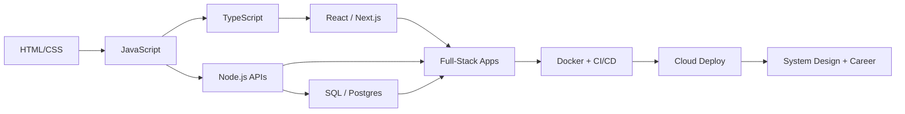

```
╔═══════════════════════════════════════════════════════════════════════════════════╗
║                                                                                   ║
║                                                                                   ║
║    ██████╗  ██████╗  █████╗ ██████╗     ████████╗ ██████╗                         ║
║    ██╔══██╗██╔═══██╗██╔══██╗██╔══██╗    ╚══██╔══╝██╔═══██╗                        ║
║    ██████╔╝██║   ██║███████║██║  ██║       ██║   ██║   ██║                        ║
║    ██╔══██╗██║   ██║██╔══██║██║  ██║       ██║   ██║   ██║                        ║
║    ██║  ██║╚██████╔╝██║  ██║██████╔╝       ██║   ╚██████╔╝                        ║
║    ╚═╝  ╚═╝ ╚═════╝ ╚═╝  ╚═╝╚═════╝        ╚═╝    ╚═════╝                         ║
║                                                                                   ║
║    ███████╗██╗   ██╗██╗     ██╗     ███████╗████████╗ █████╗  ██████╗██╗  ██╗     ║
║    ██╔════╝██║   ██║██║     ██║     ██╔════╝╚══██╔══╝██╔══██╗██╔════╝██║ ██╔╝     ║
║    █████╗  ██║   ██║██║     ██║     ███████╗   ██║   ███████║██║     █████╔╝      ║
║    ██╔══╝  ██║   ██║██║     ██║     ╚════██║   ██║   ██╔══██║██║     ██╔═██╗      ║
║    ██║     ╚██████╔╝███████╗███████╗███████║   ██║   ██║  ██║╚██████╗██║  ██╗     ║
║    ╚═╝      ╚═════╝ ╚══════╝╚══════╝╚══════╝   ╚═╝   ╚═╝  ╚═╝ ╚═════╝╚═╝  ╚═╝     ║
║                                                                                   ║
║       🛣️  Frontend → Backend → DevOps → FullStack Developer → 🚀                 ║
║                                                                                   ║
║       "Your journey to mastering the complete development stack"                  ║
║                                                                                   ║
╚═══════════════════════════════════════════════════════════════════════════════════╝
```

<p align="center">
  
  
  
  
  
</p>

A curated collection of **100% FREE** courses, docs, tutorials, and projects to go from zero → full-stack developer (with DevOps skills). Built for self-taught learners, career switchers, and anyone who wants a clear path without paywalls.

> **Last refreshed:** September 14, 2026 (mid-morning maintenance) — full link audit; added Scala/ZIO, Axum/Chi/Fiber/Echo, Django Ninja/Litestar, Quarto/Marimo/Jupyter Book/Observable Framework/NiceGUI/Reflex, Atlantis/Boundary/Molecule, PagerDuty/Opsgenie/Statuspage/Keep, Honeycomb, TryHackMe/OverTheWire, AFFiNE, Zero/TanStack DB, and Farm. Nothing previously listed was removed.

### Why this repo?
| | |
|---|---|
| 🎯 **One roadmap** | Frontend → Backend → Databases → DevOps → Career |
| 🆓 **Always free** | Every linked resource can be used at no cost |
| 🧭 **Opinionated paths** | Beginner → Advanced tracks so you are never stuck choosing |
| 🛠️ **Build, don't only watch** | Projects, labs, and interactive courses included |

### 🚀 How to use this roadmap
1. Pick a **[Learning Path](#learning-paths)** that matches your level
2. Start with **[Start Here](#start-here)** if you want the highest-signal resources first
3. Dive into any topic from the **Table of Contents** below
4. Build portfolio projects from **[Hands-on Projects](#hands-on-projects)** as you go
5. When stuck, use **[Communities & Open Source](#communities--open-source)** for help and real PRs

### Legend
| Icon | Meaning |
|------|---------|
| 📚 | Documentation / reference |
| 📖 | Tutorial / article series |
| 🎓 | Course / curriculum |
| 🎮 | Interactive / playground |
| 💻 | Practice / code / templates |
| 🗺️ | Roadmap / structured path |
| 🛠️ | Tool |
| 🎥 | Video |

<a id="start-here"></a>
## ⭐ Start Here — Highest-Signal Picks

If you only open a handful of links, open these:

| Focus | Resource | Why it matters |
|-------|----------|----------------|
| 🧭 Full curriculum | [Full Stack Open](https://fullstackopen.com/en/) | University of Helsinki's free modern fullstack course (React, Node, TypeScript, GraphQL, CI) |
| 🛤️ Structured path | [The Odin Project](https://www.theodinproject.com/) | Project-heavy free curriculum from foundations to fullstack |
| 🗺️ Visual roadmaps | [roadmap.sh](https://roadmap.sh/) | Interactive role roadmaps (Frontend, Backend, DevOps, AI) |
| 📘 Language depth | [JavaScript.info](https://javascript.info/) | Best free modern JS tutorial, beginner → advanced |
| 📘 Types | [TypeScript Handbook](https://www.typescriptlang.org/docs/handbook/intro.html) | Official TS source of truth |
| ⚛️ UI framework | [React Docs](https://react.dev/learn) | Official React learning guide |
| 🟢 Backend | [Node.js Learn](https://nodejs.org/en/learn/getting-started/introduction-to-nodejs) | Official Node learning path |
| 🗄️ SQL | [SQLBolt](https://sqlbolt.com/) | Fast interactive SQL practice |
| 🐳 Containers | [Docker Get Started](https://docs.docker.com/get-started/) | Official Docker hands-on |
| 🎓 CS foundation | [CS50x](https://cs50.harvard.edu/x/) | Harvard's free intro CS course |



<a id="table-of-contents"></a>
## 📚 Table of Contents

### 🎨 **Frontend Development**
- **Fundamentals**
  - [ HTML & CSS](#-html--css)
  - [ JavaScript](#-javascript)
  - [ TypeScript](#-typescript)
- **Frameworks & Libraries**
  - [   Frontend Frameworks](#-frontend-frameworks)
- **Design & UX**
  - [  UI/UX Design](#-uiux-design)

### ⚙️ **Backend Development**
- **Programming Languages**
  - [ Node.js](#-nodejs)
  - [ Python](#-python)
  - [ Java](#-java)
  - [ Ruby](#-ruby)
  - [ Rust](#-rust)
  - [ Go](#-go)
  - [ Scala](#-scala)
  - [ Julia](#-julia)
  - [ Clojure](#-clojure)
  - [ Elixir](#-elixir--phoenix)
  - [ PHP](#-php)
  - [ C# / .NET](#-c--net)

### 🗄️ **Database Technologies**
- **Relational Databases**
  - [   SQL Databases](#-sql-databases)
- **NoSQL & Document Stores**
  - [   NoSQL Databases](#-nosql-databases)
- **Stream Processing**
  - [  Stream Processing & Real-time](#-stream-processing--real-time-databases)

### 🔌 **APIs & Integration**
- [  APIs & Integration](#-apis--integration)

### 🛡️ **Security & Performance**
- [ Security](#-security)
- [ Auth & Identity](#auth--identity)
- [ Performance & Optimization](#-performance--optimization)

### ☁️ **DevOps & Cloud Infrastructure**
- **Containerization & Orchestration**
  - [ Docker & Containerization](#-docker--containerization)
  - [ Kubernetes](#-kubernetes)
- **Cloud Platforms**
  - [   Cloud Platforms](#-cloud-platforms)
- **Automation & Deployment**
  - [  CI/CD](#-cicd)
  - [  Monitoring & Logging](#-monitoring--logging)

### 🤖 **Automation & Workflows**
- [   Automation & Workflows](#-automation--workflows)

### 📈 **Data & Analytics**
- [  Data Visualization & Analytics](#-data-visualization--analytics)

### 🧠 **AI & Machine Learning**
- [   AI & Machine Learning](#-ai--machine-learning)
- [ AI for Developers](#-ai-for-developers)
- [ Scraping & Extraction](#scraping--extraction)
- [ MCP & Coding Agents](#mcp--coding-agents)

### 🖥️ **Content & Development Tools**
- [  Content Management](#-content-management)
- [  Development Tools & IDEs](#-development-tools--ides)

### 📊 **Visual Learning & Resources**
- [ Infographics & Visual Learning](#-infographics--visual-learning)

### 📱 **Mobile & Emerging Tech**
- [  Mobile Development](#-mobile-development)
- [  Web3 & Blockchain](#-web3--blockchain)

### 🎓 **Computer Science & Career**
- **Fundamentals**
  - [ Version Control](#-version-control)
  - [  Testing](#-testing)
  - [ Algorithms & Data Structures](#-algorithms--data-structures)
- **Architecture & Design**
  - [ System Design](#-system-design)
  - [ Computer Science Fundamentals](#-computer-science-fundamentals)
- **Documentation & Communication**
  - [ Documentation & Communication](#-documentation--communication)
- **Career Development**
  - [ Career & Interview Prep](#-career--interview-prep)
  - [ Free Development Services](#-free-development-services)

### 🧩 **Practice, A11y & Community**
- [ Hands-on Projects](#hands-on-projects)
- [ Accessibility](#accessibility)
- [ Browser & Networking](#browser--networking)
- [ Design Patterns](#design-patterns)
- [ Communities & Open Source](#communities--open-source)

### 📡 **Realtime & Media**
- [ Realtime & Media](#realtime--media)

### ⏱️ **Jobs & Reliability**
- [ Background Jobs & Queues](#background-jobs--queues)

### 🛒 **Product Essentials**
- [ Payments, Email & Files](#payments-email--files)
- [ SEO & Discoverability](#seo--discoverability)
- [ i18n & Feature Flags](#i18n--feature-flags)

### 🎯 **Learning Paths & Roadmaps**
- [ Structured Learning Paths](#learning-paths)

---

##  Frontend Development

###  HTML & CSS
| Resource | Type | Description |
|----------|------|-------------|
| [MDN Web Docs](https://developer.mozilla.org/en-US/docs/Web/HTML) | 📚 Documentation | Complete HTML reference and tutorials |
| [CSS-Tricks](https://css-tricks.com/) | 📖 Articles/Tutorials | Comprehensive CSS guides and tricks |
| [freeCodeCamp - Responsive Web Design](https://www.freecodecamp.org/learn/responsive-web-design/) | 🎓 Course | Complete certification course for HTML/CSS |
| [Flexbox Froggy](https://flexboxfroggy.com/) | 🎮 Interactive Game | Learn CSS Flexbox through games |
| [CSS Grid Garden](https://cssgridgarden.com/) | 🎮 Interactive Game | Master CSS Grid layout |
| [web.dev Learn HTML](https://web.dev/learn/html) | 📖 Course | Modern HTML course by Google |
| [MDN Learn Web Development](https://developer.mozilla.org/en-US/docs/Learn_web_development) | 🎓 Curriculum | Structured front-end learning path from MDN |
| [web.dev Learn CSS](https://web.dev/learn/css) | 🎓 Course | Modern CSS course by Google |
| [Josh Comeau — Interactive Flexbox](https://www.joshwcomeau.com/css/interactive-guide-to-flexbox/) | 🎮 Interactive | Exceptional visual Flexbox deep dive |
| [Frontend Mentor](https://www.frontendmentor.io/) | 💻 Practice | Real UI challenges to build your portfolio |
| [Can I Use](https://www.caniuse.com/) | 🛠️ Tool | Browser support tables for web features |
| [CSS Tricks — Complete Guide to Flexbox](https://css-tricks.com/snippets/css/a-guide-to-flexbox/) | 📋 Guide | The classic Flexbox reference |
| [CSS Tricks — Complete Guide to Grid](https://css-tricks.com/snippets/css/complete-guide-grid/) | 📋 Guide | The classic CSS Grid reference |
| [Every Layout](https://every-layout.dev/) | 📖 Guide | Compositional layout patterns that scale |
| [Sass Guide](https://sass-lang.com/guide/) | 📖 Guide | CSS with variables, nesting, and mixins |
| [PostCSS](https://postcss.org/) | 📚 Documentation | Transform CSS with JavaScript plugins |
| [Lightning CSS](https://lightningcss.dev/) | 📚 Documentation | Extremely fast CSS parser, transformer, and minifier |
| [Open Props](https://open-props.style/) | 📚 Documentation | Supercharged CSS variables |
| [CSS Nesting](https://developer.mozilla.org/en-US/docs/Web/CSS/CSS_nesting) | 📚 Documentation | Native nested style rules in CSS |
| [Cascade layers (@layer)](https://developer.mozilla.org/en-US/docs/Web/CSS/@layer) | 📚 Documentation | Explicit cascade control for large stylesheets |
| [:has() selector](https://developer.mozilla.org/en-US/docs/Web/CSS/:has) | 📚 Documentation | Parent/relational selectors in CSS |
| [oklch()](https://developer.mozilla.org/en-US/docs/Web/CSS/color_value/oklch) | 📚 Documentation | Perceptually uniform CSS color functions |
| [CSS Anchor Positioning](https://developer.mozilla.org/en-US/docs/Web/CSS/CSS_anchor_positioning) | 📚 Documentation | Position elements relative to anchor elements |
| [CSS Container Queries](https://developer.mozilla.org/en-US/docs/Web/CSS/CSS_containment/Container_queries) | 📚 Documentation | Style components based on their container size |
| [Popover API](https://developer.mozilla.org/en-US/docs/Web/API/Popover_API) | 📚 Documentation | Native top-layer popovers without custom JS plumbing |
| [Scroll-driven Animations](https://developer.mozilla.org/en-US/docs/Web/CSS/CSS_scroll-driven_animations) | 📚 Documentation | Tie CSS animations to scroll progress |
| [color-mix()](https://developer.mozilla.org/en-US/docs/Web/CSS/color_value/color-mix) | 📚 Documentation | Mix colors in a given color space in CSS |
| [CSS Subgrid](https://developer.mozilla.org/en-US/docs/Web/CSS/CSS_grid_layout/Subgrid) | 📚 Documentation | Nested grids that inherit parent track sizing |
| [Baseline (web platform)](https://web.dev/baseline) | 📋 Reference | Which web features are ready to use across browsers |
| [View Transitions API](https://developer.mozilla.org/en-US/docs/Web/API/View_Transition_API) | 📚 Documentation | Animated transitions between DOM states/pages |
| [Navigation API](https://developer.mozilla.org/en-US/docs/Web/API/Navigation_API) | 📚 Documentation | Modern API for app navigations |
| [Speculation Rules API](https://developer.mozilla.org/en-US/docs/Web/API/Speculation_Rules_API) | 📚 Documentation | Declarative prefetch/prerender for faster navigations |
| [103 Early Hints](https://developer.mozilla.org/en-US/docs/Web/HTTP/Reference/Status/103) | 📚 Documentation | Warm connections/caches before the final response |
| [modulepreload](https://developer.mozilla.org/en-US/docs/Web/HTML/Reference/Attributes/rel/modulepreload) | 📚 Documentation | Preload module scripts and their dependencies |
| [UnoCSS](https://unocss.dev/) | 📚 Documentation | Instant atomic CSS engine |
| [Panda CSS](https://panda-css.com/docs/overview/getting-started) | 📚 Documentation | CSS-in-JS with build-time extraction |
| [Vanilla Extract](https://vanilla-extract.style/) | 📚 Documentation | Zero-runtime stylesheets in TypeScript |
| [StyleX](https://stylexjs.com/docs/learn/) | 📚 Documentation | Scalable styling system from Meta |
| [CSS Modules](https://github.com/css-modules/css-modules) | 📚 Documentation | Locally scoped CSS by default |
| [Radix Themes](https://www.radix-ui.com/themes/docs/overview/getting-started) | 📚 Documentation | Pre-styled accessible components built on Radix |
| [web.dev Learn Design](https://web.dev/learn/design) | 🎓 Course | Responsive and intrinsic design course |

###  JavaScript
| Resource | Type | Description |
|----------|------|-------------|
| [JavaScript.info](https://javascript.info/) | 📖 Tutorial | Modern JavaScript tutorial from basics to advanced |
| [Temporal (MDN)](https://developer.mozilla.org/en-US/docs/Web/JavaScript/Reference/Global_Objects/Temporal) | 📚 Documentation | Modern dates and times API for JavaScript |
| [Explicit Resource Management](https://github.com/tc39/proposal-explicit-resource-management) | 📋 Proposal | `using` / `await using` for deterministic cleanup |
| [freeCodeCamp - JavaScript Algorithms (v8)](https://www.freecodecamp.org/learn/javascript-algorithms-and-data-structures-v8/) | 🎓 Course | Modern JavaScript fundamentals and algorithms |
| [Eloquent JavaScript](https://eloquentjavascript.net/) | 📚 Book | Free online book about JavaScript programming |
| [You Don't Know JS](https://github.com/getify/You-Dont-Know-JS) | 📚 Book Series | Deep dive into JavaScript concepts |
| [30 Days of JavaScript](https://github.com/Asabeneh/30-Days-Of-JavaScript) | 🏆 Challenge | 30-day JavaScript programming challenge |
| [JavaScript30](https://javascript30.com/) | 🎓 Course | 30 free vanilla JS build projects by Wes Bos |
| [web.dev Learn JavaScript](https://web.dev/learn/javascript) | 🎓 Course | Modern JavaScript course by Google |
| [Patterns.dev](https://www.patterns.dev/) | 📚 Guide | Modern web app design and rendering patterns |
| [33 JS Concepts](https://github.com/leonardomso/33-js-concepts) | 📋 Guide | 33 concepts every JavaScript developer should know |

###  TypeScript
| Resource | Type | Description |
|----------|------|-------------|
| [TypeScript Official Docs](https://www.typescriptlang.org/docs/) | 📚 Documentation | Complete TypeScript language documentation |
| [TypeScript Handbook](https://www.typescriptlang.org/docs/handbook/intro.html) | 📚 Book | Official handbook covering types, modules, and tooling |
| [TypeScript for JavaScript Programmers](https://www.typescriptlang.org/docs/handbook/typescript-in-5-minutes.html) | 📖 Tutorial | Fast on-ramp if you already know JavaScript |
| [Total TypeScript Tutorials](https://www.totaltypescript.com/tutorials) | 🎓 Tutorials | Free practical TypeScript tutorials |
| [React TypeScript Cheatsheet](https://react-typescript-cheatsheet.netlify.app/) | 📋 Cheatsheet | Patterns for using TypeScript with React |
| [TypeScript Roadmap](https://roadmap.sh/typescript) | 🗺️ Roadmap | Interactive TypeScript developer roadmap |

###  Frontend Frameworks
| Resource | Type | Description |
|----------|------|-------------|
| [React Official Docs](https://react.dev/learn) | 📖 Tutorial | Official React learning guide (react.dev) |
| [React 19 Blog](https://react.dev/blog/2024/12/05/react-19) | 📰 Article | What's new in React 19 |
| [React Server Components](https://react.dev/reference/rsc/server-components) | 📚 Documentation | Components that render on the server |
| [React Server Functions](https://react.dev/reference/rsc/server-functions) | 📚 Documentation | Call server-side functions from the client |
| [React Compiler](https://react.dev/learn/react-compiler) | 📚 Documentation | Automatic memoization compiler for React |
| [Vue.js Guide](https://vuejs.org/guide/) | 📚 Documentation | Complete Vue.js learning guide |
| [Pinia Docs](https://pinia.vuejs.org/) | 📚 Documentation | Official state management library for Vue |
| [VueUse](https://vueuse.org/) | 📚 Documentation | Collection of essential Vue Composition utilities |
| [Nuxt UI](https://ui.nuxt.com/getting-started) | 📚 Documentation | Fully styled and customizable Vue component library |
| [Nuxt Hub](https://hub.nuxt.com/docs/getting-started) | 📚 Documentation | Full-stack Nuxt platform features (storage, KV, AI, DB) |
| [Angular Tutorial](https://angular.dev/tutorials/learn-angular) | 📖 Tutorial | Official Angular framework tutorial |
| [Svelte Tutorial](https://svelte.dev/tutorial) | 🎮 Interactive Tutorial | Learn Svelte with hands-on examples |
| [Svelte 5 Overview](https://svelte.dev/docs/svelte/overview) | 📚 Documentation | Svelte 5 language and runes overview |
| [Svelte $state](https://svelte.dev/docs/svelte/$state) | 📚 Documentation | Reactive state rune in Svelte 5 |
| [Next.js Learn](https://nextjs.org/learn) | 🎓 Course | Complete Next.js course by Vercel |
| [Next.js App Router](https://nextjs.org/docs/app) | 📚 Documentation | Modern Next.js routing, layouts, and rendering |
| [Turbopack](https://nextjs.org/docs/app/api-reference/turbopack) | 📚 Documentation | Incremental bundler integrated with Next.js |
| [Astro Docs](https://docs.astro.build/) | 📚 Documentation | Content-focused web framework with islands architecture |
| [Astro DB](https://docs.astro.build/en/guides/astro-db/) | 📚 Documentation | Fully managed SQL database designed for Astro |
| [Astro Actions](https://docs.astro.build/en/guides/actions/) | 📚 Documentation | Type-safe backend functions from Astro frontends |
| [Astro Content Collections](https://docs.astro.build/en/guides/content-collections/) | 📚 Documentation | Typed Markdown/MDX content pipelines |
| [Starlight](https://starlight.astro.build/) | 📚 Documentation | Documentation website framework built on Astro |
| [Fumadocs](https://fumadocs.dev/docs) | 📚 Documentation | Docs framework for Next.js |
| [Nextra](https://nextra.site/) | 📚 Documentation | Next.js-based documentation/static site toolkit |
| [Docusaurus](https://docusaurus.io/docs) | 📚 Documentation | Easy-to-maintain open-source documentation sites |
| [VitePress](https://vitepress.dev/) | 📚 Documentation | Vite & Vue powered static site generator |
| [MkDocs](https://www.mkdocs.org/) | 📚 Documentation | Project documentation with Markdown |
| [Material for MkDocs](https://squidfunk.github.io/mkdocs-material/) | 📚 Documentation | Beautiful MkDocs theme |
| [mdBook](https://rust-lang.github.io/mdBook/) | 📚 Documentation | Create books from Markdown (Rust tooling) |
| [Mintlify](https://mintlify.com/docs) | 📚 Documentation | Beautiful documentation platform for developers |
| [Scalar](https://scalar.com/) | 🛠️ Tool | Modern OpenAPI documentation and API client |
| [Redocly Docs](https://redocly.com/docs) | 📚 Documentation | OpenAPI docs, linting, and API governance |
| [Swagger UI](https://github.com/swagger-api/swagger-ui) | 🛠️ Tool | Interactive OpenAPI/Swagger documentation UI |
| [Vite Guide](https://vite.dev/guide/) | 📖 Guide | Next-generation frontend build tool |
| [Farm Docs](https://www.farmfe.org/docs/quick-start) | 📚 Documentation | Extremely fast Vite-compatible web build tool written in Rust |
| [Rolldown](https://rolldown.rs/) | 📚 Documentation | Rust-based JavaScript bundler (Vite's future bundler) |
| [Rspack](https://rspack.dev/guide/start/introduction) | 📚 Documentation | Fast Rust-based bundler compatible with the Webpack ecosystem |
| [esbuild](https://esbuild.github.io/) | 📚 Documentation | Extremely fast JavaScript bundler and minifier |
| [SWC](https://swc.rs/docs/getting-started) | 📚 Documentation | Super-fast TypeScript/JavaScript compiler |
| [Webpack Concepts](https://webpack.js.org/concepts/) | 📚 Documentation | Module bundler concepts still widely used in production |
| [Module Federation](https://module-federation.io/) | 📚 Documentation | Share code between independently deployed apps |
| [Import maps (MDN)](https://developer.mozilla.org/en-US/docs/Web/HTML/Reference/Elements/script/type/importmap) | 📚 Documentation | Control browser module resolution without a bundler |
| [Tailwind CSS Docs](https://tailwindcss.com/docs) | 📚 Documentation | Utility-first CSS framework |
| [shadcn/ui Docs](https://ui.shadcn.com/docs) | 📚 Documentation | Accessible component patterns built with Radix and Tailwind |
| [daisyUI](https://daisyui.com/docs/) | 📚 Documentation | Tailwind CSS component library with semantic class names |
| [Flowbite](https://flowbite.com/docs/getting-started/introduction/) | 📚 Documentation | Tailwind CSS component library and design system |
| [Park UI](https://park-ui.com/docs) | 📚 Documentation | Beautifully designed components built with Ark UI and Panda CSS |
| [TanStack Query](https://tanstack.com/query/latest/docs/framework/react/overview) | 📚 Documentation | Powerful async state management for React |
| [TanStack Router](https://tanstack.com/router/latest) | 📚 Documentation | Type-safe routing for React and solid apps |
| [TanStack Virtual](https://tanstack.com/virtual/latest) | 📚 Documentation | Headless UI for virtualizing large lists |
| [Zustand](https://github.com/pmndrs/zustand) | 📚 Documentation | Small, fast React state management |
| [Jotai](https://jotai.org/) | 📚 Documentation | Primitive and flexible React state management |
| [Redux Toolkit](https://redux-toolkit.js.org/introduction/getting-started) | 📚 Documentation | Official, opinionated Redux toolset |
| [MobX](https://mobx.js.org/README.html) | 📚 Documentation | Simple, scalable state management |
| [XState](https://stately.ai/docs/xstate) | 📚 Documentation | State machines and statecharts for modern apps |
| [Valtio](https://valtio.pmnd.rs/) | 📚 Documentation | Proxy-based mutable state for React and vanilla |
| [Immer](https://immerjs.github.io/immer/) | 📚 Documentation | Work with immutable state as if it were mutable |
| [Preact Signals](https://preactjs.com/guide/v10/signals/) | 📚 Documentation | Fine-grained reactive state with Signals |
| [Nano Stores](https://github.com/nanostores/nanostores) | 📚 Documentation | Tiny state managers for React/Vue/Svelte/Solid |
| [SWR](https://swr.vercel.app/) | 📚 Documentation | React Hooks for data fetching |
| [urql](https://commerce.nearform.com/open-source/urql/docs/) | 📚 Documentation | Highly customizable GraphQL client |
| [Relay](https://relay.dev/docs/) | 📚 Documentation | GraphQL client for React from Meta |
| [TanStack Table](https://tanstack.com/table/latest) | 📚 Documentation | Headless UI for building powerful tables |
| [htmx Docs](https://htmx.org/docs/) | 📚 Documentation | High-power HTML attributes for modern UIs |
| [Hotwire Handbook](https://hotwired.dev/) | 📚 Documentation | HTML-over-the-wire approach (Turbo + Stimulus) |
| [Turbo Handbook](https://turbo.hotwired.dev/handbook/introduction) | 📚 Documentation | Drive pages with HTML instead of heavy SPA JS |
| [Stimulus Handbook](https://stimulus.hotwired.dev/handbook/introduction) | 📚 Documentation | Modest JavaScript framework for the HTML you have |
| [Inertia.js Docs](https://inertiajs.com/) | 📚 Documentation | Build SPAs using classic server-side routing |
| [Laravel Livewire](https://livewire.laravel.com/docs) | 📚 Documentation | Dynamic interfaces powered by Laravel |
| [Lit Docs](https://lit.dev/docs/) | 📚 Documentation | Simple, fast web components library |
| [MDN Custom Elements](https://developer.mozilla.org/en-US/docs/Web/API/Web_components/Using_custom_elements) | 📚 Documentation | Native Web Components custom elements API |
| [Shoelace](https://shoelace.style/) | 📚 Documentation | Forward-thinking library of web components |
| [Open Web Components](https://open-wc.org/) | 📚 Documentation | Guides and tools for web components |
| [Full Stack Open](https://fullstackopen.com/en/) | 🎓 Course | Deep React/Node/GraphQL fullstack curriculum |
| [30 Days of React](https://github.com/Asabeneh/30-Days-Of-React) | 🏆 Challenge | Hands-on React practice over 30 days |
| [React Router](https://reactrouter.com/home) | 📚 Documentation | Declarative routing for React apps |
| [TanStack Router](https://tanstack.com/router/latest/docs/framework/react/overview) | 📚 Documentation | Type-safe routing for React |
| [Zustand](https://zustand.docs.pmnd.rs/) | 📚 Documentation | Small, fast React state management |
| [Radix Primitives](https://www.radix-ui.com/primitives/docs/overview/introduction) | 📚 Documentation | Unstyled accessible UI primitives |
| [Storybook](https://storybook.js.org/docs) | 📚 Documentation | Build and test UI components in isolation |
| [Storybook Test](https://storybook.js.org/docs/writing-tests) | 📚 Documentation | Component, interaction, and accessibility tests in Storybook |
| [Chromatic Docs](https://www.chromatic.com/docs/) | 📚 Documentation | Visual testing and review for Storybook |
| [Percy Docs](https://www.browserstack.com/docs/percy) | 📚 Documentation | Visual testing and review platform |
| [Playwright Component Testing](https://playwright.dev/docs/test-components) | 📚 Documentation | Test components with Playwright |
| [Vitest Browser Mode](https://vitest.dev/guide/browser/) | 📚 Documentation | Run Vitest tests in real browsers |
| [Ladle](https://ladle.dev/) | 📚 Documentation | Fast Storybook alternative powered by Vite |
| [Histoire](https://histoire.dev/) | 📚 Documentation | Vite-native component workshop |
| [Motion](https://motion.dev/docs) | 📚 Documentation | Modern animation library for the web |
| [Remix Docs](https://remix.run/docs/en/main) | 📚 Documentation | Full-stack web framework focused on web standards |
| [Nuxt Docs](https://nuxt.com/docs/getting-started/introduction) | 📚 Documentation | The Intuitive Vue Framework |
| [SvelteKit Docs](https://kit.svelte.dev/docs/introduction) | 📚 Documentation | Full-stack Svelte application framework |
| [Qwik Getting Started](https://qwik.dev/docs/getting-started/) | 📚 Documentation | Resumable framework for instant-loading apps |
| [Qwik City](https://qwik.dev/docs/qwikcity/) | 📚 Documentation | Meta-framework for Qwik apps (routing, data loading) |
| [SolidStart](https://github.com/solidjs/solid-start) | 📚 Documentation | Full-stack meta-framework for SolidJS (official docs often bot-block; GitHub repo) |
| [SolidJS](https://github.com/solidjs/solid) | 📚 Documentation | Fine-grained reactive UI library (official site often bot-blocks; GitHub source/docs) |
| [Fresh](https://fresh.deno.dev/docs/introduction) | 📚 Documentation | Next-gen web framework for Deno with islands |
| [Analog](https://analogjs.org/docs) | 📚 Documentation | Fullstack meta-framework for Angular |
| [TanStack Start](https://tanstack.com/start/latest) | 📚 Documentation | Full-stack framework powered by TanStack Router |
| [RedwoodJS Docs](https://docs.redwoodjs.com/) | 📚 Documentation | Full-stack, Jamstack-oriented React framework |
| [Bulletproof React](https://github.com/alan2207/bulletproof-react) | 📋 Guide | Opinionated React architecture best practices |
| [Alpine.js](https://alpinejs.dev/start-here) | 📖 Tutorial | Lightweight JavaScript framework for HTML-first UIs |
| [Lit](https://lit.dev/docs/) | 📚 Documentation | Simple, fast web components |
| [useHooks](https://usehooks.com/) | 💻 Collection | High-quality React hooks recipes |
| [useHooks-ts](https://usehooks-ts.com/) | 💻 Collection | TypeScript-ready React hooks |
| [MDN WebAssembly](https://developer.mozilla.org/en-US/docs/WebAssembly) | 📚 Documentation | Run high-performance Wasm modules in the browser |
| [WebAssembly Developer Guide](https://webassembly.org/getting-started/developers-guide/) | 📖 Guide | Official Wasm getting-started path |
| [Bytecode Alliance](https://bytecodealliance.org/) | 🌐 Organization | Open-source Wasm runtime and standards community |
| [Wasm Component Model](https://component-model.bytecodealliance.org/) | 📚 Documentation | Compose Wasm modules across languages |
| [Wasmtime](https://wasmtime.dev/) | 📚 Documentation | Fast and secure WebAssembly runtime |
| [Spin Docs](https://developer.fermyon.com/spin/v3/index) | 📚 Documentation | Developer tool for building and running Wasm microservices |
| [WasmCloud Docs](https://wasmcloud.com/docs/intro/) | 📚 Documentation | Distributed Wasm application platform |
| [Dapr Docs](https://docs.dapr.io/) | 📚 Documentation | APIs for building portable, resilient microservices |
| [KEDA Docs](https://keda.sh/docs/) | 📚 Documentation | Kubernetes event-driven autoscaling |
| [Wasmer](https://wasmer.io/) | 📚 Documentation | Universal Wasm runtime for servers and browsers |
| [WasmEdge](https://wasmedge.org/docs/) | 📚 Documentation | Cloud-native Wasm runtime for edge and servers |
| [Spin](https://developer.fermyon.com/spin/v3/index) | 📚 Documentation | Developer tool for building Wasm microservices |
| [Extism](https://extism.org/) | 📚 Documentation | Make any software programmable with Wasm plugins |

###  UI/UX Design
| Resource | Type | Description |
|----------|------|-------------|
| [Material Design 3](https://m3.material.io/) | 📋 Guidelines | Google Material Design 3 guidelines |
| [Apple Human Interface Guidelines](https://developer.apple.com/design/human-interface-guidelines/) | 📋 Guidelines | Apple's design principles and patterns |
| [Figma Resource Library](https://www.figma.com/resource-library/) | 🎓 Course | Free Figma learning resources and design courses |
| [Adobe XD Community](https://community.adobe.com/t5/adobe-xd/ct-p/ct-adobe-xd) | 👥 Community | Adobe XD community hub (product discontinued; useful for existing projects) |
| [The Design of Everyday Things](https://www.basicbooks.com/titles/don-norman/the-design-of-everyday-things/9780465050659/) | 📚 Book | Essential UX design principles |
| [Can't Unsee](https://cantunsee.space/) | 🎮 Game | Design eye training game |
| [Heroicons](https://heroicons.com/) | 🎨 Icons | Beautiful hand-crafted SVG icons by the Tailwind team |
| [Lucide](https://lucide.dev/guide/packages/lucide-react) | 🎨 Icons | Consistent open-source icon set |
| [Phosphor Icons](https://phosphoricons.com/) | 🎨 Icons | Flexible icon family for interfaces |
| [unDraw](https://undraw.co/) | 🎨 Illustrations | Free open-source illustrations for projects |
| [Coolors](https://coolors.co/) | 🛠️ Tool | Fast color palette generator |
| [Happy Hues](https://www.happyhues.co/) | 🎨 Inspiration | Curated color palette moods for UI |

##  Backend Development

###  Node.js
| Resource | Type | Description |
|----------|------|-------------|
| [Node.js Learn](https://nodejs.org/en/learn/getting-started/introduction-to-nodejs) | 📚 Documentation | Official Node.js learning guides |
| [Node.js Test Runner](https://nodejs.org/api/test.html) | 📚 Documentation | Built-in `node:test` module |
| [Single Executable Apps](https://nodejs.org/api/single-executable-applications.html) | 📚 Documentation | Bundle Node apps into a single binary |
| [Permission Model](https://nodejs.org/api/permissions.html) | 📚 Documentation | Restrict runtime access to FS/network/etc. |
| [Undici](https://undici.nodejs.org/) | 📚 Documentation | Node's modern HTTP client and fetch implementation |
| [Package exports](https://nodejs.org/api/packages.html) | 📚 Documentation | Dual ESM/CJS packages and export maps |
| [create-t3-app](https://create.t3.gg/) | 🛠️ Tool | Scaffold a typesafe Next.js fullstack app |
| [freeCodeCamp - Back End Development and APIs](https://www.freecodecamp.org/learn/back-end-development-and-apis/) | 🎓 Course | Backend development with Node.js and Express |
| [Express.js Guide](https://expressjs.com/en/guide/routing.html) | 📚 Documentation | Complete Express.js framework guide |
| [Fastify Getting Started](https://fastify.dev/docs/latest/Guides/Getting-Started/) | 📚 Documentation | Fast and low-overhead Node.js web framework |
| [NestJS Docs](https://docs.nestjs.com/) | 📚 Documentation | Progressive Node.js framework for scalable server apps |
| [Hono Docs](https://hono.dev/docs/) | 📚 Documentation | Ultrafast web framework for the Edges |
| [Elysia](https://elysiajs.com/quick-start.html) | 📚 Documentation | Ergonomic TypeScript framework for Bun |
| [Nitro Guide](https://nitro.build/guide) | 📚 Documentation | Next-generation server toolkit |
| [Node.js Best Practices](https://github.com/goldbergyoni/nodebestpractices) | 📋 Guide | Comprehensive Node.js best practices |
| [The Odin Project - NodeJS](https://www.theodinproject.com/paths/full-stack-javascript) | 🎓 Course | Full-stack JavaScript path including Node |
| [Bun Docs](https://bun.sh/docs) | 📚 Documentation | Fast all-in-one JavaScript runtime and toolkit |
| [Deno Docs](https://docs.deno.com/) | 📚 Documentation | Modern secure TypeScript-first runtime |
| [Deno Deploy](https://docs.deno.com/deploy/manual/) | ☁️ Platform | Globally distributed TypeScript serverless |
| [pnpm Installation](https://pnpm.io/installation) | 📚 Documentation | Fast, disk-efficient package manager |

###  Python
| Resource | Type | Description |
|----------|------|-------------|
| [Python.org Tutorial](https://docs.python.org/3/tutorial/) | 📖 Tutorial | Official Python tutorial |
| [Django Tutorial](https://docs.djangoproject.com/en/stable/intro/tutorial01/) | 📖 Tutorial | Official Django web framework tutorial |
| [Flask Mega-Tutorial](https://blog.miguelgrinberg.com/post/the-flask-mega-tutorial-part-i-hello-world) | 📖 Tutorial Series | Comprehensive Flask tutorial |
| [FastAPI Tutorial](https://fastapi.tiangolo.com/tutorial/) | 📖 Tutorial | Modern Python API development |
| [Django Ninja](https://django-ninja.dev/) | 📚 Documentation | Fast Django REST framework inspired by FastAPI |
| [Litestar Docs](https://docs.litestar.dev/latest/) | 📚 Documentation | High-performance ASGI API framework for Python |
| [NiceGUI Docs](https://nicegui.io/documentation) | 📚 Documentation | Build web UIs in Python with minimal effort |
| [Reflex Docs](https://reflex.dev/docs/getting-started/introduction/) | 📚 Documentation | Build web apps in pure Python |
| [Mega Tutorial](https://github.com/getvmio/free-python-resources) | 📖 Knowledge Repo | Modern Python development |

###  Java
| Resource | Type | Description |
|----------|------|-------------|
| [Oracle Java Tutorials](https://docs.oracle.com/javase/tutorial/) | 📖 Tutorial | Official Java programming tutorials |
| [Spring Boot Guides](https://spring.io/guides) | 📖 Tutorials | Spring Boot framework tutorials |
| [Micrometer Docs](https://docs.micrometer.io/) | 📚 Documentation | Application metrics facade for JVM apps |
| [Resilience4j Docs](https://resilience4j.readme.io/) | 📚 Documentation | Lightweight fault-tolerance library for Java |
| [Spring Modulith](https://docs.spring.io/spring-modulith/reference/) | 📚 Documentation | Modular monoliths with Spring Boot |
| [Spring WebFlux](https://docs.spring.io/spring-framework/reference/web/webflux.html) | 📚 Documentation | Reactive web stack for Spring |
| [Quarkus Guides](https://quarkus.io/guides/) | 📚 Documentation | Supersonic Subatomic Java framework |
| [Micronaut Docs](https://docs.micronaut.io/latest/guide/) | 📚 Documentation | Modern JVM framework for microservices and serverless |
| [Ktor Docs](https://ktor.io/docs/welcome.html) | 📚 Documentation | Asynchronous Kotlin framework for connected applications |
| [Java Code Geeks](https://www.javacodegeeks.com/) | 📰 Articles | Java development articles and tutorials |

###  Ruby
| Resource | Type | Description |
|----------|------|-------------|
| [Ruby Documentation](https://ruby-doc.org/) | 📚 Documentation | Official Ruby language documentation |
| [Ruby on Rails Guides](https://guides.rubyonrails.org/) | 📖 Tutorial | Complete Rails framework guides |
| [The Odin Project - Ruby](https://www.theodinproject.com/paths/full-stack-ruby-on-rails) | 🎓 Course | Full-stack Ruby on Rails curriculum |
| [Ruby Koans](http://rubykoans.com/) | 🧘 Interactive | Learn Ruby through test-driven development |

###  Rust
| Resource | Type | Description |
|----------|------|-------------|
| [The Rust Programming Language](https://doc.rust-lang.org/book/) | 📚 Book | Official Rust book (free online) |
| [Zig Learn](https://ziglang.org/learn/) | 📚 Documentation | Simple language for maintaining robust software |
| [Gleam Book](https://gleam.run/book/) | 📚 Book | Type-safe language for the Erlang VM |
| [Rust by Example](https://doc.rust-lang.org/rust-by-example/) | 📖 Examples | Learn Rust through annotated examples |
| [Rustlings](https://github.com/rust-lang/rustlings) | 🏆 Exercises | Small exercises to get you used to Rust |
| [Actix Web Guide](https://actix.rs/docs/) | 📖 Tutorial | Web framework for Rust |
| [Axum](https://docs.rs/axum/latest/axum/) | 📚 Documentation | Ergonomic web framework built with Tokio and Tower |
| [Rocket Guide](https://rocket.rs/guide/v0.5/) | 📚 Documentation | Type-safe, async web framework for Rust |

###  Go
| Resource | Type | Description |
|----------|------|-------------|
| [A Tour of Go](https://tour.golang.org/) | 🎮 Interactive Tutorial | Official interactive Go tutorial |
| [Go by Example](https://gobyexample.com/) | 📖 Examples | Hands-on introduction to Go |
| [Effective Go](https://golang.org/doc/effective_go.html) | 📋 Guide | Tips for writing clear Go code |
| [Chi Docs](https://go-chi.io/#/pages/intro) | 📚 Documentation | Lightweight, idiomatic Go HTTP router |
| [Echo Docs](https://echo.labstack.com/docs/) | 📚 Documentation | High-performance Go web framework |
| [Fiber Docs](https://docs.gofiber.io/) | 📚 Documentation | Express-inspired web framework for Go |
| [Go Web Examples](https://gowebexamples.com/) | 📖 Examples | Web development examples in Go |

###  Scala
| Resource | Type | Description |
|----------|------|-------------|
| [Scala Documentation](https://docs.scala-lang.org/) | 📚 Documentation | Official Scala language documentation |
| [ZIO Docs](https://zio.dev/guides/quickstarts/hello-world) | 📚 Documentation | Type-safe, composable asynchronous and concurrent Scala library |
| [Play Framework Docs](https://www.playframework.com/documentation/latest/Home) | 📚 Documentation | High-productivity web framework for Java and Scala |

###  Julia
| Resource | Type | Description |
|----------|------|-------------|
| [Julia Documentation](https://docs.julialang.org/) | 📚 Documentation | Official Julia language documentation |
| [Julia Learning Resources](https://julialang.org/learning/) | 🎓 Courses | Official curated Julia learning resources |
| [OCaml Learn](https://ocaml.org/docs) | 📚 Documentation | Official OCaml language learning docs |
| [F# Documentation](https://learn.microsoft.com/en-us/dotnet/fsharp/) | 📚 Documentation | Functional-first language for .NET |
| [Crystal Docs](https://crystal-lang.org/reference/) | 📚 Documentation | Ruby-inspired language with static typing and native speed |
| [Haskell Documentation](https://www.haskell.org/documentation/) | 📚 Documentation | Official Haskell language documentation and guides |
| [Livebook](https://livebook.dev/) | 🛠️ Tool | Interactive Elixir notebooks for learning and data apps |

###  Clojure
| Resource | Type | Description |
|----------|------|-------------|
| [Clojure Guides](https://clojure.org/guides/getting_started) | 📖 Guide | Official Clojure getting started guides |
| [ClojureDocs](https://clojuredocs.org/) | 📚 Documentation | Community-powered Clojure documentation and examples |

###  Elixir & Phoenix
| Resource | Type | Description |
|----------|------|-------------|
| [Elixir Getting Started](https://elixir-lang.org/getting-started/introduction.html) | 📖 Tutorial | Official Elixir language introduction |
| [Phoenix Overview](https://hexdocs.pm/phoenix/overview.html) | 📚 Documentation | Productive web framework for Elixir |
| [Phoenix Framework](https://www.phoenixframework.org/) | 🌐 Website | Guides and ecosystem for Phoenix |
| [Phoenix LiveView](https://hexdocs.pm/phoenix_live_view/Phoenix.LiveView.html) | 📚 Documentation | Rich, real-time UIs with server-rendered HTML |
| [Phoenix LiveView Guides](https://hexdocs.pm/phoenix_live_view/welcome.html) | 📖 Guide | Official LiveView getting-started path |

###  PHP
| Resource | Type | Description |
|----------|------|-------------|
| [PHP Manual](https://www.php.net/manual/en/) | 📚 Documentation | Official PHP language reference |
| [PHP The Right Way](https://phptherightway.com/) | 📖 Guide | Modern PHP best practices |
| [Laravel Docs](https://laravel.com/docs) | 📚 Documentation | Popular PHP web application framework |
| [Laravel Bootcamp](https://bootcamp.laravel.com/) | 🎓 Course | Official hands-on Laravel tutorial |
| [Symfony Docs](https://symfony.com/doc/current/index.html) | 📚 Documentation | Reusable PHP components and full-stack framework |
| [Composer Docs](https://getcomposer.org/doc/) | 📚 Documentation | Dependency manager for PHP |

###  C# / .NET
| Resource | Type | Description |
|----------|------|-------------|
| [C# Documentation](https://learn.microsoft.com/en-us/dotnet/csharp/) | 📚 Documentation | Official C# language docs on Microsoft Learn |
| [.NET Docs](https://learn.microsoft.com/en-us/dotnet/) | 📚 Documentation | Build apps with .NET across web, cloud, and desktop |
| [ASP.NET Core Tutorials](https://learn.microsoft.com/en-us/aspnet/core/tutorials/) | 📖 Tutorials | Build web apps and APIs with ASP.NET Core |
| [Minimal APIs overview](https://learn.microsoft.com/en-us/aspnet/core/fundamentals/minimal-apis) | 📚 Documentation | Lightweight HTTP APIs in ASP.NET Core |
| [Entity Framework Core](https://learn.microsoft.com/en-us/ef/core/) | 📚 Documentation | Modern object-database mapper for .NET |
| [Blazor](https://learn.microsoft.com/en-us/aspnet/core/blazor/) | 📚 Documentation | Build interactive web UIs with C# |

##  Databases

###  SQL Databases
| Resource | Type | Description |
|----------|------|-------------|
| [W3Schools SQL Tutorial](https://www.w3schools.com/sql/) | 📖 Tutorial | Complete SQL tutorial with examples |
| [Mode SQL Tutorial](https://mode.com/sql-tutorial/) | 📖 Tutorial | Practical SQL tutorial for analysts and developers |
| [PostgreSQL Tutorial](https://www.postgresqltutorial.com/) | 📖 Tutorial | Comprehensive PostgreSQL guide |
| [Official PostgreSQL Tutorial](https://www.postgresql.org/docs/current/tutorial.html) | 📖 Tutorial | Official Postgres getting-started tutorial |
| [PostgreSQL EXPLAIN](https://www.postgresql.org/docs/current/using-explain.html) | 📖 Guide | Understand and tune query plans |
| [SQLite Docs](https://sqlite.org/docs.html) | 📚 Documentation | Lightweight embedded SQL database |
| [Turso Docs](https://docs.turso.tech/introduction) | 📚 Documentation | Edge-hosted SQLite (libSQL) platform |
| [Neon PostgreSQL Tutorial](https://neon.com/postgresql/tutorial) | 📖 Tutorial | Practical Postgres guide from Neon |
| [MySQL Tutorial](https://dev.mysql.com/doc/mysql-tutorial-excerpt/8.0/en/) | 📖 Tutorial | Official MySQL tutorial |
| [MySQL Getting Started](https://dev.mysql.com/doc/refman/8.4/en/tutorial.html) | 📖 Tutorial | Official MySQL reference manual tutorial (companion to excerpt) |
| [SQLBolt](https://sqlbolt.com/) | 🎮 Interactive Lessons | Learn SQL with interactive exercises |
| [TSQL Tutorial](https://www.tsql.info/) | 📖 Tutorial | Complete T-SQL (Transact-SQL) tutorial |
| [Microsoft SQL Server Learning](https://learn.microsoft.com/en-us/sql/sql-server/) | 📚 Documentation | Official SQL Server documentation |
| [T-SQL Language Reference](https://learn.microsoft.com/en-us/sql/t-sql/language-reference) | 📚 Documentation | Official Transact-SQL language reference |
| [T-SQL Tutorial (Microsoft Learn)](https://learn.microsoft.com/en-us/sql/t-sql/tutorial-writing-transact-sql-statements) | 📖 Tutorial | Official Transact-SQL writing tutorial |
| [TSQL Code Snippets](https://github.com/Microsoft/sql-server-samples) | 💻 Examples | Microsoft SQL Server code samples |

###  NoSQL Databases
| Resource | Type | Description |
|----------|------|-------------|
| [MongoDB Learn](https://learn.mongodb.com/) | 🎓 Courses | Free MongoDB courses and certification |
| [Redis Get Started](https://redis.io/docs/latest/get-started/) | 📖 Tutorial | Official Redis getting started guide |
| [Valkey](https://valkey.io/) | 📚 Documentation | Open-source Redis-compatible in-memory data store |
| [KeyDB Docs](https://docs.keydb.dev/) | 📚 Documentation | High-performance fork of Redis with multithreading |
| [Hazelcast Docs](https://docs.hazelcast.com/hazelcast/latest/) | 📚 Documentation | Distributed in-memory data grid and compute platform |
| [Dragonfly Docs](https://www.dragonflydb.io/docs) | 📚 Documentation | High-performance Redis-compatible datastore |
| [Garnet](https://github.com/microsoft/garnet) | 📚 Documentation | Remote cache-store from Microsoft Research |
| [Memcached](https://memcached.org/) | 📚 Documentation | High-performance distributed memory object caching |
| [Redis Query Engine](https://redis.io/docs/latest/develop/interact/search-and-query/) | 📚 Documentation | Search and query capabilities in Redis |
| [Redis University](https://redis.io/university/) | 🎓 Courses | Free Redis courses and certifications |
| [Redis Streams](https://redis.io/docs/latest/develop/data-types/streams/) | 📚 Documentation | Stream processing data type in Redis |
| [Firebase Documentation](https://firebase.google.com/docs) | 📚 Documentation | Complete Firebase/Firestore guide |
| [Supabase Docs](https://supabase.com/docs) | 📚 Documentation | Open-source Firebase alternative with Postgres |
| [Supabase Edge Functions](https://supabase.com/docs/guides/functions) | 📚 Documentation | Deno-based serverless functions on Supabase |
| [Supabase Realtime](https://supabase.com/docs/guides/realtime) | 📚 Documentation | Broadcast, presence, and postgres changes |
| [Supabase Storage](https://supabase.com/docs/guides/storage) | 📚 Documentation | Object storage with access policies |
| [Prisma Docs](https://www.prisma.io/docs) | 📚 Documentation | Next-generation Node.js / TypeScript ORM |
| [Prisma Studio](https://www.prisma.io/docs/orm/tools/prisma-studio) | 🛠️ Tool | Visual editor for Prisma data |
| [Drizzle ORM Docs](https://orm.drizzle.team/docs/overview) | 📚 Documentation | Lightweight TypeScript ORM |
| [Drizzle Studio](https://orm.drizzle.team/drizzle-studio/overview) | 🛠️ Tool | Browse and edit Drizzle database data |
| [Kysely](https://kysely.dev/) | 📚 Documentation | Type-safe SQL query builder for TypeScript |
| [TypeORM](https://typeorm.io/) | 📚 Documentation | ORM for TypeScript and JavaScript |
| [MikroORM](https://mikro-orm.io/docs) | 📚 Documentation | TypeScript ORM for Node.js based on Data Mapper |
| [Sequelize](https://sequelize.org/docs/v6/getting-started/) | 📚 Documentation | Promise-based Node.js ORM |
| [Knex.js](https://knexjs.org/guide/) | 📚 Documentation | SQL query builder for multiple dialects |
| [SQLAlchemy](https://docs.sqlalchemy.org/) | 📚 Documentation | Python SQL toolkit and ORM |
| [Neon Docs](https://neon.com/docs/introduction) | 📚 Documentation | Serverless Postgres platform |

###  Stream Processing & Real-time Databases
| Resource | Type | Description |
|----------|------|-------------|
| [Apache Kafka Documentation](https://kafka.apache.org/documentation/) | 📚 Documentation | Official Apache Kafka documentation |
| [Kafka Tutorials](https://kafka-tutorials.confluent.io/) | 📖 Tutorials | Step-by-step Kafka tutorials by Confluent |
| [Kafka Connect Documentation](https://docs.confluent.io/platform/current/connect/index.html) | 📚 Documentation | Kafka Connect for data integration |
| [Kafka Streams Documentation](https://kafka.apache.org/documentation/streams/) | 📚 Documentation | Stream processing with Kafka Streams |
| [Apache Kafka Course](https://developer.confluent.io/learn-kafka/) | 🎓 Course | Free comprehensive Kafka course |
| [Kafka Schema Registry](https://docs.confluent.io/platform/current/schema-registry/index.html) | 📚 Documentation | Schema evolution and compatibility |
| [ksqlDB Documentation](https://docs.ksqldb.io/) | 📚 Documentation | Official ksqlDB documentation and tutorials |
| [ksqlDB Course](https://developer.confluent.io/courses/ksqldb/intro/) | 🎓 Course | Free Confluent Developer ksqlDB course |
| [Confluent Developer](https://developer.confluent.io/courses/) | 🎓 Courses | Free Apache Kafka and ksqlDB courses |
| [ksqlDB Concepts](https://docs.ksqldb.io/en/latest/concepts/) | 📖 Guide | Core ksqlDB concepts and architecture |
| [Apache Pulsar Documentation](https://pulsar.apache.org/docs/en/standalone/) | 📚 Documentation | Apache Pulsar distributed messaging |
| [Apache Storm Tutorial](https://storm.apache.org/releases/current/Tutorial.html) | 📖 Tutorial | Real-time computation system |
| [Apache Flink Docs](https://nightlies.apache.org/flink/flink-docs-stable/) | 📚 Documentation | Stable Apache Flink documentation |
| [Learn Flink](https://nightlies.apache.org/flink/flink-docs-stable/docs/learn-flink/overview/) | 🎓 Course | Official Learn Flink training materials |
| [Flink Forward](https://www.flink-forward.org/) | 🎥 Videos | Flink Forward conference talks and resources |
| [Stream Processing with Apache Flink](https://www.oreilly.com/library/view/stream-processing-with/9781491974285/) | 📚 Book | O'Reilly book (free with trial) |
| [Flink CDC Documentation](https://nightlies.apache.org/flink/flink-cdc-docs-stable/) | 📚 Documentation | Change Data Capture with Flink CDC |
| [Confluent Demo Scene](https://github.com/confluentinc/demo-scene) | 💻 Demo | Hands-on Kafka and stream processing demos |
| [Flink Getting Started](https://flink.apache.org/getting-started/) | 🚀 Quick Start | Official Flink getting started paths |
| [Kafka vs Pulsar vs RabbitMQ](https://www.confluent.io/blog/kafka-fastest-messaging-system/) | 📰 Article | Messaging systems comparison |
| [Kafka Streams vs ksqlDB](https://www.confluent.io/blog/kafka-streams-vs-ksqldb-compared/) | 📰 Article | Comparison guide for stream processing |
| [Flink SQL Cookbook](https://github.com/ververica/flink-sql-cookbook) | 📖 Cookbook | SQL recipes for Apache Flink |
| [Building Real-time Applications](https://www.youtube.com/playlist?list=PLa7VYi0yPIH2eX8qfmPL7R9LgQwgaHUNh) | 🎥 Video Series | YouTube series on stream processing |
| [Kafka Performance Testing](https://kafka.apache.org/documentation/#performance) | 📖 Guide | Performance testing and tuning |
| [Event Sourcing with Kafka](https://www.confluent.io/blog/event-sourcing-cqrs-stream-processing-apache-kafka-whats-connection/) | 📰 Article | Event-driven architecture patterns |
| [RabbitMQ Tutorials](https://www.rabbitmq.com/tutorials) | 📖 Tutorials | Hands-on messaging tutorials |
| [Elasticsearch Getting Started](https://www.elastic.co/guide/en/elasticsearch/reference/current/getting-started.html) | 📚 Documentation | Search and analytics engine basics |
| [Meilisearch Docs](https://www.meilisearch.com/docs/learn/getting_started/installation) | 📚 Documentation | Fast, easy open-source search |
| [ZincSearch](https://github.com/zincsearch/zincsearch) | 📚 Documentation | Lightweight Elasticsearch alternative for full-text search |
| [Typesense Docs](https://typesense.org/docs/) | 📚 Documentation | Typo-tolerant open-source search engine |
| [OpenSearch Docs](https://opensearch.org/docs/latest/) | 📚 Documentation | Community-driven Elasticsearch fork |
| [pgvector](https://github.com/pgvector/pgvector) | 📚 Documentation | Vector similarity search for Postgres |
| [Qdrant Docs](https://qdrant.tech/documentation/) | 📚 Documentation | High-performance vector database |
| [Weaviate Docs](https://weaviate.io/developers/weaviate) | 📚 Documentation | Open-source vector database |
| [Chroma Docs](https://docs.trychroma.com/docs/overview/introduction) | 📚 Documentation | AI-native embedding database |
| [Timescale Docs](https://docs.timescale.com/) | 📚 Documentation | Postgres for time-series and analytics |
| [Vitess Docs](https://vitess.io/docs/) | 📚 Documentation | Horizontally scalable MySQL clustering system |
| [Citus Docs](https://docs.citusdata.com/) | 📚 Documentation | Distributed Postgres for multi-tenant and real-time analytics |
| [Apache Hudi Docs](https://hudi.apache.org/docs/overview/) | 📚 Documentation | Transactional data lake platform |
| [OpenMetadata Docs](https://docs.open-metadata.org/) | 📚 Documentation | Unified metadata platform for data discovery and governance |
| [CockroachDB Docs](https://www.cockroachlabs.com/docs/) | 📚 Documentation | Distributed SQL database |
| [Cloudflare D1](https://developers.cloudflare.com/d1/) | 📚 Documentation | Serverless SQL database on Cloudflare |
| [Typesense Guide](https://typesense.org/docs/guide/) | 📚 Documentation | Typo-tolerant open-source search engine |
| [DuckDB Docs](https://duckdb.org/docs/) | 📚 Documentation | In-process analytical SQL database |
| [DuckDB Wasm](https://duckdb.org/docs/stable/clients/wasm/overview.html) | 📚 Documentation | Run DuckDB entirely in the browser via WebAssembly |
| [MotherDuck Docs](https://motherduck.com/docs/) | 📚 Documentation | Serverless DuckDB cloud analytics platform |
| [Polars Docs](https://docs.pola.rs/) | 📚 Documentation | Fast DataFrame library for Python/Rust |
| [Apache Arrow Docs](https://arrow.apache.org/docs/) | 📚 Documentation | Columnar in-memory analytics foundation |
| [LakeFS Docs](https://docs.lakefs.io/) | 📚 Documentation | Git-like version control for data lakes |
| [DataHub Docs](https://datahubproject.io/docs/) | 📚 Documentation | Open-source metadata platform for data discovery |
| [ClickHouse Docs](https://clickhouse.com/docs) | 📚 Documentation | Fast open-source OLAP database |
| [Apache Iceberg Docs](https://iceberg.apache.org/docs/latest/) | 📚 Documentation | Open table format for huge analytic datasets |
| [Delta Lake Docs](https://docs.delta.io/latest/index.html) | 📚 Documentation | Reliable open-source storage layer for data lakes |
| [Trino Docs](https://trino.io/docs/current/) | 📚 Documentation | Distributed SQL query engine for data lakes |
| [Apache Pinot Docs](https://docs.pinot.apache.org/) | 📚 Documentation | Realtime distributed OLAP datastore |
| [Apache Druid Docs](https://druid.apache.org/docs/latest/design/) | 📚 Documentation | Real-time analytics database |
| [Great Expectations](https://docs.greatexpectations.io/) | 📚 Documentation | Data quality / validation framework |
| [dbt Docs](https://docs.getdbt.com/docs/introduction) | 📚 Documentation | Analytics engineering / SQL transformations |
| [Metabase Docs](https://www.metabase.com/docs/latest/) | 📚 Documentation | Open-source business intelligence |
| [Cube Docs](https://cube.dev/docs) | 📚 Documentation | Semantic layer and headless BI for data apps |
| [Apache Superset Docs](https://superset.apache.org/docs/intro/) | 📚 Documentation | Modern data exploration and visualization platform |
| [Evidence Docs](https://docs.evidence.dev/) | 📚 Documentation | Business intelligence as code with Markdown/SQL |
| [Neo4j Graph Academy](https://graphacademy.neo4j.com/) | 🎓 Courses | Free interactive graph database courses |
| [Neo4j Docs](https://neo4j.com/docs/) | 📚 Documentation | Official Neo4j graph database documentation |
| [PostGIS Docs](https://postgis.net/documentation/) | 📚 Documentation | Spatial and geographic objects for PostgreSQL |
| [Flyway Docs](https://documentation.red-gate.com/flyway) | 📚 Documentation | Database migration tooling |
| [golang-migrate](https://github.com/golang-migrate/migrate) | 🛠️ Tool | Database migrations written in Go |
| [Airbyte Docs](https://docs.airbyte.com/) | 📚 Documentation | Open-source data integration / ELT platform |
| [Dagster Docs](https://docs.dagster.io/) | 📚 Documentation | Data orchestration for analytics and ML |
| [Prefect Docs](https://docs.prefect.io/) | 📚 Documentation | Modern workflow orchestration for data pipelines |
| [Meltano Docs](https://docs.meltano.com/) | 📚 Documentation | Open-source DataOps / ELT framework |
| [SurrealDB Docs](https://surrealdb.com/docs) | 📚 Documentation | Multi-model database (document, graph, relational) |
| [Gel Docs](https://docs.geldata.com/) | 📚 Documentation | Next-gen graph-relational database (formerly EdgeDB) |
| [Apache Cassandra Docs](https://cassandra.apache.org/doc/latest/) | 📚 Documentation | Highly scalable distributed NoSQL database |
| [ScyllaDB Docs](https://docs.scylladb.com/) | 📚 Documentation | High-performance Cassandra-compatible NoSQL database |
| [PlanetScale Docs](https://planetscale.com/docs) | 📚 Documentation | Serverless MySQL platform with branching workflows |

##  APIs & Integration

| Resource | Type | Description |
|----------|------|-------------|
| [RESTful API Design](https://restfulapi.net/) | 📋 Guide | Best practices for REST API design |
| [GraphQL Introduction](https://graphql.org/learn/) | 📖 Tutorial | Complete GraphQL learning guide |
| [Postman API Learning Center](https://learning.postman.com/docs/getting-started/introduction/) | 🎓 Course | API development and testing |
| [Public APIs List](https://github.com/public-apis/public-apis) | 📋 Repository | Huge list of free APIs for practice |
| [JSON API Specification](https://jsonapi.org/) | 📋 Specification | Building APIs in JSON |
| [OpenAPI Specification](https://swagger.io/specification/) | 📋 Specification | API documentation standard |
| [JSON:API](https://jsonapi.org/) | 📋 Specification | Convention for building JSON APIs |
| [OpenAPI Generator](https://openapi-generator.tech/docs/installation) | 🛠️ Tool | Generate clients, servers, and docs from OpenAPI |
| [Buf Docs](https://github.com/bufbuild/buf) | 📚 Documentation | Protobuf tooling, linting, and schema registry (buf.build docs block some bots) |
| [Speakeasy Docs](https://www.speakeasy.com/docs) | 📚 Documentation | Generate type-safe SDKs from OpenAPI |
| [Fern Docs](https://www.buildwithfern.com/learn) | 📚 Documentation | Define APIs and generate SDKs/docs |
| [webhooks.fyi](https://webhooks.fyi/) | 📖 Guide | Complete guide to webhooks |
| [tRPC Docs](https://trpc.io/docs) | 📚 Documentation | End-to-end typesafe APIs for TypeScript |
| [Zod Documentation](https://zod.dev/) | 📚 Documentation | TypeScript-first schema validation |
| [Valibot](https://valibot.dev/guides/introduction/) | 📚 Documentation | Modular TypeScript schema library |
| [ArkType](https://arktype.io/docs/intro) | 📚 Documentation | TypeScript's 1:1 validator |
| [TypeBox](https://github.com/sinclairzx81/typebox) | 📚 Documentation | JSON Schema type builder for TypeScript |
| [oRPC](https://orpc.unnoq.com/) | 📚 Documentation | End-to-end typesafe APIs with OpenAPI support |
| [Effect Docs](https://effect.website/docs/getting-started/introduction/) | 📚 Documentation | TypeScript library for robust, typed programs |
| [Effect Schema](https://effect.website/docs/schema/introduction/) | 📚 Documentation | Powerful schema definition and validation for Effect |
| [Standard Schema](https://standardschema.dev/) | 📋 Specification | Common interface for TypeScript validation libraries |
| [Learn OpenAPI](https://learn.openapis.org/) | 📖 Guide | Official OpenAPI learning resources |
| [Apollo Client Get Started](https://www.apollographql.com/docs/react/get-started) | 📖 Tutorial | GraphQL client setup for React |
| [GraphQL Yoga](https://the-guild.dev/graphql/yoga-server/docs) | 📚 Documentation | Soft, batteries-included GraphQL server |
| [Socket.IO Docs](https://socket.io/docs/v4/) | 📚 Documentation | Real-time bidirectional event-based communication |
| [Server-Sent Events (MDN)](https://developer.mozilla.org/en-US/docs/Web/API/Server-sent_events) | 📚 Documentation | One-way server-to-client streaming over HTTP |
| [EventSource (MDN)](https://developer.mozilla.org/en-US/docs/Web/API/EventSource) | 📚 Documentation | Browser API for consuming SSE streams |
| [Mercure](https://mercure.rocks/docs/) | 📚 Documentation | Publish-subscribe protocol for real-time web apps |
| [Centrifugo](https://centrifugal.dev/docs/getting-started/introduction) | 📚 Documentation | Scalable real-time messaging server |
| [Soketi](https://github.com/soketi/soketi) | 📚 Documentation | Free Pusher protocol-compatible WebSocket server |
| [Pusher Docs](https://pusher.com/docs) | 📚 Documentation | Hosted realtime channels and APIs |
| [Ably Docs](https://ably.com/docs) | 📚 Documentation | Realtime infrastructure and messaging platform |
| [MDN WebSockets](https://developer.mozilla.org/en-US/docs/Web/API/WebSockets_API) | 📚 Documentation | Browser WebSocket API reference |
| [JSONPlaceholder](https://jsonplaceholder.typicode.com/) | 🛠️ Tool | Free fake REST API for practice |
| [DummyJSON](https://dummyjson.com/) | 🛠️ Tool | Fake REST/GraphQL-like data for prototyping |
| [httpbingo](https://httpbingo.org/) | 🛠️ Tool | HTTP request & response testing service (httpbin-compatible) |
| [ReqRes](https://reqres.in/) | 🛠️ Tool | Hosted REST-API ready to respond to your AJAX requests |
| [webhook.site](https://webhook.site/) | 🛠️ Tool | Inspect and debug webhooks live |
| [MDN CORS](https://developer.mozilla.org/en-US/docs/Web/HTTP/Guides/CORS) | 📚 Documentation | Cross-Origin Resource Sharing explained |
| [gRPC Introduction](https://grpc.io/docs/what-is-grpc/introduction/) | 📚 Documentation | High-performance RPC framework |
| [Connect RPC Docs](https://connectrpc.com/docs/introduction/) | 📚 Documentation | Protobuf RPC that works with browsers and gRPC |
| [CloudEvents](https://cloudevents.io/) | 📋 Specification | Common event data format across services |
| [JSON Schema](https://json-schema.org/learn/getting-started-step-by-step) | 📖 Guide | Annotate and validate JSON documents |
| [Protocol Buffers](https://protobuf.dev/) | 📚 Documentation | Language-neutral data serialization |
| [AsyncAPI Docs](https://www.asyncapi.com/docs) | 📚 Documentation | Spec for event-driven APIs |
| [NATS Docs](https://docs.nats.io/) | 📚 Documentation | Lightweight cloud-native messaging |
| [NATS JetStream](https://docs.nats.io/nats-concepts/jetstream) | 📚 Documentation | Persistent streaming and queues for NATS |
| [Redpanda Docs](https://docs.redpanda.com/current/home/) | 📚 Documentation | Kafka-compatible streaming platform (no ZooKeeper) |
| [Apache RocketMQ Docs](https://rocketmq.apache.org/docs/quick-start/) | 📚 Documentation | Cloud-native distributed messaging and streaming |
| [Apache Pulsar Concepts](https://pulsar.apache.org/docs/4.0.x/concepts-overview/) | 📚 Documentation | Multi-tenant pub-sub messaging and streaming |

##  Security

| Resource | Type | Description |
|----------|------|-------------|
| [OWASP Top 10](https://owasp.org/projects/top-ten) | 📋 Guide | Top 10 web application security risks (official project) |
| [OWASP Juice Shop](https://owasp.org/www-project-juice-shop/) | 🎮 Interactive | Intentionally insecure web app for security practice |
| [TryHackMe](https://tryhackme.com/) | 🎓 Courses | Hands-on cybersecurity learning paths (free rooms available) |
| [OverTheWire](https://overthewire.org/wargames/) | 🎮 Interactive | Security wargames for learning through practice |
| [Snyk Learn](https://learn.snyk.io/) | 🎓 Courses | Free interactive lessons on application security |
| [Web Security Academy](https://portswigger.net/web-security) | 🎓 Course | Free web security learning platform |
| [Cybrary](https://www.cybrary.it/) | 🎓 Courses | Free cybersecurity training |
| [HackerOne University](https://www.hacker101.com/) | 🎓 Course | Bug bounty and security testing |
| [SANS Reading Room](https://www.sans.org/white-papers/) | 📰 Articles | Security research papers and guides |
| [Mozilla Web Security Guidelines](https://infosec.mozilla.org/guidelines/web_security) | 📋 Guidelines | Web security best practices |
| [OWASP Cheat Sheet Series](https://cheatsheetseries.owasp.org/) | 📋 Cheat Sheets | Practical secure-coding cheat sheets |
| [MDN Content Security Policy](https://developer.mozilla.org/en-US/docs/Web/HTTP/Guides/CSP) | 📚 Documentation | Mitigate XSS and injection with CSP headers |
| [MDN Subresource Integrity](https://developer.mozilla.org/en-US/docs/Web/Security/Subresource_Integrity) | 📚 Documentation | Verify third-party scripts/styles are untampered |
| [web.dev Secure Cookies](https://web.dev/articles/samesite-cookies-explained) | 📖 Article | SameSite cookies and cross-site request risks |
| [Permissions Policy (MDN)](https://developer.mozilla.org/en-US/docs/Web/HTTP/Reference/Headers/Permissions-Policy) | 📚 Documentation | Control browser features available to a document |


<a id="auth--identity"></a>
##  Auth & Identity

| Resource | Type | Description |
|----------|------|-------------|
| [Auth.js](https://authjs.dev/getting-started) | 📚 Documentation | Authentication for the Web (NextAuth successor) |
| [Better Auth](https://www.better-auth.com/docs/introduction) | 📚 Documentation | Framework-agnostic TypeScript auth framework |
| [OAuth 2.0](https://oauth.net/2/) | 📋 Specification | Core OAuth 2.0 resources and guides |
| [JWT Introduction](https://jwt.io/introduction) | 📖 Guide | How JSON Web Tokens work |
| [Passkeys](https://passkeys.dev/) | 📚 Documentation | Modern passwordless authentication |
| [WebAuthn Guide](https://webauthn.guide/) | 📖 Guide | Practical introduction to WebAuthn |
| [OWASP Node.js Security Cheat Sheet](https://cheatsheetseries.owasp.org/cheatsheets/Nodejs_Security_Cheat_Sheet.html) | 📋 Cheat Sheet | Secure Node.js application practices |
| [MDN Web Security](https://developer.mozilla.org/en-US/docs/Web/Security) | 📚 Documentation | Browser security topics for web developers |
| [web.dev Security Headers](https://web.dev/articles/security-headers) | 📖 Article | Important HTTP security headers explained |
| [Clerk Docs](https://clerk.com/docs) | 📚 Documentation | Auth/user management platform with generous free tier docs |
| [WorkOS Docs](https://workos.com/docs) | 📚 Documentation | Enterprise-ready auth and user management APIs |
| [Kinde Docs](https://kinde.com/docs/) | 📚 Documentation | Modern authentication and user management |
| [SuperTokens Docs](https://supertokens.com/docs/guides) | 📚 Documentation | Open-source user authentication |
| [Ory Docs](https://www.ory.sh/docs/) | 📚 Documentation | Identity and access infrastructure (Kratos/Hydra/etc.) |
| [SimpleWebAuthn](https://simplewebauthn.dev/) | 📚 Documentation | WebAuthn/passkeys helpers for Node and browsers |
| [WebAuthn Guide](https://webauthn.guide/) | 📖 Guide | Practical introduction to WebAuthn |
| [passkeys.dev](https://passkeys.dev/docs/) | 📚 Documentation | Implementation guidance for passkeys |
| [Supabase Auth](https://supabase.com/docs/guides/auth) | 📚 Documentation | Open-source auth with social providers and RLS |
| [Lucia](https://lucia-auth.com/) | 📚 Documentation | Learning resource for implementing sessions/auth |
| [Keycloak Docs](https://www.keycloak.org/documentation) | 📚 Documentation | Open-source identity and access management |
| [Logto Docs](https://docs.logto.io/) | 📚 Documentation | Open-source Auth0/Cognito alternative for modern apps |
| [Zitadel Docs](https://zitadel.com/docs) | 📚 Documentation | Open-source identity infrastructure with CIAM features |
| [Authentik Docs](https://docs.goauthentik.io/) | 📚 Documentation | Flexible open-source identity provider |
| [Authelia Docs](https://www.authelia.com/overview/prologue/introduction/) | 📚 Documentation | Open-source authentication and authorization server |
| [Open Policy Agent](https://www.openpolicyagent.org/docs/latest/) | 📚 Documentation | Policy-as-code for authorization decisions |

##  Performance & Optimization

| Resource | Type | Description |
|----------|------|-------------|
| [PageSpeed Insights](https://pagespeed.web.dev/) | 🛠️ Tool | Website performance analysis by Google |
| [GTmetrix](https://gtmetrix.com/) | 🛠️ Tool | Website speed and performance monitoring |
| [Web.dev](https://web.dev/) | 📖 Articles | Performance optimization guides by Google |
| [Chrome Lighthouse](https://developer.chrome.com/docs/lighthouse/overview) | 🛠️ Tool | Automated website quality audits |
| [WebPageTest](https://www.webpagetest.org/) | 🛠️ Tool | Website performance testing |
| [Critical Path CSS Generator](https://www.sitelocity.com/critical-path-css-generator) | 🛠️ Tool | Optimize CSS delivery |
| [Web Vitals](https://web.dev/articles/vitals) | 📋 Guide | Core Web Vitals metrics every fullstack should know |
| [Interaction to Next Paint (INP)](https://web.dev/articles/inp) | 📖 Guide | Responsiveness metric guidance |
| [Baseline](https://developer.mozilla.org/en-US/docs/Glossary/Baseline/Compatibility) | 📋 Reference | What web features are ready to use broadly |
| [Web Platform Status](https://webstatus.dev/) | 🛠️ Tool | Track web feature availability across browsers |
| [Fontsource](https://fontsource.org/) | 🛠️ Tool | Self-host open-source fonts via npm |
| [Modern Font Stacks](https://modernfontstacks.com/) | 📋 Reference | System font stacks for fast, polished typography |
| [Squoosh](https://squoosh.app/) | 🛠️ Tool | Compress and convert images in the browser |
| [imgproxy](https://imgproxy.net/) | 📚 Documentation | Fast, secure standalone image processing server |
| [MinIO Docs](https://min.io/docs/minio/linux/index.html) | 📚 Documentation | High-performance S3-compatible object storage |
| [Garage Docs](https://garagehq.deuxfleurs.fr/documentation/) | 📚 Documentation | Lightweight geo-distributed S3-compatible storage |
| [SeaweedFS](https://github.com/seaweedfs/seaweedfs) | 📚 Documentation | Fast distributed storage for blobs, objects, and files |
| [Cloudflare R2](https://developers.cloudflare.com/r2/) | 📚 Documentation | Object storage without egress fees |
| [NocoDB](https://nocodb.com/) | 🛠️ Tool | Open-source Airtable alternative on your database |
| [Baserow](https://baserow.io/) | 🛠️ Tool | Open-source no-code database and application builder |
| [Appsmith Docs](https://docs.appsmith.com/) | 📚 Documentation | Open-source platform for internal tools |
| [ToolJet Docs](https://docs.tooljet.com/) | 📚 Documentation | Open-source low-code platform for building apps |
| [Budibase Docs](https://docs.budibase.com/) | 📚 Documentation | Open-source low-code platform for business apps |
| [Cal.com Docs](https://cal.com/docs) | 📚 Documentation | Open-source scheduling infrastructure |
| [Twenty CRM Docs](https://docs.twenty.com/) | 📚 Documentation | Open-source CRM (Salesforce alternative) |
| [Plane Docs](https://docs.plane.so/) | 📚 Documentation | Open-source project management (Jira alternative) |
| [AppFlowy Docs](https://docs.appflowy.io/) | 📚 Documentation | Open-source Notion-style workspace |
| [Chrome Performance DevTools](https://developer.chrome.com/docs/devtools/performance) | 📖 Tutorial | Profile runtime performance in the browser |

##  DevOps & Cloud

###  Docker & Containerization
| Resource | Type | Description |
|----------|------|-------------|
| [Docker Get Started](https://docs.docker.com/get-started/) | 📖 Tutorial | Official Docker tutorial |
| [Play with Docker](https://labs.play-with-docker.com/) | 🧪 Interactive Lab | Hands-on Docker learning environment |
| [Docker Compose](https://docs.docker.com/compose/) | 📚 Documentation | Multi-container apps with Compose |
| [Docker 101 Tutorial](https://www.docker.com/101-tutorial/) | 🎓 Tutorial | Official beginner-friendly Docker tutorial |
| [What is a container?](https://docs.docker.com/get-started/docker-concepts/the-basics/what-is-a-container/) | 📖 Guide | Core container concepts from Docker docs |

###  Kubernetes
| Resource | Type | Description |
|----------|------|-------------|
| [Kubernetes Basics](https://kubernetes.io/docs/tutorials/kubernetes-basics/) | 📖 Tutorial | Official Kubernetes tutorial |
| [Kubernetes Tutorials](https://kubernetes.io/docs/tutorials/) | 🎓 Course | Official Kubernetes tutorials and learning paths |
| [Kubernetes the Hard Way](https://github.com/kelseyhightower/kubernetes-the-hard-way) | 📖 Tutorial | Bootstrap Kubernetes the hard way on Google Cloud Platform |
| [Killercoda Kubernetes](https://killercoda.com/course/kubernetes) | 🎮 Interactive | Hands-on Kubernetes scenarios (Katacoda successor) |
| [CNCF Kubernetes Training](https://www.cncf.io/certification/training/) | 🎓 Training | Cloud Native Computing Foundation training resources |
| [Kubernetes Training](https://kubernetes.io/training/) | 🎓 Course | Official curated Kubernetes training resources |
| [Play with Kubernetes](https://labs.play-with-k8s.com/) | 🧪 Interactive Lab | Hands-on Kubernetes playground |
| [Hello Minikube](https://kubernetes.io/docs/tutorials/hello-minikube/) | 📖 Tutorial | Run a first cluster locally with Minikube |
| [Helm Docs](https://helm.sh/docs/) | 📚 Documentation | Kubernetes package manager |
| [Kustomize](https://kubectl.docs.kubernetes.io/references/kustomize/) | 📚 Documentation | Kubernetes native configuration management |
| [Argo CD](https://argo-cd.readthedocs.io/en/stable/) | 📚 Documentation | Declarative GitOps continuous delivery |
| [Flux Docs](https://fluxcd.io/flux/) | 📚 Documentation | GitOps toolkit for Kubernetes continuous delivery |
| [Argo Workflows](https://argo-workflows.readthedocs.io/en/latest/) | 📚 Documentation | Kubernetes-native workflow engine |
| [Tekton Docs](https://tekton.dev/docs/) | 📚 Documentation | Cloud-native CI/CD building blocks on Kubernetes |
| [Cloud Native Buildpacks](https://buildpacks.io/docs/) | 📚 Documentation | Transform source code into OCI images |
| [Kaniko](https://github.com/GoogleContainerTools/kaniko) | 🛠️ Tool | Build container images inside Kubernetes without a Docker daemon |
| [Falco Docs](https://falco.org/docs/) | 📚 Documentation | Cloud-native runtime security with eBPF/syscalls |
| [Flux](https://fluxcd.io/flux/get-started/) | 📚 Documentation | GitOps toolkit for Kubernetes |
| [Podman Docs](https://docs.podman.io/) | 📚 Documentation | Daemonless container engine |
| [BuildKit](https://docs.docker.com/build/buildkit/) | 📚 Documentation | Next-generation Docker/OCI image builder |
| [Buildah Docs](https://buildah.io/) | 📚 Documentation | Build OCI container images without a daemon |
| [DevSpace Docs](https://www.devspace.sh/docs/getting-started/installation) | 📚 Documentation | Fast Kubernetes development workflow tool |

###  Cloud Platforms
| Resource | Type | Description |
|----------|------|-------------|
| [AWS Free Tier](https://aws.amazon.com/free/) | ☁️ Platform | Free AWS services and tutorials |
| [AWS Training and Certification](https://aws.amazon.com/training/) | 🎓 Courses | Free AWS digital training courses |
| [AWS Well-Architected](https://aws.amazon.com/architecture/well-architected/) | 📋 Framework | AWS architecture best practices |
| [AWS Workshops](https://workshops.aws/) | 🧪 Workshops | Hands-on AWS learning workshops |
| [Google Cloud Training](https://cloud.google.com/learn/training) | 🎓 Courses | Free and paid Google Cloud learning resources |
| [Google Cloud Architecture Center](https://cloud.google.com/architecture) | 📋 Guides | Cloud architecture patterns and guides |
| [Azure Learning Paths](https://learn.microsoft.com/en-us/training/azure/) | 🎓 Courses | Microsoft Azure learning resources |
| [Azure Architecture Center](https://learn.microsoft.com/en-us/azure/architecture/) | 📋 Guides | Azure architecture best practices |
| [Azure Free Account](https://azure.microsoft.com/en-us/free/) | ☁️ Platform | Free Azure services and credits |
| [Azure Fundamentals](https://learn.microsoft.com/en-us/training/paths/microsoft-azure-fundamentals-describe-cloud-concepts/) | 🎓 Course | Complete Azure fundamentals learning path |
| [Heroku Dev Center](https://devcenter.heroku.com/) | 📚 Documentation | Heroku deployment guides |
| [AWS CLI Getting Started](https://docs.aws.amazon.com/cli/latest/userguide/cli-chap-getting-started.html) | 📖 Tutorial | Work with AWS from the terminal |
| [Azure CLI Get Started](https://learn.microsoft.com/en-us/cli/azure/get-started-with-azure-cli) | 📖 Tutorial | Manage Azure resources from the CLI |
| [Google Cloud SDK](https://cloud.google.com/sdk/docs/install-sdk) | 📚 Documentation | Install and use gcloud |

###  CI/CD
| Resource | Type | Description |
|----------|------|-------------|
| [GitHub Actions Documentation](https://docs.github.com/en/actions) | 📚 Documentation | Learn GitHub Actions for CI/CD |
| [GitLab CI/CD Tutorial](https://docs.gitlab.com/ee/ci/quick_start/) | 📖 Tutorial | GitLab CI/CD pipeline tutorial |
| [Jenkins User Documentation](https://www.jenkins.io/doc/) | 📚 Documentation | Complete Jenkins automation guide |

###  Monitoring & Logging
| Resource | Type | Description |
|----------|------|-------------|
| [Prometheus Documentation](https://prometheus.io/docs/) | 📚 Documentation | Open-source monitoring system |
| [VictoriaMetrics Docs](https://docs.victoriametrics.com/) | 📚 Documentation | Fast, cost-efficient time series database and monitoring |
| [Pyroscope Docs](https://grafana.com/docs/pyroscope/latest/) | 📚 Documentation | Continuous profiling for every application |
| [OpenObserve Docs](https://openobserve.ai/docs/) | 📚 Documentation | Open-source observability platform (logs/metrics/traces) |
| [Parca Docs](https://www.parca.dev/docs/) | 📚 Documentation | Continuous profiling with eBPF |
| [Grafana Tutorials](https://grafana.com/tutorials/) | 📖 Tutorials | Data visualization and monitoring |
| [Grafana Getting Started](https://grafana.com/docs/grafana/latest/getting-started/) | 📚 Documentation | Official Grafana getting-started docs |
| [Grafana Loki](https://grafana.com/docs/loki/latest/) | 📚 Documentation | Log aggregation inspired by Prometheus |
| [Grafana Tempo](https://grafana.com/docs/tempo/latest/) | 📚 Documentation | Distributed tracing backend |
| [k6 Docs](https://k6.io/docs/) | 📚 Documentation | Modern load testing for APIs and websites |
| [Gatling Docs](https://docs.gatling.io/) | 📚 Documentation | High-performance load testing framework |
| [Artillery Docs](https://www.artillery.io/docs) | 📚 Documentation | Cloud-scale load testing toolkit |
| [WireMock Docs](https://wiremock.org/docs/) | 📚 Documentation | API mocking for integration tests |
| [REST Assured](https://rest-assured.io/) | 📚 Documentation | Java DSL for testing REST services |
| [Spectral Docs](https://github.com/stoplightio/spectral) | 📚 Documentation | OpenAPI/AsyncAPI linting and style rules |
| [Schemathesis](https://schemathesis.readthedocs.io/) | 📚 Documentation | Property-based API testing from OpenAPI schemas |
| [SigNoz Docs](https://signoz.io/docs/) | 📚 Documentation | Open-source observability alternative to Datadog |
| [Uptime Kuma](https://github.com/louislam/uptime-kuma) | 🛠️ Tool | Self-hosted uptime monitoring |
| [Checkly Docs](https://www.checklyhq.com/docs/) | 📚 Documentation | API and browser synthetic monitoring |
| [Better Stack Docs](https://betterstack.com/docs) | 📚 Documentation | Logging, uptime, and incident management |
| [ELK Stack Tutorial](https://www.elastic.co/guide/en/elastic-stack-get-started/current/get-started-elastic-stack.html) | 📖 Tutorial | Elasticsearch, Logstash, and Kibana |
| [Jaeger Documentation](https://www.jaegertracing.io/docs/) | 📚 Documentation | Distributed tracing system |
| [OpenTelemetry Docs](https://opentelemetry.io/docs/) | 📚 Documentation | Vendor-neutral observability framework |
| [Zipkin](https://zipkin.io/) | 📚 Documentation | Distributed tracing system |
| [Apache SkyWalking Docs](https://skywalking.apache.org/docs/) | 📚 Documentation | Application performance monitor and observability platform |
| [VictoriaLogs Docs](https://docs.victoriametrics.com/victorialogs/) | 📚 Documentation | Fast, resource-efficient log database |
| [Grafana OnCall](https://grafana.com/docs/oncall/latest/) | 📚 Documentation | Open-source on-call and incident response |
| [PagerDuty Docs](https://developer.pagerduty.com/docs/) | 📚 Documentation | Incident management and on-call APIs |
| [Opsgenie Docs](https://support.atlassian.com/opsgenie/) | 📚 Documentation | Alerting and on-call management |
| [Atlassian Statuspage](https://support.atlassian.com/statuspage/) | 📚 Documentation | Public status pages for service communication |
| [Keep Docs](https://docs.keephq.dev/) | 📚 Documentation | Open-source AIOps / alert management platform |
| [Honeycomb Docs](https://docs.honeycomb.io/) | 📚 Documentation | Observability platform for high-cardinality data |
| [OpenCost Docs](https://www.opencost.io/docs/) | 📚 Documentation | Open-source Kubernetes cost monitoring |
| [OpenTelemetry Collector](https://opentelemetry.io/docs/collector/) | 📚 Documentation | Vendor-agnostic way to receive, process, and export telemetry |
| [Grafana Alloy](https://grafana.com/docs/alloy/latest/) | 📚 Documentation | OpenTelemetry Collector distribution with Prometheus pipelines |
| [Prometheus Operator](https://prometheus-operator.dev/) | 📚 Documentation | Manage Prometheus monitoring stacks on Kubernetes |
| [The Twelve-Factor App](https://12factor.net/) | 📋 Guide | Methodology for building SaaS apps |
| [Sentry JS Docs](https://docs.sentry.io/platforms/javascript/) | 📚 Documentation | Error monitoring for JavaScript apps |
| [GlitchTip Docs](https://glitchtip.com/documentation) | 📚 Documentation | Open-source error tracking (Sentry-compatible) |
| [Highlight Docs](https://www.highlight.io/docs) | 📚 Documentation | Open-source session replay, error monitoring, and logging |
| [Pino](https://github.com/pinojs/pino) | 📚 Documentation | Extremely fast Node.js logger |
| [Caddy Getting Started](https://caddyserver.com/docs/getting-started) | 📚 Documentation | Automatic HTTPS web server |
| [Nginx Docs](https://nginx.org/en/docs/) | 📚 Documentation | High-performance reverse proxy and web server |
| [Let's Encrypt Getting Started](https://letsencrypt.org/getting-started/) | 📖 Guide | Free TLS certificates for your sites |
| [Certbot](https://certbot.eff.org/) | 🛠️ Tool | Automate Let's Encrypt certificate issuance |
| [MDN DNS](https://developer.mozilla.org/en-US/docs/Glossary/DNS) | 📋 Reference | Domain Name System basics |
| [MDN TLS](https://developer.mozilla.org/en-US/docs/Glossary/TLS) | 📋 Reference | Transport Layer Security basics |
| [Traefik Quick Start](https://doc.traefik.io/traefik/getting-started/quick-start/) | 📚 Documentation | Cloud-native application proxy |
| [Kong Gateway Docs](https://docs.konghq.com/gateway/latest/) | 📚 Documentation | API gateway and microservices connectivity |
| [Envoy Proxy Docs](https://www.envoyproxy.io/docs/envoy/latest/) | 📚 Documentation | Cloud-native high-performance proxy |
| [Linkerd Docs](https://linkerd.io/2/overview/) | 📚 Documentation | Ultralight service mesh for Kubernetes |
| [Istio Docs](https://istio.io/latest/docs/) | 📚 Documentation | Service mesh for traffic, security, and observability |
| [Locust Docs](https://docs.locust.io/) | 📚 Documentation | Scalable Python-based load testing |
| [Trivy Docs](https://trivy.dev/docs/) | 📚 Documentation | Vulnerability scanner for containers and code |
| [Gitleaks](https://github.com/gitleaks/gitleaks) | 🛠️ Tool | Detect secrets and credentials in git history |
| [OWASP Dependency-Check](https://owasp.org/www-project-dependency-check/) | 🛠️ Tool | Identify known vulnerable dependencies |
| [Cosign Docs](https://docs.sigstore.dev/cosign/system_config/installation/) | 📚 Documentation | Sign and verify container images with Sigstore |
| [Syft](https://github.com/anchore/syft) | 🛠️ Tool | Generate Software Bill of Materials (SBOM) |
| [Grype](https://github.com/anchore/grype) | 🛠️ Tool | Vulnerability scanner for container images and filesystems |
| [Kyverno Docs](https://kyverno.io/docs/) | 📚 Documentation | Kubernetes-native policy management |
| [OPA / Gatekeeper](https://open-policy-agent.github.io/gatekeeper/website/docs/) | 📚 Documentation | Policy controller for Kubernetes admission |
| [Cilium Docs](https://docs.cilium.io/) | 📚 Documentation | eBPF-based networking, security, and observability |
| [ingress-nginx](https://kubernetes.github.io/ingress-nginx/) | 📚 Documentation | Ingress controller for Kubernetes using NGINX |
| [ExternalDNS](https://kubernetes-sigs.github.io/external-dns/) | 📚 Documentation | Configure external DNS providers from Kubernetes resources |
| [Longhorn Docs](https://longhorn.io/docs/) | 📚 Documentation | Cloud-native distributed block storage for Kubernetes |
| [Cluster API](https://cluster-api.sigs.k8s.io/) | 📚 Documentation | Declarative Kubernetes cluster lifecycle management |

##  Automation & Workflows

| Resource | Type | Description |
|----------|------|-------------|
| [n8n Documentation](https://docs.n8n.io/) | 📚 Documentation | Complete n8n workflow automation guide |
| [n8n Academy](https://docs.n8n.io/courses/) | 🎓 Course | Free n8n automation courses |
| [n8n Community Workflows](https://n8n.io/workflows/) | 💻 Templates | Ready-to-use automation workflows |
| [Zapier Learning Center](https://zapier.com/learn/) | 🎓 Course | Automation fundamentals and best practices |
| [Microsoft Power Automate Learning](https://learn.microsoft.com/en-us/training/powerplatform/power-automate) | 🎓 Course | Free Power Automate training |
| [IFTTT Platform](https://ifttt.com/explore) | 🎮 Interactive | Simple automation recipes and triggers |
| [GitHub Actions Workflow Examples](https://github.com/actions/starter-workflows) | 💻 Templates | Pre-built GitHub Actions workflows |
| [Ansible Getting Started](https://docs.ansible.com/ansible/latest/getting_started/index.html) | 📖 Tutorial | IT automation with Ansible |
| [Terraform Tutorials](https://learn.hashicorp.com/terraform) | 📖 Tutorials | Infrastructure as Code with Terraform |
| [OpenTofu Docs](https://opentofu.org/docs/) | 📚 Documentation | Open-source Terraform-compatible IaC tool |
| [Dagger Docs](https://docs.dagger.io/) | 📚 Documentation | Programmable CI/CD pipelines as code |
| [Earthly Docs](https://docs.earthly.dev/) | 📚 Documentation | Repeatable builds with Dockerfile-like syntax |
| [Helmfile](https://helmfile.readthedocs.io/) | 📚 Documentation | Declarative spec for deploying Helm charts |
| [Pulumi Docs](https://www.pulumi.com/docs/) | 📚 Documentation | Infrastructure as code using familiar languages |
| [Terragrunt Docs](https://terragrunt.gruntwork.io/docs/) | 📚 Documentation | Thin wrapper for keeping Terraform DRY and maintainable |
| [Atlantis Docs](https://www.runatlantis.io/docs/) | 📚 Documentation | Terraform pull-request automation |
| [Boundary Docs](https://developer.hashicorp.com/boundary/docs) | 📚 Documentation | Secure remote access to hosts and services |
| [Molecule Docs](https://github.com/ansible/molecule) | 📚 Documentation | Testing framework for Ansible roles |
| [Backstage Docs](https://backstage.io/docs) | 📚 Documentation | Open platform for building developer portals |
| [CDK for Terraform](https://developer.hashicorp.com/terraform/cdktf) | 📚 Documentation | Define Terraform configs with TypeScript/Python/etc. |
| [Checkov Docs](https://www.checkov.io/1.Welcome/What%20is%20Checkov.html) | 📚 Documentation | Static analysis for IaC misconfigurations |
| [Nix Flakes](https://nix.dev/manual/nix/stable/command-ref/new-cli/nix3-flake.html) | 📚 Documentation | Reproducible, hermetic development and package management |
| [AWS CDK](https://docs.aws.amazon.com/cdk/v2/guide/home.html) | 📚 Documentation | Define cloud infrastructure in code |
| [AWS SAM](https://docs.aws.amazon.com/serverless-application-model/latest/developerguide/what-is-sam.html) | 📚 Documentation | Build serverless applications on AWS |
| [Serverless Framework](https://www.serverless.com/framework/docs) | 📚 Documentation | Develop and deploy serverless apps across clouds |
| [SST Docs](https://sst.dev/docs) | 📚 Documentation | Build full-stack apps on your own infrastructure |
| [Crossplane Docs](https://www.crossplane.io/docs) | 📚 Documentation | Control plane for cloud infrastructure via Kubernetes |
| [CNCF Landscape](https://landscape.cncf.io/) | 🗺️ Map | Map of cloud-native projects and products |
| [OpenTelemetry Demo](https://opentelemetry.io/docs/demo/) | 💻 Demo | End-to-end observability demo application |
| [Kubernetes Gateway API](https://gateway-api.sigs.k8s.io/) | 📚 Documentation | Next-generation Kubernetes service networking |
| [cert-manager](https://cert-manager.io/docs/) | 📚 Documentation | Automated TLS certificates for Kubernetes |
| [External Secrets](https://external-secrets.io/) | 📚 Documentation | Sync secrets from external providers into Kubernetes |
| [Sealed Secrets](https://github.com/bitnami-labs/sealed-secrets) | 🛠️ Tool | Encrypt Kubernetes secrets into safe-to-commit SealedSecrets |
| [Quickwit](https://github.com/quickwit-oss/quickwit) | 📚 Documentation | Cloud-native search engine for logs and traces |
| [SOPS](https://github.com/getsops/sops) | 🛠️ Tool | Encrypt secrets in YAML/JSON/ENV files |
| [Vault Docs](https://developer.hashicorp.com/vault/docs) | 📚 Documentation | Secrets management and encryption as a service |
| [Consul Docs](https://developer.hashicorp.com/consul/docs) | 📚 Documentation | Service networking, discovery, and mesh |
| [Nomad Docs](https://developer.hashicorp.com/nomad/docs) | 📚 Documentation | Simple and flexible workload orchestrator |
| [Packer Docs](https://developer.hashicorp.com/packer/docs) | 📚 Documentation | Automated machine image builds |
| [Vagrant Docs](https://developer.hashicorp.com/vagrant/docs) | 📚 Documentation | Reproducible development environments |
| [Infisical Docs](https://infisical.com/docs/documentation/getting-started/introduction) | 📚 Documentation | Open-source secrets management platform |
| [Doppler Docs](https://docs.doppler.com/) | 📚 Documentation | Secrets management for developers and DevOps |
| [Puppet Learning VM](https://puppet.com/try-puppet/puppet-learning-vm/) | 🧪 Interactive | Learn Puppet configuration management |

##  Data Visualization & Analytics

| Resource | Type | Description |
|----------|------|-------------|
| [Tableau Public Training](https://public.tableau.com/en-us/s/resources) | 🎓 Course | Free Tableau Public training resources |
| [Tableau Learning Path](https://help.tableau.com/current/guides/get-started-tutorial/en-us/get-started-tutorial-home.htm) | 📖 Tutorial | Complete Tableau learning guide |
| [Tableau Community](https://community.tableau.com/s/) | 👥 Community | Forums, tips, and user-generated content |
| [Tableau Sample Workbooks](https://public.tableau.com/en-us/gallery/?tab=viz-of-the-day&type=viz-of-the-day) | 💻 Examples | Inspiring data visualizations and templates |
| [Power BI Learning Path](https://learn.microsoft.com/en-us/training/powerplatform/power-bi) | 🎓 Course | Microsoft Power BI training |
| [D3.js Tutorial](https://observablehq.com/@d3/learn-d3) | 📖 Tutorial | Interactive data visualization with D3.js |
| [Chart.js Documentation](https://www.chartjs.org/docs/latest/) | 📚 Documentation | Simple yet flexible JavaScript charting |
| [Plotly Dash Tutorial](https://dash.plotly.com/tutorial) | 📖 Tutorial | Build analytical web applications |
| [Apache Superset](https://superset.apache.org/) | 🛠️ Tool | Modern data exploration platform |
| [Grafana Fundamentals](https://grafana.com/docs/grafana/latest/getting-started/) | 🎓 Course | Official Grafana getting-started path (tutorials hub may block some networks) |

##  AI & Machine Learning

### 🎓 Machine Learning Fundamentals
| Resource | Type | Description |
|----------|------|-------------|
| [Machine Learning Course - Stanford](https://www.coursera.org/learn/machine-learning) | 🎓 Course | Andrew Ng's famous ML course (audit for free) |
| [CS229 Stanford ML Course](http://cs229.stanford.edu/) | 🎓 Course | Stanford's machine learning course materials |
| [Fast.ai Practical Deep Learning](https://course.fast.ai/) | 🎓 Course | Practical deep learning for coders |
| [MIT Introduction to Machine Learning](https://ocw.mit.edu/courses/6-0002-introduction-to-computational-thinking-and-data-science-fall-2016/) | 🎓 Course | MIT's computational thinking and data science |
| [Kaggle Learn](https://www.kaggle.com/learn) | 🎓 Courses | Free micro-courses on ML, Python, and data science |
| [Google AI Education](https://ai.google/education/) | 🎓 Courses | Google's AI and ML educational resources |
| [Elements of AI](https://www.elementsofai.com/) | 🎓 Course | University of Helsinki's introduction to AI |

### 🐍 Python for AI/ML
| Resource | Type | Description |
|----------|------|-------------|
| [Python Machine Learning](https://github.com/rasbt/python-machine-learning-book-3rd-edition) | 📚 Book | Free chapters and code for ML with Python |
| [Scikit-learn Getting Started](https://scikit-learn.org/stable/getting_started.html) | 📚 Documentation | Official scikit-learn getting started guide |
| [Pandas Documentation](https://pandas.pydata.org/docs/user_guide/index.html) | 📚 Documentation | Data manipulation and analysis |
| [NumPy Tutorials](https://numpy.org/learn/) | 📖 Tutorial | Numerical computing with Python |
| [Matplotlib Tutorials](https://matplotlib.org/stable/tutorials/index.html) | 📖 Tutorial | Data visualization with Python |
| [Seaborn Tutorial](https://seaborn.pydata.org/tutorial.html) | 📖 Tutorial | Statistical data visualization |

### 🧠 Deep Learning
| Resource | Type | Description |
|----------|------|-------------|
| [Deep Learning Specialization](https://www.coursera.org/specializations/deep-learning) | 🎓 Course | Andrew Ng's deep learning course (audit for free) |
| [Deep Learning Book](https://www.deeplearningbook.org/) | 📚 Book | Free online deep learning textbook |
| [TensorFlow Tutorials](https://www.tensorflow.org/tutorials) | 📖 Tutorial | Official TensorFlow learning resources |
| [PyTorch Tutorials](https://pytorch.org/tutorials/) | 📖 Tutorial | Official PyTorch learning resources |
| [Keras Documentation](https://keras.io/guides/) | 📚 Documentation | High-level neural networks API |
| [Neural Networks and Deep Learning](http://neuralnetworksanddeeplearning.com/) | 📚 Book | Free online book by Michael Nielsen |
| [CS231n Stanford CNN Course](http://cs231n.stanford.edu/) | 🎓 Course | Convolutional Neural Networks for Visual Recognition |

### 🤖 AI Tools & Frameworks
| Resource | Type | Description |
|----------|------|-------------|
| [Hugging Face Transformers](https://huggingface.co/docs/transformers/index) | 📚 Documentation | State-of-the-art NLP models |
| [OpenAI API Documentation](https://platform.openai.com/docs) | 📚 Documentation | GPT and other AI model APIs |
| [LangChain Documentation](https://docs.langchain.com/oss/python/langchain/overview) | 📚 Documentation | Build applications with LLMs (LangChain) |
| [LangGraph](https://langchain-ai.github.io/langgraph/) | 📚 Documentation | Build stateful, multi-actor AI agent workflows |
| [LlamaIndex Docs](https://docs.llamaindex.ai/en/stable/) | 📚 Documentation | Framework for LLM-powered data agents and RAG |
| [Haystack](https://docs.haystack.deepset.ai/docs/intro) | 📚 Documentation | LLM orchestration framework for production NLP |
| [Ollama](https://ollama.com/) | 🛠️ Tool | Run open LLMs locally with a simple CLI/API |
| [GPT4All Docs](https://docs.gpt4all.io/) | 📚 Documentation | Run local LLMs on desktops with a free open-source chat client |
| [AnythingLLM Docs](https://docs.anythingllm.com/) | 📚 Documentation | All-in-one desktop/server app for private AI |
| [MLX](https://ml-explore.github.io/mlx/build/html/index.html) | 📚 Documentation | Array framework for ML on Apple silicon |
| [GGUF](https://github.com/ggerganov/ggml/blob/master/docs/gguf.md) | 📋 Spec | Quantized model file format used by llama.cpp |
| [llama.cpp](https://github.com/ggerganov/llama.cpp) | 📚 Documentation | Efficient LLM inference in C/C++ |
| [vLLM Docs](https://docs.vllm.ai/) | 📚 Documentation | High-throughput LLM serving engine |
| [Langfuse Docs](https://langfuse.com/docs) | 📚 Documentation | Open-source LLM observability and analytics |
| [OpenRouter Docs](https://openrouter.ai/docs) | 📚 Documentation | Unified API across many LLM providers |
| [Gemini API Docs](https://ai.google.dev/gemini-api/docs) | 📚 Documentation | Google Gemini models for developers |
| [Anthropic Docs](https://docs.anthropic.com/) | 📚 Documentation | Claude API documentation |
| [Mistral Docs](https://docs.mistral.ai/) | 📚 Documentation | Mistral AI platform and model APIs |
| [Mastra Docs](https://mastra.ai/en/docs) | 📚 Documentation | TypeScript framework for AI agents and workflows |
| [CrewAI Docs](https://docs.crewai.com/) | 📚 Documentation | Framework for orchestrating role-playing AI agents |
| [Semantic Kernel](https://learn.microsoft.com/en-us/semantic-kernel/overview/) | 📚 Documentation | Microsoft SDK for AI agents and orchestration |
| [AutoGen](https://microsoft.github.io/autogen/stable/) | 📚 Documentation | Multi-agent AI application framework |
| [smolagents](https://huggingface.co/docs/smolagents) | 📚 Documentation | Tiny agent framework from Hugging Face |
| [LM Studio](https://lmstudio.ai/docs) | 🛠️ Tool | Run local LLMs with a desktop UI and local server |
| [Jan](https://jan.ai/docs) | 🛠️ Tool | Open-source ChatGPT alternative that runs offline |
| [Pydantic AI](https://ai.pydantic.dev/) | 📚 Documentation | Type-safe agent framework built on Pydantic |
| [Open WebUI](https://docs.openwebui.com/) | 📚 Documentation | Self-hosted web UI for local and remote LLMs |
| [Dify Docs](https://docs.dify.ai/) | 📚 Documentation | Open-source LLM app development platform |
| [Flowise Docs](https://docs.flowiseai.com/) | 📚 Documentation | Drag-and-drop UI to build LLM flows |
| [Instructor](https://python.useinstructor.com/) | 📚 Documentation | Structured LLM outputs with Pydantic/Zod-like schemas |
| [DSPy](https://dspy.ai/) | 📚 Documentation | Programmatic prompting and optimizer framework |
| [Transformers.js](https://huggingface.co/docs/transformers.js) | 📚 Documentation | Run Hugging Face transformers in the browser |
| [WebLLM](https://webllm.mlc.ai/) | 🛠️ Tool | High-performance in-browser LLM inference via WebGPU |
| [WASI Preview](https://wasi.dev/) | 📚 Documentation | System interface for running Wasm outside the browser |
| [Bytecode Alliance](https://bytecodealliance.org/) | 🌐 Website | Secure Wasm/WASI runtime ecosystem |
| [Gradio Documentation](https://gradio.app/docs/) | 📚 Documentation | Build ML web apps quickly |
| [Streamlit Documentation](https://docs.streamlit.io/) | 📚 Documentation | Build data apps in Python |
| [MLflow Documentation](https://mlflow.org/docs/latest/index.html) | 📚 Documentation | ML lifecycle management |
| [Weights & Biases](https://docs.wandb.ai/) | 📚 Documentation | Experiment tracking and visualization |
| [Vercel AI SDK](https://ai-sdk.dev/docs/introduction) | 📚 Documentation | TypeScript toolkit for building AI-powered apps |
| [Prompt Engineering Guide](https://www.promptingguide.ai/) | 📖 Guide | Free comprehensive prompt engineering resource |

### 📊 Data Science & Analytics
| Resource | Type | Description |
|----------|------|-------------|
| [Data Science Handbook](https://jakevdp.github.io/PythonDataScienceHandbook/) | 📚 Book | Free Python Data Science Handbook |
| [Jupyter Notebook Documentation](https://jupyter-notebook.readthedocs.io/) | 📚 Documentation | Interactive computing environment |
| [Quarto Docs](https://quarto.org/docs/guide/) | 📚 Documentation | Scientific and technical publishing system |
| [Marimo Docs](https://docs.marimo.io/) | 📚 Documentation | Reactive Python notebook as a reusable app |
| [Jupyter Book](https://jupyterbook.org/en/stable/intro.html) | 📚 Documentation | Build books and documentation from Jupyter notebooks |
| [Observable Framework](https://github.com/observablehq/framework) | 📚 Documentation | Static site generator for data apps |
| [Google Colab](https://colab.research.google.com/) | 🛠️ Tool | Free GPU/TPU Jupyter notebooks |
| [Apache Spark Documentation](https://spark.apache.org/docs/latest/) | 📚 Documentation | Large-scale data processing |
| [Dask Documentation](https://docs.dask.org/) | 📚 Documentation | Parallel computing with Python |
| [Apache Airflow Tutorial](https://airflow.apache.org/docs/apache-airflow/stable/tutorial/) | 📖 Tutorial | Workflow orchestration platform |

### 🗣️ Natural Language Processing
| Resource | Type | Description |
|----------|------|-------------|
| [spaCy Course](https://course.spacy.io/) | 🎓 Course | Advanced NLP with spaCy |
| [NLTK Book](https://www.nltk.org/book/) | 📚 Book | Natural Language Processing with Python |
| [Hugging Face NLP Course](https://huggingface.co/course/chapter1/1) | 🎓 Course | Complete NLP course using Transformers |
| [CS224n Stanford NLP](http://web.stanford.edu/class/cs224n/) | 🎓 Course | Natural Language Processing with Deep Learning |
| [OpenNMT Documentation](https://opennmt.net/) | 📚 Documentation | Neural machine translation |

### 👁️ Computer Vision
| Resource | Type | Description |
|----------|------|-------------|
| [OpenCV Documentation](https://docs.opencv.org/) | 📖 Tutorial | Computer vision library docs and tutorials |
| [CS231n Assignments](http://cs231n.github.io/) | 💻 Assignments | Stanford computer vision assignments |
| [PyImageSearch](https://pyimagesearch.com/start-here/) | 📖 Tutorials | Computer vision and image processing |
| [Detectron2 Tutorial](https://detectron2.readthedocs.io/tutorials/getting_started.html) | 📖 Tutorial | Object detection and segmentation |
| [YOLO Documentation](https://docs.ultralytics.com/) | 📚 Documentation | Real-time object detection |

### 🎮 Reinforcement Learning
| Resource | Type | Description |
|----------|------|-------------|
| [Gymnasium](https://gymnasium.farama.org/) | 📚 Documentation | RL environment toolkit (OpenAI Gym successor) |
| [Stable Baselines3](https://stable-baselines3.readthedocs.io/) | 📚 Documentation | RL algorithms implementation |
| [CS285 Berkeley Deep RL](https://github.com/berkeleydeeprlcourse/homework) | 🎓 Course | Berkeley Deep RL course materials and homework |
| [Spinning Up in Deep RL](https://spinningup.openai.com/) | 📚 Guide | OpenAI's deep RL educational resource |

### 🔧 MLOps & Production
| Resource | Type | Description |
|----------|------|-------------|
| [MLOps Specialization](https://www.coursera.org/specializations/machine-learning-engineering-for-production-mlops) | 🎓 Course | DeepLearning.AI MLOps course (audit for free) |
| [DVC Documentation](https://dvc.org/doc) | 📚 Documentation | Data version control for ML |
| [Kubeflow Documentation](https://www.kubeflow.org/docs/) | 📚 Documentation | ML workflows on Kubernetes |
| [BentoML Documentation](https://docs.bentoml.org/) | 📚 Documentation | Model serving framework |
| [Seldon Documentation](https://docs.seldon.ai/) | 📚 Documentation | ML model deployment platform |

### 🆓 Free AI Development Platforms
| Resource | Type | Description |
|----------|------|-------------|
| [Google Colab](https://colab.research.google.com/) | ☁️ Platform | Free GPU/TPU Jupyter environment |
| [Kaggle Notebooks](https://www.kaggle.com/code) | ☁️ Platform | Free GPU notebooks and datasets |
| [Hugging Face Spaces](https://huggingface.co/spaces) | ☁️ Platform | Free ML model hosting |
| [Replit AI](https://replit.com/) | ☁️ Platform | AI-powered coding environment |
| [GitHub Copilot](https://github.com/features/copilot) | 🤖 Tool | AI pair programmer (free for students) |
| [Papers with Code](https://paperswithcode.com/) | 📰 Repository | Latest ML research with code |
| [Hugging Face Models](https://huggingface.co/models) | 🏪 Repository | Huge catalog of pre-trained ML models (Model Zoo destination timed out) |


<a id="scraping--extraction"></a>
##  Scraping & Extraction

| Resource | Type | Description |
|----------|------|-------------|
| [Firecrawl Docs](https://docs.firecrawl.dev/) | 📚 Documentation | Crawl websites into clean LLM-ready data |
| [Crawl4AI](https://github.com/unclecode/crawl4ai) | 📚 Documentation | Open-source LLM-friendly web crawler |
| [Scrapy Docs](https://docs.scrapy.org/) | 📚 Documentation | Fast high-level web crawling & scraping framework |
| [Cheerio](https://cheerio.js.org/docs/intro) | 📚 Documentation | Fast, flexible HTML parsing for the server |
| [Beautiful Soup](https://www.crummy.com/software/BeautifulSoup/bs4/doc/) | 📚 Documentation | Python library for pulling data out of HTML/XML |
| [Playwright Docs](https://playwright.dev/docs/intro) | 📚 Documentation | Browser automation for scraping and E2E testing |
| [Puppeteer Docs](https://pptr.dev/) | 📚 Documentation | Headless Chrome automation for Node.js |
| [Selenium Docs](https://www.selenium.dev/documentation/) | 📚 Documentation | Cross-browser browser automation suite |
| [Robots Exclusion Protocol](https://developers.google.com/search/docs/crawling-indexing/robots/intro) | 📋 Guide | Respect robots.txt when crawling sites |
| [HTTP Archive](https://httparchive.org/) | 📊 Dataset | Public web performance and technology trends |

<a id="mcp--coding-agents"></a>
##  MCP & Coding Agents

| Resource | Type | Description |
|----------|------|-------------|
| [Model Context Protocol](https://modelcontextprotocol.io/) | 📚 Documentation | Open standard for connecting AI assistants to tools and data |
| [MCP Servers](https://github.com/modelcontextprotocol/servers) | 📋 Repository | Reference and community MCP server implementations |
| [MCP Inspector](https://github.com/modelcontextprotocol/inspector) | 🛠️ Tool | Visual debugger for MCP servers |
| [AGENTS.md](https://agents.md/) | 📋 Guide | Open format for guiding coding agents in repositories |
| [Cursor Rules](https://cursor.com/docs/context/rules) | 📚 Documentation | Persist project-specific guidance for Cursor Agent |
| [Claude Code Docs](https://code.claude.com/docs/en/overview) | 📚 Documentation | Anthropic's agentic coding tool in the terminal |
| [OpenAI Codex CLI](https://github.com/openai/codex) | 🛠️ Tool | Lightweight coding agent that runs in your terminal |
| [Gemini CLI](https://github.com/google-gemini/gemini-cli) | 🛠️ Tool | Open-source AI agent for the command line |
| [Aider](https://aider.chat/) | 🛠️ Tool | AI pair programming in your terminal |
| [Continue Docs](https://docs.continue.dev/) | 📚 Documentation | Open-source AI code assistant for IDEs |
| [Goose](https://block.github.io/goose/) | 🛠️ Tool | Local, extensible AI agent by Block |
| [OpenHands](https://docs.openhands.dev/) | 📚 Documentation | Open platform for software development agents |
| [GitHub Copilot Docs](https://docs.github.com/en/copilot) | 📚 Documentation | AI pair programmer integrated with GitHub |
| [v0 Docs](https://v0.dev/docs) | 📚 Documentation | AI UI generation from Vercel |
| [shadcn MCP](https://ui.shadcn.com/docs/mcp) | 📚 Documentation | MCP server for shadcn/ui components |
| [Smithery](https://smithery.ai/) | 🗺️ Registry | Discover and connect MCP servers |
| [Browserbase Docs](https://www.browserbase.com/docs) | 📚 Documentation | Headless browsers for AI agents |
| [Firecrawl Docs](https://docs.firecrawl.dev/) | 📚 Documentation | Turn websites into LLM-ready markdown/data |
| [Tavily Docs](https://docs.tavily.com/) | 📚 Documentation | Search API built for AI agents |
| [Jina Reader](https://jina.ai/reader/) | 🛠️ Tool | Convert any URL into LLM-friendly text |
| [MCP Specification](https://modelcontextprotocol.io/specification/latest) | 📋 Specification | Protocol details for building MCP clients and servers |
| [Anthropic MCP Docs](https://docs.anthropic.com/en/docs/agents-and-tools/mcp) | 📚 Documentation | Using MCP with Claude and Anthropic tools |
| [LangChain MCP Adapters](https://docs.langchain.com/oss/python/langchain/mcp) | 📚 Documentation | Connect LangChain agents to MCP tool servers |

##  AI for Developers

| Resource | Type | Description |
|----------|------|-------------|
| [Vercel AI SDK](https://ai-sdk.dev/docs/introduction) | 📚 Documentation | Build chatbots and generative UI with TypeScript |
| [Prompt Engineering Guide](https://www.promptingguide.ai/) | 📖 Guide | Techniques for effective prompting across models |
| [Cursor Docs](https://cursor.com/docs) | 📚 Documentation | AI-assisted coding editor documentation |
| [GitHub Copilot Docs](https://docs.github.com/en/copilot) | 📚 Documentation | AI pair programming with GitHub Copilot |
| [OpenAI API Documentation](https://platform.openai.com/docs) | 📚 Documentation | GPT and other model APIs for app developers |
| [Hugging Face Hub](https://huggingface.co/docs/hub/index) | 📚 Documentation | Host, share, and run ML models and datasets |

##  Infographics & Visual Learning

### 🗺️ Development Roadmaps
| Resource | Type | Description |
|----------|------|-------------|
| [Developer Roadmaps](https://roadmap.sh/) | 🗺️ Interactive Roadmaps | Complete roadmaps for Frontend, Backend, DevOps, and more |
| [Web Developer Roadmap](https://github.com/kamranahmedse/developer-roadmap) | 🗺️ GitHub Repository | Step-by-step guides and paths for different roles |
| [Full Stack Developer Roadmap](https://roadmap.sh/full-stack) | 🗺️ Interactive Guide | Complete full-stack development path |
| [React Developer Roadmap](https://roadmap.sh/react) | 🗺️ Interactive Guide | React ecosystem learning path |
| [Node.js Developer Roadmap](https://roadmap.sh/nodejs) | 🗺️ Interactive Guide | Backend development with Node.js |
| [DevOps Roadmap](https://roadmap.sh/devops) | 🗺️ Interactive Guide | DevOps engineer learning path |
| [AI/ML Engineer Roadmap](https://roadmap.sh/ai-data-scientist) | 🗺️ Interactive Guide | AI and Machine Learning career path |

### 📈 Technology Stack Visualizations
| Resource | Type | Description |
|----------|------|-------------|
| [Stack Overflow Developer Survey](https://insights.stackoverflow.com/survey) | 📊 Annual Report | Most popular technologies and trends |
| [GitHub State of the Octoverse](https://octoverse.github.com/) | 📊 Annual Report | Programming language trends and statistics |
| [JavaScript Rising Stars](https://risingstars.js.org/) | 📊 Annual Report | JavaScript ecosystem trends |
| [State of JS Survey](https://stateofjs.com/) | 📊 Annual Report | JavaScript framework and tool popularity |
| [State of CSS Survey](https://stateofcss.com/) | 📊 Annual Report | CSS features and framework usage |
| [Best of JS](https://bestofjs.org/) | 📊 Trends | Track popular open-source projects in the web ecosystem |

### 🎨 Cheat Sheets & Quick References
| Resource | Type | Description |
|----------|------|-------------|
| [OverAPI.com](https://overapi.com/) | 📋 Cheat Sheets | Collecting all cheat sheets for developers |
| [DevHints / rstacruz cheatsheets](https://github.com/rstacruz/cheatsheets) | 📋 Cheat Sheets | TL;DR developer cheatsheets (DevHints source) |
| [QuickRef.ME](https://quickref.me/) | 📋 Cheat Sheets | Beautiful cheatsheets for popular technologies |
| [Awesome Cheatsheets](https://github.com/LeCoupa/awesome-cheatsheets) | 📋 Repository | Useful cheatsheets for popular technologies |
| [HTML5 Cheat Sheet](https://websitesetup.org/html5-cheat-sheet/) | 📋 Visual Guide | HTML5 tags and attributes reference |
| [CSS3 Cheat Sheet](https://websitesetup.org/css3-cheat-sheet/) | 📋 Visual Guide | CSS3 properties and selectors |
| [JavaScript Cheat Sheet](https://websitesetup.org/javascript-cheat-sheet/) | 📋 Visual Guide | JavaScript syntax and methods |
| [Git Cheat Sheet](https://education.github.com/git-cheat-sheet-education.pdf) | 📋 PDF | Git commands visual reference |

### 🏗️ Architecture Diagrams & Patterns
| Resource | Type | Description |
|----------|------|-------------|
| [AWS Architecture Icons](https://aws.amazon.com/architecture/icons/) | 🎨 Icons | Official AWS architecture icons for diagrams |
| [Azure Architecture Icons](https://learn.microsoft.com/en-us/azure/architecture/icons/) | 🎨 Icons | Microsoft Azure architecture symbols |
| [Google Cloud Architecture Diagrams](https://cloud.google.com/docs/overview/cloud-platform-services) | 🗺️ Diagrams | GCP service architecture visualizations |
| [System Design Interview Guide](https://github.com/donnemartin/system-design-primer#system-design-interview-questions-with-solutions) | 📊 Diagrams | Visual system design examples |
| [Microservices Patterns](https://microservices.io/patterns/index.html) | 🗺️ Pattern Library | Visual microservices architecture patterns |
| [Software Architecture Patterns](https://github.com/DovAmir/awesome-design-patterns) | 📊 Visual Guides | Common software design patterns |

### 🔄 Process & Workflow Visualizations
| Resource | Type | Description |
|----------|------|-------------|
| [CI/CD Pipeline Visualization](https://about.gitlab.com/topics/ci-cd/) | 🔄 Diagrams | DevOps pipeline visual explanations |
| [Agile vs Waterfall](https://www.visual-paradigm.com/scrum/agile-vs-waterfall/) | 📊 Comparison | Development methodology comparisons |
| [Git Workflow Visualizations](https://www.atlassian.com/git/tutorials/comparing-workflows) | 🔄 Diagrams | Different Git workflow patterns |
| [Docker Container Visualization](https://www.docker.com/resources/what-container) | 🐳 Diagrams | Container vs VM visual explanations |
| [Kubernetes Architecture](https://kubernetes.io/docs/concepts/overview/components/) | ☸️ Diagrams | K8s cluster component visualizations |

### 📱 Technology Comparison Charts
| Resource | Type | Description |
|----------|------|-------------|
| [Frontend Framework Comparison](https://bestofjs.org/projects?tags=framework) | 📊 Chart | React vs Vue vs Angular trends (Best of JS; npmtrends often rate-limits bots) |
| [DB-Engines Ranking](https://db-engines.com/en/ranking) | 📊 Rankings | Database popularity ranking (SSL/network sensitive; see DBDB.io below) |
| [DBDB.io](https://dbdb.io/) | 📊 Catalog | Encyclopedia of database management systems |
| [DBeaver Docs](https://dbeaver.com/docs/) | 📚 Documentation | Universal database tool |
| [pgAdmin Docs](https://www.pgadmin.org/docs/) | 📚 Documentation | PostgreSQL administration and development platform |
| [Adminer](https://www.adminer.org/) | 🛠️ Tool | Lightweight single-file database management |
| [Beekeeper Studio](https://www.beekeeperstudio.io/) | 🛠️ Tool | Modern, easy SQL editor and DB manager |
| [Cloud Provider Comparison](https://comparecloud.in/) | 📊 Comparison | AWS vs Azure vs GCP feature comparison |
| [Programming Language Performance](https://benchmarksgame-team.pages.debian.net/benchmarksgame/) | 📊 Benchmarks | Language performance comparisons |
| [Flexbox Froggy](https://flexboxfroggy.com/) | 🎮 Interactive | Visual CSS Flexbox learning game |
| [Regex101](https://regex101.com/) | 🛠️ Visual Tool | Regular expression visualization and testing |
| [JSON Crack](https://jsoncrack.com/) | 📊 Visualizer | JSON data structure visualization |
| [Git Visualizer](https://git-school.github.io/visualizing-git/) | 🔄 Interactive | Git commands visualization |

##  Version Control

| Resource | Type | Description |
|----------|------|-------------|
| [Pro Git Book](https://git-scm.com/book) | 📚 Book | Complete Git version control book |
| [GitHub Skills](https://skills.github.com/) | 🎮 Interactive Courses | GitHub-specific skills and workflows |
| [Atlassian Git Tutorials](https://www.atlassian.com/git/tutorials) | 📖 Tutorials | Comprehensive Git tutorials |
| [Learn Git Branching](https://learngitbranching.js.org/) | 🎮 Interactive Tutorial | Visual Git branching tutorial |
| [Conventional Commits](https://www.conventionalcommits.org/) | 📋 Spec | Standard for clear, automated-friendly commit messages |
| [Semantic Versioning](https://semver.org/) | 📋 Spec | How to version releases properly |
| [Keep a Changelog](https://keepachangelog.com/) | 📋 Guide | Write changelogs humans and tools can trust |
| [Conventional Commits](https://www.conventionalcommits.org/) | 📋 Spec | Structured commit messages for automation |
| [Changesets](https://github.com/changesets/changesets) | 🛠️ Tool | Versioning and changelog workflow for monorepos |
| [semantic-release](https://semantic-release.gitbook.io/semantic-release/) | 🛠️ Tool | Fully automated version management and package publishing |
| [EditorConfig](https://editorconfig.org/) | 🛠️ Tool | Maintain consistent coding styles across editors |
| [Lefthook](https://lefthook.dev/) | 🛠️ Tool | Fast polyglot git hooks manager |
| [Husky](https://typicode.github.io/husky/) | 🛠️ Tool | Modern native Git hooks made easy |
| [lint-staged](https://github.com/lint-staged/lint-staged) | 🛠️ Tool | Run linters on staged git files only |
| [Commitlint](https://commitlint.js.org/) | 🛠️ Tool | Lint commit messages against Conventional Commits |
| [Dependabot docs](https://docs.github.com/en/code-security/dependabot) | 📚 Documentation | Automated dependency updates on GitHub |
| [Renovate Docs](https://docs.renovatebot.com/) | 📚 Documentation | Automated dependency updates across platforms |
| [OSV](https://osv.dev/) | 🛠️ Tool | Open source vulnerability database and API |
| [Semgrep Docs](https://semgrep.dev/docs/) | 📚 Documentation | Static analysis for finding bugs and vulnerabilities |
| [CodeQL Docs](https://codeql.github.com/docs/) | 📚 Documentation | Semantic code analysis engine from GitHub |

##  Testing

| Resource | Type | Description |
|----------|------|-------------|
| [Jest Documentation](https://jestjs.io/docs/getting-started) | 📚 Documentation | JavaScript testing framework |
| [Testing Library](https://testing-library.com/docs/) | 📚 Documentation | Simple and complete testing utilities |
| [Cypress Documentation](https://docs.cypress.io/) | 📚 Documentation | End-to-end testing framework |
| [Postman Learning Center](https://learning.postman.com/) | 🎓 Courses | API testing with Postman |
| [Playwright Docs](https://playwright.dev/docs/intro) | 📚 Documentation | Reliable end-to-end testing for modern web apps |
| [Vitest Guide](https://vitest.dev/guide/) | 📚 Documentation | Fast Vite-native unit testing framework |
| [Mock Service Worker](https://mswjs.io/docs) | 📚 Documentation | API mocking by intercepting requests |
| [Faker](https://fakerjs.dev/guide/) | 📚 Documentation | Generate massive amounts of fake data |
| [fast-check](https://fast-check.dev/) | 📚 Documentation | Property-based testing for JavaScript |
| [Stryker Mutator](https://stryker-mutator.io/docs/) | 📚 Documentation | Mutation testing for JS/TS and more |
| [c8](https://github.com/bcoe/c8) | 🛠️ Tool | Native V8 code coverage using Node.js |
| [Codecov Docs](https://docs.codecov.com/) | 📚 Documentation | Coverage reporting and insights |
| [React Hook Form](https://react-hook-form.com/get-started) | 📚 Documentation | Performant, flexible React forms |
| [TanStack Form](https://tanstack.com/form/latest) | 📚 Documentation | Headless, framework-agnostic form state |
| [Conform](https://conform.guide/) | 📚 Documentation | Progressive enhancement-friendly form validation |
| [Embla Carousel](https://www.embla-carousel.com/) | 📚 Documentation | Lightweight carousel library with great a11y defaults |
| [Base UI](https://base-ui.com/react/overview/quick-start) | 📚 Documentation | Unstyled accessible React components |
| [Ark UI](https://ark-ui.com/) | 📚 Documentation | Headless component library powered by Zag.js |

##  Mobile Development

| Resource | Type | Description |
|----------|------|-------------|
| [React Native Tutorial](https://reactnative.dev/docs/tutorial) | 📖 Tutorial | Build mobile apps with React Native |
| [Expo Docs](https://docs.expo.dev/) | 📚 Documentation | Fastest way to build React Native apps |
| [Expo Router](https://docs.expo.dev/router/introduction/) | 📚 Documentation | File-based routing for universal React Native apps |
| [Maestro Docs](https://docs.maestro.dev/) | 📚 Documentation | Simple, fast mobile UI testing framework |
| [Detox Docs](https://wix.github.io/Detox/) | 📚 Documentation | Gray-box end-to-end testing for React Native |
| [Appium Docs](https://appium.io/docs/en/latest/) | 📚 Documentation | Cross-platform mobile automation framework |
| [NativeWind](https://www.nativewind.dev/) | 📚 Documentation | Tailwind CSS for React Native |
| [Flutter Documentation](https://docs.flutter.dev/) | 📚 Documentation | Google's UI toolkit for mobile |
| [Dart Overview](https://dart.dev/overview) | 📚 Documentation | Language powering Flutter and modern Dart apps |
| [Flutter Get Started](https://docs.flutter.dev/get-started/install) | 📖 Tutorial | Install Flutter and create your first app |
| [Ionic Framework](https://ionicframework.com/docs) | 📚 Documentation | Hybrid mobile app development |
| [Capacitor Docs](https://capacitorjs.com/docs) | 📚 Documentation | Native runtime for web apps on iOS/Android |
| [Tauri](https://tauri.app/start/) | 📚 Documentation | Build tiny, secure desktop apps with web frontends |
| [Wails](https://github.com/wailsapp/wails) | 📚 Documentation | Build desktop apps with Go and web frontends |
| [Neutralinojs Docs](https://neutralino.js.org/docs/) | 📚 Documentation | Lightweight cross-platform desktop apps with web tech |
| [Electron Docs](https://www.electronjs.org/docs/latest/) | 📚 Documentation | Cross-platform desktop apps with Chromium + Node |
| [SwiftUI Tutorials](https://developer.apple.com/tutorials/swiftui) | 🎓 Tutorials | Build native Apple apps with SwiftUI |
| [Jetpack Compose Course](https://developer.android.com/courses/android-basics-compose/course) | 🎓 Course | Modern Android UI with Compose |
| [Kotlin Multiplatform](https://www.jetbrains.com/help/kotlin-multiplatform-dev/get-started.html) | 📚 Documentation | Share code across Android, iOS, and more |
| [Kotlin Coroutines Guide](https://kotlinlang.org/docs/coroutines-guide.html) | 📚 Documentation | Structured concurrency for Kotlin |
| [Compose Multiplatform](https://www.jetbrains.com/compose-multiplatform/) | 📚 Documentation | Declarative UI framework for Android, iOS, desktop, and web |

##  Web3 & Blockchain

| Resource | Type | Description |
|----------|------|-------------|
| [Ethereum Documentation](https://ethereum.org/en/developers/docs/) | 📚 Documentation | Ethereum blockchain development |
| [Solidity by Example](https://solidity-by-example.org/) | 📖 Examples | Learn Solidity smart contract programming |
| [Web3.js Docs](https://docs.web3js.org/) | 📚 Documentation | Ethereum JavaScript API (v4 docs) |
| [Hardhat Tutorial](https://hardhat.org/tutorial/) | 📖 Tutorial | Ethereum development environment |

##  System Design

| Resource | Type | Description |
|----------|------|-------------|
| [System Design Primer](https://github.com/donnemartin/system-design-primer) | 📋 Guide | Learn how to design large-scale systems |
| [High Scalability](http://highscalability.com/) | 📰 Articles | Real-world architecture case studies |
| [Microservices.io](https://microservices.io/) | 📋 Patterns | Microservices architecture patterns |
| [ByteByteGo Blog](https://blog.bytebytego.com/) | 📰 Articles | Visual system design explainers |
| [Refactoring Guru — Design Patterns](https://refactoring.guru/design-patterns) | 📚 Guide | Clear catalog of design patterns with examples |
| [Martin Fowler](https://martinfowler.com/) | 📰 Articles | Classic software architecture and refactoring essays |

##  Algorithms & Data Structures

| Resource | Type | Description |
|----------|------|-------------|
| [Algorithm Visualizer](https://github.com/algorithm-visualizer/algorithm-visualizer) | 🎮 Interactive | Visualize algorithms in action (open-source project) |
| [VisuAlgo](https://visualgo.net/) | 🎮 Interactive | Algorithm and data structure visualizations |
| [Big-O Cheat Sheet](https://www.bigocheatsheet.com/) | 📋 Reference | Time and space complexity reference |
| [GeeksforGeeks](https://www.geeksforgeeks.org/) | 📖 Articles | Comprehensive algorithm tutorials |
| [Khan Academy - Algorithms](https://www.khanacademy.org/computing/computer-science/algorithms) | 🎓 Course | Introduction to algorithms |
| [MIT OpenCourseWare - Algorithms](https://ocw.mit.edu/courses/electrical-engineering-and-computer-science/6-006-introduction-to-algorithms-fall-2011/) | 🎓 Course | MIT's Introduction to Algorithms |
| [NeetCode](https://neetcode.io/) | 💻 Practice | Curated coding interview roadmap and explanations |
| [Exercism](https://exercism.org/) | 💻 Practice | Mentored coding practice across dozens of languages |
| [Advent of Code](https://adventofcode.com/) | 🏆 Challenge | Seasonal algorithmic puzzles loved by developers |

##  Content Management

| Resource | Type | Description |
|----------|------|-------------|
| [Sanity Studio Documentation](https://www.sanity.io/docs) | 📚 Documentation | Complete Sanity CMS documentation |
| [Sanity Learn](https://www.sanity.io/learn) | 🎓 Course | Free Sanity CMS courses and tutorials |
| [Sanity Templates](https://www.sanity.io/templates) | 💻 Templates | Ready-to-use Sanity project templates |
| [Sanity Community](https://www.sanity.io/community) | 👥 Community | Community forum and resources |
| [Contentful University](https://www.contentful.com/developers/docs/) | 📚 Documentation | Headless CMS documentation |
| [Strapi Documentation](https://docs.strapi.io/) | 📚 Documentation | Open-source headless CMS |
| [Ghost Publishing Platform](https://ghost.org/docs/) | 📚 Documentation | Modern publishing platform |
| [Hugo Docs](https://gohugo.io/documentation/) | 📚 Documentation | Extremely fast static site generator |
| [Eleventy Docs](https://www.11ty.dev/docs/) | 📚 Documentation | Simpler static site generator (11ty) |
| [Jekyll Docs](https://jekyllrb.com/docs/) | 📚 Documentation | Blog-aware static site generator |
| [VitePress](https://vitepress.dev/) | 📚 Documentation | Vite & Vue powered static site generator |
| [TinaCMS](https://tina.io/docs/) | 📚 Documentation | Git-based CMS (Forestry successor) |
| [Payload CMS](https://payloadcms.com/docs) | 📚 Documentation | Code-first TypeScript headless CMS |
| [Directus Docs](https://docs.directus.io/) | 📚 Documentation | Open-source data platform / headless CMS |
| [Appwrite Docs](https://appwrite.io/docs) | 📚 Documentation | Open-source backend platform for web and mobile |
| [PocketBase](https://pocketbase.io/docs/) | 📚 Documentation | Open-source backend in a single file |
| [Nhost Docs](https://docs.nhost.io/) | 📚 Documentation | Open-source Firebase alternative with GraphQL and Auth |
| [Encore.ts Docs](https://encore.dev/docs/ts) | 📚 Documentation | TypeScript backend framework with infra from code |
| [Convex Docs](https://www.convex.dev/docs) | 📚 Documentation | Reactive backend-as-a-service for TypeScript |
| [Hasura Docs](https://hasura.io/docs/latest/index/) | 📚 Documentation | Instant GraphQL/REST APIs on Postgres |
| [PostgREST](https://docs.postgrest.org/) | 📚 Documentation | Turn Postgres into a RESTful API |
| [ElectricSQL](https://github.com/electric-sql/electric) | 📚 Documentation | Sync layer for local-first Postgres apps |
| [Liveblocks Docs](https://liveblocks.io/docs) | 📚 Documentation | APIs for collaborative products |
| [TinyBase](https://tinybase.org/) | 📚 Documentation | Reactive local-first data store |
| [RxDB](https://rxdb.info/) | 📚 Documentation | Offline-first JavaScript database |
| [WatermelonDB](https://watermelondb.dev/docs) | 📚 Documentation | High-performance local database for React/RN |
| [PouchDB](https://pouchdb.com/) | 📚 Documentation | Offline-first database inspired by CouchDB |
| [Yjs Docs](https://docs.yjs.dev/) | 📚 Documentation | CRDT framework for shared editing |
| [Zero Docs](https://zero.rocicorp.dev/docs) | 📚 Documentation | Sync engine for building instant apps |
| [TanStack DB](https://tanstack.com/db/latest) | 📚 Documentation | Reactive client store for syncing and live queries |
| [AFFiNE Docs](https://docs.affine.pro/) | 📚 Documentation | Open-source Notion/Miro-style collaborative workspace |
| [Automerge](https://automerge.org/docs/hello/) | 📚 Documentation | Conflict-free replicated data types library |
| [PartyKit Docs](https://docs.partykit.io/) | 📚 Documentation | Build realtime multiplayer apps on the edge |
| [PowerSync Docs](https://docs.powersync.com/) | 📚 Documentation | Sync Postgres to on-device SQLite |

##  Career & Interview Prep

| Resource | Type | Description |
|----------|------|-------------|
| [LeetCode](https://leetcode.com/) | 💻 Practice Platform | Algorithm and data structure problems |
| [HackerRank](https://www.hackerrank.com/) | 💻 Practice Platform | Programming challenges and contests |
| [CodeSignal Arcade](https://codesignal.com/learn/) | 💻 Practice | Interactive coding practice and assessments |
| [freeCodeCamp Coding Interview Prep](https://www.freecodecamp.org/learn/coding-interview-prep/) | 💻 Practice | Free algorithm and interview practice challenges |
| [Codewars](https://www.codewars.com/) | 💻 Practice Platform | Code challenges and kata |
| [Tech Interview Handbook](https://github.com/yangshun/tech-interview-handbook) | 📋 Guide | Comprehensive interview preparation guide |
| [System Design Interview](https://github.com/checkcheckzz/system-design-interview) | 📋 Guide | System design interview questions and answers |
| [Interviewing.io](https://interviewing.io/) | 🎤 Practice | Anonymous technical interview practice |
| [levels.fyi](https://www.levels.fyi/) | 📊 Reference | Compensation and leveling data across companies |
| [Pramp](https://www.pramp.com/) | 🎤 Practice | Peer-to-peer interview practice |
| [Front End Interview Handbook](https://github.com/yangshun/front-end-interview-handbook) | 📋 Guide | HTML/CSS/JS frontend interview questions and answers |
| [Excalidraw](https://excalidraw.com/) | 🛠️ Tool | Sketch system-design diagrams during interviews |
| [tldraw](https://tldraw.dev/) | 📚 Documentation | Infinite canvas SDK for React |
| [TipTap](https://tiptap.dev/docs) | 📚 Documentation | Headless rich-text editor framework |
| [Lexical](https://lexical.dev/docs/intro) | 📚 Documentation | Extensible text editor framework by Meta |
| [diagrams.net](https://www.diagrams.net/) | 🛠️ Tool | Free diagramming (draw.io) |
| [Penpot](https://penpot.app/) | 🛠️ Tool | Open-source design and prototyping platform |

---

##  Development Tools & IDEs

| Resource | Type | Description |
|----------|------|-------------|
| [VS Code Docs](https://code.visualstudio.com/docs) | 📚 Documentation | Official Visual Studio Code documentation |
| [VS Code Learn](https://code.visualstudio.com/learn) | 🎓 Tutorials | Guided tutorials for the VS Code editor |
| [GitHub Docs](https://docs.github.com/en) | 📚 Documentation | GitHub platform features and workflows |
| [GitHub CLI Manual](https://cli.github.com/manual/) | 📚 Documentation | Work with GitHub from the command line |
| [pnpm Docs](https://pnpm.io/) | 📚 Documentation | Fast, disk-efficient JavaScript package manager |
| [npm Docs](https://docs.npmjs.com/) | 📚 Documentation | Official npm package manager documentation |
| [Chrome DevTools](https://developer.chrome.com/docs/devtools) | 📚 Documentation | Debug and profile web apps in Chrome |
| [ESLint Getting Started](https://eslint.org/docs/latest/use/getting-started) | 📚 Documentation | Find and fix problems in JavaScript code |
| [Prettier Docs](https://prettier.io/docs/en/) | 📚 Documentation | Opinionated code formatter |
| [Biome Getting Started](https://biomejs.dev/guides/getting-started/) | 📚 Documentation | Fast formatter and linter (Rust-based) |
| [oxc / oxlint](https://oxc.rs/) | 🛠️ Tool | High-performance Rust-based JS/TS compiler tooling and linter |
| [typos](https://github.com/crate-ci/typos) | 🛠️ Tool | Fast source-code spell checker |
| [dprint](https://dprint.dev/) | 🛠️ Tool | Pluggable code formatting platform |
| [mise](https://mise.jdx.dev/) | 🛠️ Tool | Dev tools / runtime version manager (asdf-compatible) |
| [Oxc](https://oxc.rs/) | 📚 Documentation | High-performance Rust-based JS/TS toolchain |
| [dprint](https://dprint.dev/) | 📚 Documentation | Pluggable and configurable code formatting platform |
| [Ruff](https://docs.astral.sh/ruff/) | 📚 Documentation | Extremely fast Python linter and formatter |
| [ShellCheck](https://www.shellcheck.net/) | 🛠️ Tool | Static analysis for shell scripts |
| [hadolint](https://github.com/hadolint/hadolint) | 🛠️ Tool | Dockerfile linter |
| [actionlint](https://github.com/rhysd/actionlint) | 🛠️ Tool | Static checker for GitHub Actions workflows |
| [Vale](https://vale.sh/) | 📚 Documentation | Syntax-aware prose linter for docs and blogs |
| [Turborepo Handbook](https://turbo.build/repo/docs/handbook) | 📚 Documentation | High-performance monorepo build system |
| [Moonrepo Docs](https://moonrepo.dev/docs) | 📚 Documentation | Fast, developer-friendly monorepo build system |
| [Bazel Docs](https://bazel.build/start) | 📚 Documentation | Fast, scalable multi-language build system |
| [Nx Intro](https://nx.dev/getting-started/intro) | 📚 Documentation | Smart monorepos and AI-assisted tooling |

##  Computer Science Fundamentals

| Resource | Type | Description |
|----------|------|-------------|
| [CS50x](https://cs50.harvard.edu/x/) | 🎓 Course | Harvard's introduction to computer science (free audit) |
| [CS50's Web Programming](https://cs50.harvard.edu/web/) | 🎓 Course | Harvard CS50W — web programming with Python and JavaScript |
| [CS50's AI](https://cs50.harvard.edu/ai/) | 🎓 Course | Harvard CS50AI — introduction to artificial intelligence |
| [MIT OpenCourseWare](https://ocw.mit.edu/) | 🎓 Courses | Free MIT course materials across CS and engineering |
| [Scrimba](https://scrimba.com/) | 🎓 Courses | Interactive frontend coding courses (free tracks available) |
| [The Odin Project Foundations](https://www.theodinproject.com/paths/foundations/courses/foundations) | 🎓 Course | Foundations path before fullstack specializations |
| [MIT Missing Semester](https://missing.csail.mit.edu/) | 🎓 Course | Tools and practices for programmers (shell, git, vim) |
| [OSSU Computer Science](https://github.com/ossu/computer-science) | 🗺️ Curriculum | Free self-taught CS degree path |
| [Teach Yourself CS](https://teachyourselfcs.com/) | 📋 Guide | Curated CS fundamentals reading list |
| [Nand2Tetris](https://www.nand2tetris.org/) | 🎓 Course | Build a computer from first principles |
| [Command line for beginners](https://ubuntu.com/tutorials/command-line-for-beginners) | 📖 Tutorial | Practical Linux shell introduction |
| [SS64 Command References](https://ss64.com/) | 📋 Reference | Command-line references across platforms |

##  Documentation & Communication

| Resource | Type | Description |
|----------|------|-------------|
| [Write the Docs Guide](https://www.writethedocs.org/guide/) | 📖 Guide | Community-written documentation best practices |
| [Outline Docs](https://docs.getoutline.com/) | 📚 Documentation | Open-source team knowledge base / wiki |
| [BookStack Docs](https://www.bookstackapp.com/docs/) | 📚 Documentation | Simple, self-hosted platform for organising documentation |
| [Wiki.js Docs](https://docs.requarks.io/) | 📚 Documentation | Modern and powerful open-source wiki app |
| [Matomo Docs](https://matomo.org/guide/) | 📚 Documentation | Open-source web analytics platform |
| [Diátaxis Framework](https://diataxis.fr/) | 📋 Framework | Approach for structuring technical documentation |
| [Google Technical Writing Courses](https://developers.google.com/tech-writing) | 🎓 Courses | Free technical writing courses from Google |
| [The Good Docs Project](https://www.thegooddocsproject.dev/) | 📋 Templates | Templates and guidance for project docs |
| [Markdown Guide](https://www.markdownguide.org/) | 📖 Guide | Complete Markdown syntax and best practices |

##  Free Development Services

| Resource | Type | Description |
|----------|------|-------------|
| [Vercel Docs](https://vercel.com/docs) | ☁️ Platform | Deploy frontend and fullstack apps |
| [Netlify Docs](https://docs.netlify.com/) | ☁️ Platform | Hosting, forms, functions, and edge for web apps |
| [Render Docs](https://render.com/docs) | ☁️ Platform | Free-tier friendly web services and databases |
| [Railway Docs](https://docs.railway.com) | ☁️ Platform | Deploy apps, databases, and workers quickly |
| [Fly.io Docs](https://fly.io/docs/) | ☁️ Platform | Run containers close to your users |
| [Cloudflare Workers Docs](https://developers.cloudflare.com/workers/) | ☁️ Platform | Serverless compute on Cloudflare's edge |
| [Cloudflare Workers AI](https://developers.cloudflare.com/workers-ai/) | 📚 Documentation | Run AI models on Cloudflare's global network |
| [Cloudflare AI Gateway](https://developers.cloudflare.com/ai-gateway/) | 📚 Documentation | Control, cache, and observe AI traffic |
| [Cloudflare Vectorize](https://developers.cloudflare.com/vectorize/) | 📚 Documentation | Vector database for AI applications |
| [Cloudflare Queues](https://developers.cloudflare.com/queues/) | 📚 Documentation | Message queues for Workers |
| [Cloudflare Workflows](https://developers.cloudflare.com/workflows/) | 📚 Documentation | Durable multi-step applications on Workers |
| [Cloudflare Durable Objects](https://developers.cloudflare.com/durable-objects/) | 📚 Documentation | Strongly consistent stateful edge compute |
| [Fly Machines](https://fly.io/docs/machines/overview/) | 📚 Documentation | Fast-booting VMs for fullstack workloads |
| [Coolify Docs](https://coolify.io/docs) | 📚 Documentation | Self-host PaaS alternative (open source) |
| [Dokploy Docs](https://docs.dokploy.com/) | 📚 Documentation | Self-hosted PaaS for deploying apps with Docker |
| [Portainer Docs](https://docs.portainer.io/) | 📚 Documentation | Container management UI for Docker and Kubernetes |
| [CapRover Docs](https://caprover.com/docs/get-started.html) | 📚 Documentation | Self-hosted Heroku-like PaaS on your own VPS |
| [GitHub Student Developer Pack](https://education.github.com/pack) | 🎁 Bundle | Free developer tools and credits for students |
| [date-fns](https://date-fns.org/) | 📚 Documentation | Modern JavaScript date utility library |
| [Day.js](https://day.js.org/docs/en/installation/installation) | 📚 Documentation | Tiny date library with a Moment-like API |
| [PostHog Docs](https://posthog.com/docs) | 📚 Documentation | Open-source product analytics |
| [Plausible Docs](https://plausible.io/docs) | 📚 Documentation | Privacy-friendly web analytics |
| [Umami Docs](https://umami.is/docs) | 📚 Documentation | Simple, self-hosted web analytics |
| [Homebrew](https://brew.sh/) | 🛠️ Tool | Package manager for macOS (and Linux) |
| [mise](https://mise.jdx.dev/) | 🛠️ Tool | Polyglot runtime version manager (asdf-compatible) |
| [Volta](https://volta.sh/) | 🛠️ Tool | Hassle-free JavaScript tool manager |
| [fnm](https://github.com/Schniz/fnm) | 🛠️ Tool | Fast Node.js version manager |
| [uv](https://docs.astral.sh/uv/) | 🛠️ Tool | Extremely fast Python package/project manager |
| [Poetry](https://python-poetry.org/docs/) | 📚 Documentation | Python dependency management and packaging |
| [Just](https://github.com/casey/just) | 🛠️ Tool | Handy command runner (Makefile alternative) |
| [Task](https://taskfile.dev/) | 📚 Documentation | Task runner / build tool using YAML |
| [direnv](https://direnv.net/) | 🛠️ Tool | Per-directory environment variables |
| [Colima](https://colima.io/) | 🛠️ Tool | Container runtimes on macOS with minimal setup |
| [OrbStack](https://orbstack.dev/) | 🛠️ Tool | Fast, light Docker Desktop alternative for Mac |
| [Dev Containers](https://containers.dev/) | 📚 Documentation | Consistent, reproducible development environments |
| [GitHub Codespaces](https://docs.github.com/en/codespaces) | 📚 Documentation | Cloud development environments on GitHub |
| [Gitpod Docs](https://www.gitpod.io/docs) | 📚 Documentation | Automated cloud developer environments |
| [Devbox](https://www.jetify.com/devbox/docs) | 📚 Documentation | Isolated, reproducible shell environments |
| [SDKMAN!](https://sdkman.io/) | 🛠️ Tool | Manage multiple SDKs (Java, Kotlin, Gradle, etc.) |
| [Tilt Docs](https://docs.tilt.dev/) | 📚 Documentation | Better Kubernetes inner-loop development |
| [Skaffold Docs](https://skaffold.dev/docs/) | 📚 Documentation | Continuous development for Kubernetes applications |
| [Telepresence](https://www.telepresence.io/docs/latest/) | 📚 Documentation | Code and test Kubernetes services locally |
| [mirrord](https://mirrord.dev/docs/) | 📚 Documentation | Run local processes in the context of a cloud env |
| [Hoppscotch](https://hoppscotch.io/) | 🛠️ Tool | Open-source API development ecosystem |
| [Bruno](https://docs.usebruno.com/introduction) | 📚 Documentation | Git-friendly, offline-first API client |
| [xh](https://github.com/ducaale/xh) | 🛠️ Tool | Friendly and fast HTTP client (HTTPie-compatible, Rust) |
| [HTTPie](https://httpie.io/docs/cli) | 📚 Documentation | Human-friendly HTTP client for the terminal |
| [Testcontainers](https://www.testcontainers.org/) | 📚 Documentation | Throwaway Docker containers for integration tests |
| [LocalStack Docs](https://docs.localstack.cloud/) | 📚 Documentation | Local AWS cloud stack for development |
| [Pact Docs](https://docs.pact.io/) | 📚 Documentation | Contract testing for microservices |


<a id="hands-on-projects"></a>
##  Hands-on Projects

Build these (or variations) into a portfolio. Prefer shipping and deploying over endless tutorials.

| Project | Stack focus | Goal |
|---------|-------------|------|
| Personal portfolio site | HTML/CSS/JS or Astro | Ship your first public site + custom domain |
| CRUD notes / todo API | Node + Postgres / Prisma | Auth, validation, REST or tRPC |
| Fullstack blog / CMS | Next.js + Sanity/Markdown | Content modeling + SSG/SSR |
| Realtime chat | WebSockets / Supabase | Presence, rooms, optimistic UI |
| Expense tracker | React + charts + API | Forms, aggregation, dashboards |
| DevOps starter | Docker + GitHub Actions | CI tests + containerized deploy |

| Resource | Type | Description |
|----------|------|-------------|
| [Project-Based Learning](https://github.com/practical-tutorials/project-based-learning) | 📋 Repository | Massive list of project-based tutorials by language |
| [Frontend Mentor](https://www.frontendmentor.io/) | 💻 Practice | Production-like UI challenges with designs |
| [JavaScript30](https://javascript30.com/) | 🎓 Course | 30 mini-projects in vanilla JavaScript |
| [The Odin Project](https://www.theodinproject.com/) | 🎓 Curriculum | Curriculum built around real portfolio projects |
| [Full Stack Open](https://fullstackopen.com/en/) | 🎓 Course | Course exercises that produce real fullstack apps |

<a id="accessibility"></a>
##  Accessibility

| Resource | Type | Description |
|----------|------|-------------|
| [web.dev Learn Accessibility](https://web.dev/learn/accessibility) | 🎓 Course | Practical accessibility course by Google |
| [The A11Y Project](https://www.a11yproject.com/) | 📋 Guide | Community-driven accessibility checklist and patterns |
| [WAI Accessibility Intro](https://www.w3.org/WAI/fundamentals/accessibility-intro/) | 📚 Documentation | W3C introduction to web accessibility |
| [ARIA Authoring Practices Guide](https://www.w3.org/WAI/ARIA/apg/) | 📋 Patterns | Correct keyboard/semantics patterns for widgets |
| [MDN Accessibility](https://developer.mozilla.org/en-US/docs/Learn/Accessibility) | 📖 Tutorial | MDN accessibility learning modules |
| [Accessibility Developer Guide](https://www.accessibility-developer-guide.com/) | 📖 Guide | Practical a11y patterns for everyday UI work |
| [axe-core](https://github.com/dequelabs/axe-core) | 🛠️ Tool | Accessibility engine for automated testing |
| [axe DevTools](https://www.deque.com/axe/devtools/) | 🛠️ Tool | Browser extension for accessibility audits |
| [Pa11y](https://pa11y.org/) | 🛠️ Tool | Automated accessibility testing from the command line |
| [WAVE](https://wave.webaim.org/) | 🛠️ Tool | Web accessibility evaluation tool |
| [Inclusive Components](https://inclusive-components.design/) | 📖 Guide | Accessible component design patterns |
| [React Aria](https://react-spectrum.adobe.com/react-aria/) | 📚 Documentation | Accessible UI primitives for React |

<a id="browser--networking"></a>
##  Browser & Networking

| Resource | Type | Description |
|----------|------|-------------|
| [MDN HTTP Overview](https://developer.mozilla.org/en-US/docs/Web/HTTP/Overview) | 📚 Documentation | How HTTP actually works for web developers |
| [MDN Fetch API](https://developer.mozilla.org/en-US/docs/Web/API/Fetch_API) | 📖 Tutorial | Modern browser networking with fetch |
| [web.dev Learn PWA](https://web.dev/learn/pwa) | 🎓 Course | Progressive Web Apps fundamentals |
| [Can I Use](https://www.caniuse.com/) | 🛠️ Tool | Feature support across browsers |
| [Chrome DevTools](https://developer.chrome.com/docs/devtools) | 📚 Documentation | Network, performance, and debugging panels |
| [Three.js Manual](https://threejs.org/manual/) | 📖 Tutorial | 3D graphics on the web with Three.js |
| [WebGPU Fundamentals](https://webgpufundamentals.org/) | 📖 Tutorial | Next-generation GPU graphics/compute on the web |
| [WebGPU API (MDN)](https://developer.mozilla.org/en-US/docs/Web/API/WebGPU_API) | 📚 Documentation | Modern GPU access for graphics and compute |
| [WebNN](https://webmachinelearning.github.io/webnn/) | 📚 Documentation | Hardware-accelerated neural networks in the browser |
| [WebTransport (MDN)](https://developer.mozilla.org/en-US/docs/Web/API/WebTransport) | 📚 Documentation | Low-latency client-server messaging over HTTP/3 |
| [HTTP/3 (MDN)](https://developer.mozilla.org/en-US/docs/Web/HTTP/Guides/Protocol_upgrade_mechanism) | 📚 Documentation | Next-generation HTTP over QUIC |
| [QUIC (MDN)](https://developer.mozilla.org/en-US/docs/Glossary/QUIC) | 📋 Reference | Transport protocol underlying HTTP/3 |
| [Server-Timing (MDN)](https://developer.mozilla.org/en-US/docs/Web/HTTP/Reference/Headers/Server-Timing) | 📚 Documentation | Communicate backend timing metrics to the browser |
| [gRPC-Web](https://github.com/grpc/grpc-web) | 📚 Documentation | gRPC for browser clients |
| [Web Crypto API](https://developer.mozilla.org/en-US/docs/Web/API/Web_Crypto_API) | 📚 Documentation | Cryptography primitives in the browser |
| [Push API](https://developer.mozilla.org/en-US/docs/Web/API/Push_API) | 📚 Documentation | Push notifications from a server to a web app |
| [FedCM API](https://developer.mozilla.org/en-US/docs/Web/API/FedCM_API) | 📚 Documentation | Privacy-preserving federated identity on the web |
| [Chrome FedCM guide](https://developer.chrome.com/docs/privacy-sandbox/fedcm/) | 📖 Guide | Practical Federated Credential Management overview |
| [MDN Forms](https://developer.mozilla.org/en-US/docs/Learn_web_development/Extensions/Forms) | 📖 Tutorial | Accessible, robust web forms |
| [web.dev Learn Forms](https://web.dev/learn/forms) | 🎓 Course | Modern form UX and validation |
| [Workbox](https://developer.chrome.com/docs/workbox) | 📚 Documentation | Service worker libraries for offline-ready PWAs |
| [IndexedDB](https://developer.mozilla.org/en-US/docs/Web/API/IndexedDB_API) | 📚 Documentation | Client-side structured storage |
| [Dexie.js](https://dexie.org/docs/) | 📚 Documentation | Friendly wrapper around IndexedDB |
| [File System Access / OPFS](https://developer.mozilla.org/en-US/docs/Web/API/File_System_API) | 📚 Documentation | Local and origin-private file access |
| [Trusted Types](https://web.dev/articles/trusted-types) | 📖 Guide | DOM XSS mitigation with Trusted Types |
| [Lighthouse CI](https://github.com/GoogleChrome/lighthouse-ci) | 🛠️ Tool | Automate Lighthouse checks in CI |

<a id="design-patterns"></a>
##  Design Patterns

| Resource | Type | Description |
|----------|------|-------------|
| [Patterns.dev](https://www.patterns.dev/) | 📚 Guide | Rendering, performance, and design patterns for the web |
| [Refactoring Guru](https://refactoring.guru/design-patterns) | 📚 Guide | Visual design-pattern encyclopedia |
| [Martin Fowler](https://martinfowler.com/) | 📰 Articles | Architecture, refactoring, and enterprise patterns |
| [C4 Model](https://c4model.com/) | 📋 Guide | Hierarchical software architecture diagrams |
| [Architecture Decision Records](https://adr.github.io/) | 📋 Guide | Capture important architecture decisions |
| [Domain-Driven Design](https://martinfowler.com/bliki/DomainDrivenDesign.html) | 📰 Article | Fowler's overview of DDD |
| [The Clean Architecture](https://blog.cleancoder.com/uncle-bob/2012/08/13/the-clean-architecture.html) | 📰 Article | Uncle Bob's Clean Architecture essay |

<a id="communities--open-source"></a>
##  Communities & Open Source

| Resource | Type | Description |
|----------|------|-------------|
| [DEV Community](https://dev.to/) | 👥 Community | Friendly developer blogging and discussion |
| [daily.dev](https://app.daily.dev/) | 📰 Feed | Developer news feed to stay current |
| [Good First Issue](https://goodfirstissue.dev/) | 💻 Practice | Find beginner-friendly open-source issues |
| [Up For Grabs](https://up-for-grabs.net/) | 💻 Practice | Curated tasks for new contributors |
| [First Timers Only](https://www.firsttimersonly.com/) | 📋 Guide | How to make your first open-source contribution |
| [Fireship](https://www.youtube.com/@Fireship) | 🎥 YouTube | High-signal web/dev explainers |
| [Traversy Media](https://www.youtube.com/@TraversyMedia) | 🎥 YouTube | Practical fullstack crash courses |
| [Web Dev Simplified](https://www.youtube.com/@WebDevSimplified) | 🎥 YouTube | Clear frontend and JS concept videos |
| [The Net Ninja](https://www.youtube.com/@NetNinja) | 🎥 YouTube | Long-form free framework courses |
| [TkDodo's Blog](https://tkdodo.eu/blog/) | 📰 Articles | Excellent React Query / TanStack insights |
| [Kent C. Dodds Blog](https://kentcdodds.com/blog) | 📰 Articles | Testing and React best practices |
| [Awesome Lists](https://github.com/sindresorhus/awesome) | 📋 Repository | Curated lists of awesome resources across topics |
| [Slack API](https://api.slack.com/start) | 📚 Documentation | Build Slack apps and workflow integrations |
| [Discord Developer Docs](https://discord.com/developers/docs/intro) | 📚 Documentation | Bots and apps for Discord |
| [Notion API](https://developers.notion.com/docs/getting-started) | 📚 Documentation | Read and write Notion workspaces programmatically |


<a id="realtime--media"></a>
##  Realtime & Media

| Resource | Type | Description |
|----------|------|-------------|
| [WebRTC Overview](https://webrtc.org/getting-started/overview) | 📚 Documentation | Peer-to-peer audio, video, and data |
| [LiveKit Docs](https://docs.livekit.io/home/) | 📚 Documentation | Open-source WebRTC application platform |
| [Leaflet](https://leafletjs.com/reference.html) | 📚 Documentation | Lightweight open-source map library |
| [Sharp](https://sharp.pixelplumbing.com/) | 📚 Documentation | High-performance Node.js image processing |
| [FFmpeg Documentation](https://ffmpeg.org/documentation.html) | 📚 Documentation | Record, convert, and stream audio/video |
| [Mux Docs](https://docs.mux.com/) | 📚 Documentation | Video API for streaming and on-demand playback |
| [HLS.js Docs](https://github.com/video-dev/hls.js/#getting-started) | 📚 Documentation | HTTP Live Streaming client for browsers |
| [MediaRecorder API (MDN)](https://developer.mozilla.org/en-US/docs/Web/API/MediaRecorder) | 📚 Documentation | Record media streams in the browser |

<a id="background-jobs--queues"></a>
##  Background Jobs & Queues

| Resource | Type | Description |
|----------|------|-------------|
| [BullMQ Docs](https://docs.bullmq.io/) | 📚 Documentation | Redis-based Node.js job queues |
| [Bull](https://github.com/OptimalBits/bull) | 📚 Documentation | Premium Queue package for handling jobs in Node |
| [node-schedule](https://github.com/node-schedule/node-schedule) | 🛠️ Tool | Cron-like job scheduler for Node.js |
| [Croner](https://github.com/Hexagon/croner) | 🛠️ Tool | Trigger functions or evaluate cron expressions |
| [Graphile Worker](https://worker.graphile.org/) | 📚 Documentation | High-performance Node.js/PostgreSQL job queue |
| [pg-boss](https://github.com/timgit/pg-boss) | 📚 Documentation | Queueing jobs in Postgres for Node.js |
| [Sidekiq](https://sidekiq.org/) | 📚 Documentation | Efficient background processing for Ruby |
| [Inngest Docs](https://www.inngest.com/docs) | 📚 Documentation | Event-driven background jobs and workflows |
| [Restate Docs](https://docs.restate.dev/) | 📚 Documentation | Durable execution platform for reliable distributed apps |
| [Trigger.dev Docs](https://trigger.dev/docs) | 📚 Documentation | Background jobs for TypeScript apps |
| [Temporal Docs](https://docs.temporal.io/) | 📚 Documentation | Durable workflow execution platform |
| [Azure Circuit Breaker Pattern](https://learn.microsoft.com/en-us/azure/architecture/patterns/circuit-breaker) | 📋 Pattern | Stop cascading failures in distributed systems |
| [Azure Rate Limiting Pattern](https://learn.microsoft.com/en-us/azure/architecture/patterns/rate-limiting-pattern) | 📋 Pattern | Protect services from overload |
| [Unkey Docs](https://www.unkey.com/docs) | 📚 Documentation | API key management and rate limiting |
| [Arcjet Docs](https://docs.arcjet.com/) | 📚 Documentation | Security SDK for rate limiting, bots, and email validation |
| [Upstash Ratelimit](https://upstash.com/docs/redis/sdks/ratelimit-ts/overview) | 📚 Documentation | Serverless rate limiting with Redis |

<a id="payments-email--files"></a>
##  Payments, Email & Files

| Resource | Type | Description |
|----------|------|-------------|
| [Stripe Get Started](https://docs.stripe.com/get-started) | 📚 Documentation | Accept payments and build billing flows |
| [Stripe Development Docs](https://stripe.com/docs/development) | 📚 Documentation | APIs, testing, and integration guides |
| [Polar Docs](https://polar.sh/docs) | 📚 Documentation | Payments and monetization for open-source / indie hackers |
| [Lemon Squeezy Docs](https://docs.lemonsqueezy.com/) | 📚 Documentation | Payments, tax, and subscriptions for digital products |
| [Paddle Billing Docs](https://developer.paddle.com/) | 📚 Documentation | Merchant-of-record billing APIs for SaaS |
| [Resend Docs](https://resend.com/docs/introduction) | 📚 Documentation | Modern transactional email for developers |
| [Twilio Docs](https://www.twilio.com/docs) | 📚 Documentation | SMS, voice, WhatsApp, and communications APIs |
| [Backblaze B2 Docs](https://www.backblaze.com/docs/cloud-storage) | 📚 Documentation | Affordable S3-compatible cloud object storage |
| [Wasabi Docs](https://docs.wasabi.com/) | 📚 Documentation | Hot cloud storage with S3-compatible APIs |
| [Postmark Docs](https://postmarkapp.com/developer) | 📚 Documentation | Reliable transactional email delivery |
| [SendGrid Docs](https://www.twilio.com/docs/sendgrid) | 📚 Documentation | Email delivery and marketing APIs |
| [Amazon SES](https://docs.aws.amazon.com/ses/) | 📚 Documentation | Scalable cloud email sending service |
| [Novu Docs](https://docs.novu.co/) | 📚 Documentation | Open-source notification infrastructure |
| [Courier Docs](https://www.courier.com/docs) | 📚 Documentation | Multi-channel notification platform |
| [OneSignal Docs](https://documentation.onesignal.com/) | 📚 Documentation | Push notifications and messaging |
| [Listmonk](https://listmonk.app/) | 🛠️ Tool | Self-hosted newsletter and mailing list manager |
| [Ghost Docs](https://ghost.org/docs/) | 📚 Documentation | Publishing platform with memberships and newsletters |
| [React Email](https://react.email/docs/introduction) | 📚 Documentation | Build and send emails using React components |
| [MJML](https://mjml.io/) | 📚 Documentation | Responsive email markup language |
| [Mailpit](https://github.com/axllent/mailpit) | 🛠️ Tool | Local email testing with a web UI |
| [Can I Email](https://www.caniemail.com/) | 🛠️ Tool | Email client CSS/HTML support tables |
| [UploadThing Docs](https://docs.uploadthing.com/) | 📚 Documentation | Type-safe file uploads for fullstack apps |
| [Uppy Docs](https://uppy.io/docs/) | 📚 Documentation | Modular open-source file uploader for the web |
| [FilePond Docs](https://pqina.nl/filepond/docs/) | 📚 Documentation | Accessible and flexible JavaScript file upload library |

<a id="seo--discoverability"></a>
##  SEO & Discoverability

| Resource | Type | Description |
|----------|------|-------------|
| [Google SEO Starter Guide](https://developers.google.com/search/docs/fundamentals/seo-starter-guide) | 📋 Guide | Official SEO fundamentals for site owners |
| [Next.js Learn SEO](https://nextjs.org/learn/seo/introduction-to-seo) | 🎓 Course | Practical SEO concepts in a Next.js learning path |
| [Open Graph Protocol](https://ogp.me/) | 📋 Specification | Social preview metadata standard |
| [Intro to Structured Data](https://developers.google.com/search/docs/appearance/structured-data/intro-structured-data) | 📖 Guide | Help search engines understand your pages |
| [Schema.org](https://schema.org/) | 📚 Documentation | Vocabulary for structured data on the web |
| [MDN SEO Glossary](https://developer.mozilla.org/en-US/docs/Glossary/SEO) | 📋 Reference | Quick SEO definition and related concepts |
| [Google Sitemaps Guide](https://developers.google.com/search/docs/crawling-indexing/sitemaps/overview) | 📖 Guide | Create and submit XML sitemaps for search discovery |
| [XML Sitemaps Protocol](https://www.sitemaps.org/protocol.html) | 📋 Specification | Sitemap format for search engine crawlers |
| [robots.txt Specification](https://www.rfc-editor.org/rfc/rfc9309.html) | 📋 Specification | Robots Exclusion Protocol (RFC 9309) |

<a id="i18n--feature-flags"></a>
##  i18n & Feature Flags

| Resource | Type | Description |
|----------|------|-------------|
| [i18next](https://www.i18next.com/) | 📚 Documentation | Internationalization framework for JavaScript |
| [next-intl](https://next-intl.dev/docs/getting-started) | 📚 Documentation | Internationalization for Next.js apps |
| [Unleash Docs](https://docs.getunleash.io/) | 📚 Documentation | Open-source feature flag platform |
| [Flagsmith Docs](https://docs.flagsmith.com/) | 📚 Documentation | Feature flags and remote config |
| [FormatJS](https://formatjs.io/docs/getting-started/installation/) | 📚 Documentation | Internationalization libraries and tools (ICU message format) |
| [Lingui](https://lingui.dev/) | 📚 Documentation | Readable, automated i18n for JavaScript projects |
| [Paraglide JS](https://inlang.com/m/gerre34r/library-inlang-paraglideJs) | 📚 Documentation | Tiny, type-safe i18n library compiled at build time |
| [OpenFeature](https://openfeature.dev/docs/reference/intro) | 📚 Documentation | Vendor-neutral feature flag standard and SDKs |
| [GrowthBook Docs](https://docs.growthbook.io/) | 📚 Documentation | Open-source feature flags and A/B testing |
| [LaunchDarkly Docs](https://docs.launchdarkly.com/home) | 📚 Documentation | Feature management platform (free tier / docs) |

<a id="learning-paths"></a>
##  Learning Paths

### 🌱 Beginner Path (3-6 months)
1. **📝 HTML/CSS basics** → **⚡ JavaScript fundamentals** → **🔨 Simple projects**
2. **📝 Version control with Git** → **🟢 Basic backend with Node.js**
3. **🔍 Database basics (SQL)** → **🚀 Deploy simple applications**

### 🌿 Intermediate Path (6-12 months)
1. **⚛️ Frontend framework (React/Vue)** → **🐍 Backend framework (Express/Django)**
2. **🗄️ Database design** → **🔌 API development** → **🧪 Testing**
3. **🐳 Basic DevOps (Docker, basic CI/CD)**

### 🌳 Advanced Path (12+ months)
1. **🏗️ System design** → **🔧 Microservices** → **☁️ Cloud platforms**
2. **🧪 Advanced testing** → **⚡ Performance optimization**
3. **🛡️ Security best practices** → **📱 Mobile/🔗 Web3 specialization**

### 🟦 Modern Full-Stack Path (TypeScript-first)
1. **📘 TypeScript** → **⚛️ React + Vite/Next.js** → **🎨 Tailwind / accessible UI**
2. **🟢 Node or Bun APIs** → **🗄️ Postgres + Prisma/Drizzle** → **🔌 typed APIs (tRPC/OpenAPI)**
3. **🧪 Vitest + Playwright** → **🐳 Docker** → **🚀 Deploy (Vercel/Render/Fly)**
4. **🤖 Optional:** AI features with the Vercel AI SDK and solid prompt engineering

### ☁️ Cloud-Native DevOps Path
1. **🐳 Docker** → **☸️ Kubernetes fundamentals** → **📦 CI/CD (GitHub Actions)**
2. **📐 Infrastructure as Code (Terraform)** → **📊 Observability (Prometheus/OpenTelemetry)**
3. **☁️ Pick a cloud (AWS/GCP/Azure)** → **🛡️ Security + cost-aware architecture**

### 🎓 freeCodeCamp Certifications (free)
| Certification | Link |
|---------------|------|
| Responsive Web Design | [Start](https://www.freecodecamp.org/learn/responsive-web-design/) |
| JavaScript Algorithms and Data Structures | [Start](https://www.freecodecamp.org/learn/javascript-algorithms-and-data-structures-v8/) |
| Front End Development Libraries | [Start](https://www.freecodecamp.org/learn/front-end-development-libraries/) |
| Back End Development and APIs | [Start](https://www.freecodecamp.org/learn/back-end-development-and-apis/) |
| Relational Database | [Start](https://www.freecodecamp.org/learn/relational-database/) |
| Quality Assurance | [Start](https://www.freecodecamp.org/learn/quality-assurance/) |
| Information Security | [Start](https://www.freecodecamp.org/learn/information-security/) |

### ✅ First Week Checklist (absolute beginners)
- [ ] Complete [MDN Learn HTML/CSS basics](https://developer.mozilla.org/en-US/docs/Learn_web_development) intro modules
- [ ] Finish 3 games: [Flexbox Froggy](https://flexboxfroggy.com/), [Grid Garden](https://cssgridgarden.com/), and a [Frontend Mentor](https://www.frontendmentor.io/) newbie challenge
- [ ] Read the first chapters of [JavaScript.info](https://javascript.info/)
- [ ] Create a GitHub account and finish [GitHub Skills](https://skills.github.com/)
- [ ] Deploy a static page to [Vercel](https://vercel.com/docs) or [Netlify](https://docs.netlify.com/)

## 🤝 Contributing
Feel free to contribute by adding more free resources! Please ensure all resources are:
- ✅ Completely free to access (free tier / audit / public docs OK)
- ✅ High quality and reasonably up-to-date
- ✅ Publicly available without mandatory signup walls when possible
- ✅ Relevant to full-stack development
- ✅ Linked with a short description and type label matching the tables above

**PR tip:** Prefer fixing broken links or adding a *high-signal* resource over adding many low-quality ones.

---

<p align="center">
  <a href="#start-here">⭐ Start Here</a> ·
  <a href="#table-of-contents">📚 Contents</a> ·
  <a href="#learning-paths">🎯 Paths</a> ·
  <a href="#hands-on-projects">🛠️ Projects</a>
</p>

<p align="center">
  <strong>If this roadmap helped you, star the repo and share it with another learner.</strong><br/>
  Built with ❤️ for the next generation of fullstack developers.
</p>

## 📄 License
This compilation is open source and available under the [MIT License](LICENSE).
